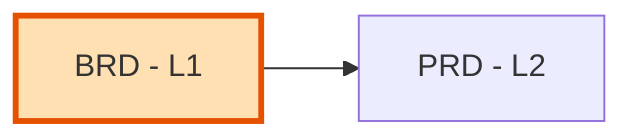

# BRD-00: Business Requirements Document Index

Master index of all Business Requirements Documents for the project.

---

## Position in Document Workflow

**Layer**: 1 (Business Requirements Layer)
**Downstream**: PRD (Layer 2)
**Traceability chain**: BRD -> PRD -> EARS -> BDD -> ADR -> SPEC -> TDD -> IPLAN -> Code

---

## Document Registry

| BRD ID | Module | Type | Status | PRD-Ready | Canonical | Readable |
|--------|--------|------|--------|-----------|-----------|----------|
| BRD-01 | TradeSpine Platform Foundation | Platform | Approved | 94/100 | [YAML](BRD-01_platform_tradespine_framework/BRD-01_platform_tradespine_framework.yaml) | [Markdown](BRD-01_platform_tradespine_framework/BRD-01_platform_tradespine_framework.readable.md) |

---

## Module Categories

Group BRDs into project-defined module categories (for example, reusable
foundation modules and business-specific domain modules). Replace the rows
below with the project's own module taxonomy.

| ID | Module Name | BRD | Status |
|----|-------------|-----|--------|
| M1 | Platform Foundation | BRD-01 | Draft |

---

## Planned BRDs

| ID | Title | Priority | Target Date | Notes |
|----|-------|----------|-------------|-------|
| BRD-02 | Downstream feature or strategy BRD | TBD | After v1.0 feedback | Create only when a new MVP cycle is justified |

---

## Quick Links

- **PRD Layer**: [02_PRD](../02_PRD/)
- **Active BRD**: [BRD-01_platform_tradespine_framework.yaml](BRD-01_platform_tradespine_framework/BRD-01_platform_tradespine_framework.yaml)
- **README**: [README.md](README.md)

---

## Allocation Rules

- **Numbering**: Allocate sequentially starting at `01`; keep numbers stable
- **Module grouping**: Assign contiguous BRD ranges to each module category
- **Feature BRDs**: Continue sequence from last allocated number
- **Filename**: `BRD-NN_{descriptive_slug}.yaml` (platform BRDs: `BRD-NN_platform_{slug}.yaml`)

---

*Last Updated: 2026-06-01*
