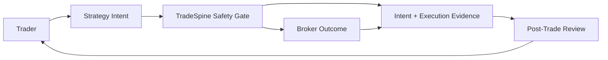

# BRD-01 Business Audit Flow Diagram

## Document Control

- Parent: `../BRD-01_platform_tradespine_framework.yaml`
- Diagram type: DFD-L1
- Source: `../../../../Project/architecture-diagram.html`
- Created: 2026-06-01

## Overview

Business-level data flow for trade intent and execution evidence.

## References

- Parent BRD: `../BRD-01_platform_tradespine_framework.yaml`
- Source brief: `../../../../Project/PRD.md`
