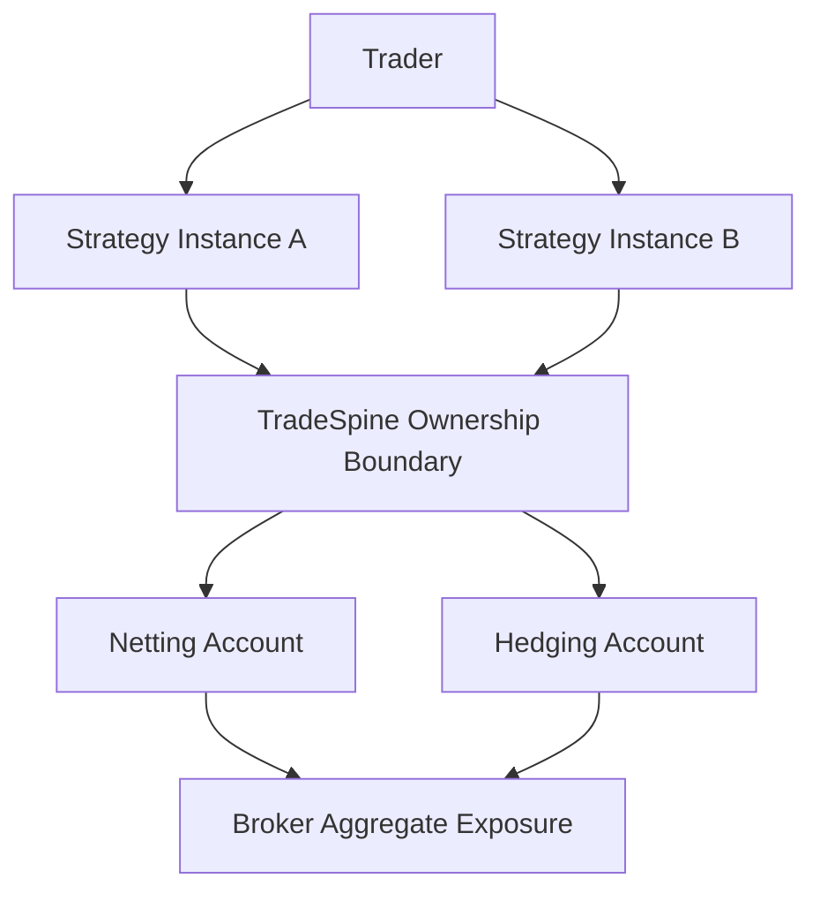

# BRD-01 State Ownership Context Diagram

## Document Control

- Parent: `../BRD-01_platform_tradespine_framework.yaml`
- Diagram type: C4-L1 context
- Source: `../../../../Project/architecture-diagram.html`
- Created: 2026-06-01

## Overview

Context view of strategy-scoped ownership across account modes.

## References

- Parent BRD: `../BRD-01_platform_tradespine_framework.yaml`
- Source brief: `../../../../Project/PRD.md`
