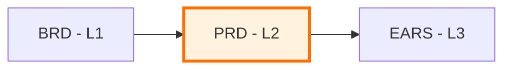

# PRD-00: Product Requirements Documents Master Index

## Purpose

This document serves as the master index for all Product Requirements Documents in the project. Use this index to:

- **Discover** existing product requirements
- **Track** feature specification status
- **Coordinate** product planning across teams
- **Reference** upstream BRD and downstream EARS artifacts

## Position in Document Workflow

**Layer**: 2 (Product Requirements Layer)
**Upstream**: BRD (Business Requirements, Layer 1)
**Downstream**: EARS (Formal Requirements, Layer 3)
**Traceability chain**: BRD -> PRD -> EARS -> BDD -> ADR -> SPEC -> TDD -> IPLAN -> Code

## Product Requirements Index

| PRD ID | Title | Status | Related BRD | Features | Priority | Canonical | Readable | Latest Audit | Latest Fix | Last Updated |
|--------|-------|--------|-------------|----------|----------|-----------|----------|--------------|------------|--------------|
| PRD-01 | TradeSpine Platform Requirements | Approved | BRD-01 | 7 P1 capabilities | High | [YAML](PRD-01_tradespine_platform_requirements/PRD-01_tradespine_platform_requirements.yaml) | [Markdown](PRD-01_tradespine_platform_requirements/PRD-01_tradespine_platform_requirements.readable.md) | [v006 PASS](PRD-01_tradespine_platform_requirements/PRD-01.A_audit_report_v006.md) | [v002](PRD-01_tradespine_platform_requirements/PRD-01.F_fix_report_v002.md) | 2026-06-01 |

## Planned

| ID | Title | Priority | Target Date | Notes |
|----|-------|----------|-------------|-------|
| PRD-02 | Future TradeSpine feature PRD | TBD | After v1.0 feedback | Create only for a new approved BRD cycle |

## Status Definitions

| Status | Meaning | Description |
|--------|---------|-------------|
| **Draft** | In development | PRD being written, requirements gathering in progress |
| **In Review** | Under review | Stakeholders reviewing product requirements |
| **Approved** | Finalized | PRD approved, ready for downstream EARS generation |
| **In Progress** | Active development | Features being implemented |
| **Completed** | Delivered | All features implemented and released |
| **Archived** | Superseded | Replaced by newer PRD or no longer relevant |

> The PRD document's own `status` enum is **Draft / In Review / Approved** (per
> `PRD-TEMPLATE.yaml`). The post-Approved rows (In Progress / Completed /
> Archived) track downstream implementation lifecycle in this index, not the
> PRD document's authoring status.

## Adding New Product Requirements

When creating a new PRD:

1. **Generate from template**: Copy `PRD-TEMPLATE.yaml` into a new `PRD-NN` file
2. **Assign PRD ID**: Use next sequential number (PRD-01, PRD-02, ...)
3. **Update This Index**: Add new row to the registry table above
4. **Create Cross-References**: Update related BRD to reference new PRD

## Allocation Rules

- **Numbering**: Allocate sequentially starting at `01`; keep numbers stable
- **One Product Per File**: Each `PRD-NN` file covers a coherent product or feature area
- **Slugs**: Short, descriptive, lower_snake_case
- **Cross-Links**: Each PRD references upstream BRD hash-based element IDs
- **Index Updates**: Add a line for every new PRD; do not remove past entries
- **Element IDs**: Hash-based format `PRD.NN.SS.xxxx` (SHA256, 4-char hex)

## Threshold Registry Integration

Threshold tags in PRD functional requirements use `@threshold:` convention for quantitative values that may change across iterations:

| Category | Example Key | Description |
|----------|-------------|-------------|
| Quota Limits | `quota_velocity_daily` | Daily transaction limits by verification tier |
| Transaction Limits | `tx_max_single` | Maximum single transaction amount |
| Timeout Values | `api_timeout_p99` | API response time SLAs |
| Risk Thresholds | `risk_score_high` | Risk scoring breakpoints |
| Rate Limits | `api_rate_per_minute` | API rate limiting values |

When to use thresholds:
1. Value appears in 2+ sections
2. Value affects cross-system behavior
3. Value requires coordinated updates

See `PRD-TEMPLATE.yaml` Section 9 (Functional Requirements) for `@threshold:` tag format.

## Quality Gate

PRD must achieve **EARS-Ready score >=90/100** before downstream EARS generation.

## Related Documents

- **Template**: framework `layers/02_PRD/PRD-TEMPLATE.yaml`
- **README**: [README.md](./README.md) — PRD purpose and structure
- **Upstream**: [01_BRD](../01_BRD/) — Business Requirements
- **Downstream**: [03_EARS](../03_EARS/) — Formal Requirements

## Maintenance Guidelines

### Updating This Index

- Update this index whenever a new PRD is created
- Update status when PRD moves through workflow stages
- Add cross-references when BRD or downstream documents are created
- Archive PRDs that are superseded or no longer relevant

### Quality Checks

Before marking PRD as "Approved":
- [PASS] All user stories follow standard format (As a... I want... So that...)
- [PASS] Functional requirements are testable and specific
- [PASS] Quality attributes have measurable criteria
- [PASS] Cross-references to BRD use hash-based element IDs
- [PASS] Acceptance criteria defined for each feature
- [PASS] **EARS-Ready score >=90** (required for EARS progression)
- [PASS] **Bidirectional references validated** (all A→B have B→A)
- [PASS] **Threshold registry references** for shared values

---

## Active PRDs

- [PRD-01 canonical YAML](PRD-01_tradespine_platform_requirements/PRD-01_tradespine_platform_requirements.yaml)

**Last Updated**: 2026-06-01
**Maintainer**: phbr
