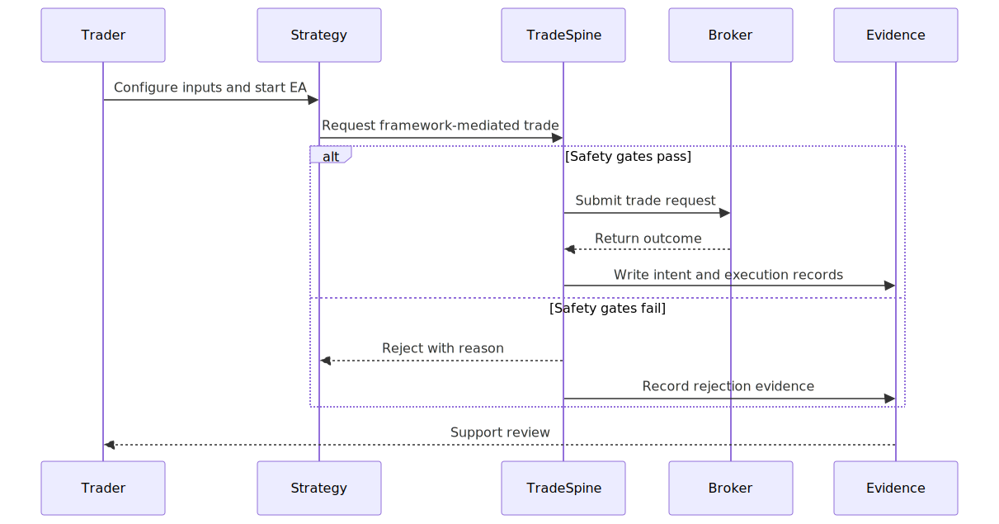

# PRD-01: TradeSpine Platform Requirements

> Human-readable rendering generated from `PRD-01_tradespine_platform_requirements.yaml`. The YAML file remains the canonical aidoc artifact.

## Document Control

| Field | Value |
| --- | --- |
| Document ID | PRD-01 |
| Title | TradeSpine Platform Requirements |
| Status | Approved |
| Version | 1.0 |
| EARS-ready score | 92/100 |
| BRD reference | @brd: BRD.01.03.d116 |
| Created | 2026-06-01T14:05:00-03:00 |
| Updated | 2026-06-01T19:49:37-03:00 |
| Target release | TradeSpine v1.0 after v0.1-v0.9 phased build |

### Revision History

| Version | Date | Author | Changes |
| --- | --- | --- | --- |
| 1.0 | 2026-06-01T14:05:00-03:00 | Codex | Initial PRD generated from approved BRD-01 and TradeSpine PRD v3.73. |
| 1.0.1 | 2026-06-01T14:18:42-03:00 | Codex | Fixed section-scoped element IDs from PRD audit v001. |
| 1.0.2 | 2026-06-01T14:31:40-03:00 | Codex | Clarified v1 strategy guide, evidence-stream separation, and account-mode ownership requirements. |
| 1.0.3 | 2026-06-01T19:13:08-03:00 | Codex | Resolved PRD audit v004 source-drift findings for runtime risk controls, performance budgets, validation evidence, session and sizing scope, release governance, and v1 safety behaviors. |
| 1.0-approval | 2026-06-01T19:30:00-03:00 | Paulo Henrique Barreto Reboucas | PRD approved for downstream EARS generation. |
| 1.0.4 | 2026-06-01T19:49:37-03:00 | Codex | Aligned EARS review clarifications for one-day contract-expiration warnings, explicit symbol-information validation, and day-trade no-overnight behavior. |

## Executive Summary

TradeSpine is a MetaTrader 5 product platform for B3 futures strategy authors. It gives the trader a single-file strategy authoring surface while product-level framework capabilities provide guarded trade execution, runtime risk controls, strategy-scoped account-mode ownership, audit evidence, and release validation.

### MVP Hypothesis

We believe that the owner-operator trader will create safer B3 futures strategies if TradeSpine separates strategy logic from reusable trading infrastructure.

We will know this is true when two reference strategies compile, trade through framework helpers, and satisfy the v1.0 launch gates.

### Timeline

| Phase | Dates | Duration |
| --- | --- | --- |
| Foundation | v0.1 to v0.3 | Phased build |
| Strategy lifecycle | v0.4 to v0.6 | Phased build |
| Netting and reference delivery | v0.7 to v0.9 | Phased build |
| MVP Launch | v1.0 | Release gate |

## Problem Statement

### Current State

- Strategy files repeat execution, session, state, risk, logging, and recovery infrastructure.
- Duplicated infrastructure increases real-money defect exposure when each EA re-solves broker and account-mode behavior.
- The current monolithic reference strategy contains roughly 70% reusable infrastructure.

### Business Impact

| Area | Value |
| --- | --- |
| revenue | Not estimated in source brief |
| customer_satisfaction | Owner-operator velocity and confidence are reduced by repeated infrastructure work. |
| competitive | The framework must keep authoring speed without reducing trading safety. |

### Opportunity

TradeSpine can turn repeated EA infrastructure into a reusable product surface with auditable safety gates and reference strategy workflows.

## Target Audience and User Personas

| Persona | Role | Pain Point | Success Criteria | Usage |
| --- | --- | --- | --- | --- |
| Owner-Operator Trader | MQL5 strategy author and live operator | Each strategy requires repeated broker, risk, state, and audit infrastructure. | Can write a new strategy as one strategy file and rely on framework safety and evidence capabilities. | Every strategy build, backtest, optimization, and live deployment cycle. |

### Secondary Personas

| Name | Role |
| --- | --- |
| Future MQL5 Developer | Strategy contributor |
| Post-Trade Analyst | Python analytics consumer |

## Success Metrics and KPIs

### MVP Validation Metrics

| ID | Metric | Baseline | Target | Measurement | BRD |
| --- | --- | --- | --- | --- | --- |
| PRD.01.05.129c | Reference strategy packaging | Reference Turtle strategy has roughly 70% repeated infrastructure | Two v1 reference strategies use one strategy file plus shared framework services | Repository review and compile evidence | @brd: BRD.01.04.22e9 |
| PRD.01.05.680e | Guarded helper coverage | Safety checks repeated per EA | 100% of framework helper entry paths route through guarded execution | Code review plus test evidence | @brd: BRD.01.04.7b04 |
| PRD.01.05.bb1f | Runtime risk controls | Daily loss, open-lot, trade-count, and panic controls are repeated or absent per EA | Per-EA daily loss, max open lots, max trades per day, and strategy-scoped panic stop are documented and release-tested | Risk-control test evidence and operator-input review | @brd: BRD.01.07.a94e |
| PRD.01.05.f4c5 | Account-mode ownership validation | Netting same-symbol isolation is a known design risk | Same-symbol strategy ownership validated on netting, exchange-netting, and hedging modes, including manual concurrent netting evidence | Automated mode-specific report plus manual live/demo evidence pack | @brd: BRD.01.04.4fb6 |
| PRD.01.05.ecfb | Manual netting evidence pack | Strategy Tester cannot validate true concurrent same-symbol netting contention | Concurrent multi-EA netting release sign-off includes manual live or demo evidence because Strategy Tester cannot validate true concurrency | Release evidence pack review | @brd: BRD.01.07.b44d |
| PRD.01.05.4218 | Audit evidence pairing | Per-EA logging is inconsistent | Accepted entry attempts produce paired intent and execution evidence | Trade journal inspection | @brd: BRD.01.07.8e15 |
| PRD.01.05.9b99 | Strategy implementation guide | Strategy authoring knowledge is embedded in existing EA source | New strategy authors can create a v1 strategy from the guide without copying broker execution infrastructure | Documentation review plus reference-strategy walkthrough | @brd: BRD.01.07.88a6 |
| PRD.01.05.5be3 | Tester overhead | Hand-written equivalent strategy | <=10% median overhead | Minimum benchmark protocol | @brd: BRD.01.07.bf02 |
| PRD.01.05.9ccc | Performance budget coverage | Only tester overhead is tracked | Release evidence covers tester overhead <=10%, memory <=2 MB per EA, idle tick <=50 us, and low-I/O write budgets | Benchmark report and release checklist | @brd: BRD.01.07.bf02 |

### Decision Gate

| Outcome | Rule |
| --- | --- |
| proceed | All P1 gates pass -> generate EARS and continue to implementation planning |
| iterate | Minor P2 findings remain -> fix before v1.0 release tag |
| pivot | Account-mode ownership or safety gates fail -> revise PRD and ADR topics |

## Goals and Objectives

| ID | Goal | Metric | Target | Timeline | BRD |
| --- | --- | --- | --- | --- | --- |
| PRD.01.06.4cf2 | Define the strategy authoring product surface | Reference strategy shape | One `.mq5` strategy file per reference strategy | v1.0 | @brd: BRD.01.07.88a6 |
| PRD.01.06.248e | Define guarded trading behavior | Helper-path coverage | 100% framework helper routing through guarded execution | v1.0 | @brd: BRD.01.07.a94e |
| PRD.01.06.c9c6 | Define strategy-scoped account-mode behavior | Same-symbol mode validation | Independent ownership evidence in supported account modes | v1.0 | @brd: BRD.01.07.b44d |
| PRD.01.06.da13 | Define audit evidence and analytics handoff behavior | Intent and execution evidence pairing | Paired records for accepted entries | v1.0 | @brd: BRD.01.07.8e15 |

## Scope and Requirements

### In Scope Features

| ID | Name | Priority | Description | BRD |
| --- | --- | --- | --- | --- |
| PRD.01.07.2878 | Strategy authoring workspace | P1-Must | Template, implementation guide, and reference strategy structure that lets a strategy author focus on signal logic and behavior selection. | @brd: BRD.01.07.88a6 |
| PRD.01.07.0b72 | Execution safety path | P1-Must | Product behavior that routes framework-mediated entries through safety, session, risk, broker, and evidence gates. | @brd: BRD.01.07.a94e |
| PRD.01.07.7733 | Runtime risk controls | P1-Must | Per-EA daily loss, max open lots, max trades per day, and strategy-scoped panic stop that can refuse entries or close this strategy when tripped. | @brd: BRD.01.07.a94e |
| PRD.01.07.6107 | Account-mode ownership | P1-Must | Product behavior that lets same-symbol strategies maintain strategy-scoped ownership across supported account modes. | @brd: BRD.01.07.b44d |
| PRD.01.07.3ab9 | B3 futures market context | P1-Must | Product behavior for v1 futures sizing modes, broker-session awareness, user trading-hours windows, and symbol metadata validation. | @brd: BRD.01.07.69ef |
| PRD.01.07.f540 | Trade audit exports | P1-Must | Separated diagnostic logs and structured trade evaluation evidence suitable for code audit and Python-side post-trade analysis. | @brd: BRD.01.07.8e15 |
| PRD.01.07.1bce | Testability and release evidence | P1-Must | Release gates that prove safety, mode ownership, manual netting evidence, reference strategy behavior, benchmark targets, and documentation governance before v1.0. | @brd: BRD.01.07.717b |

### Dependencies

| Type | Detail |
| --- | --- |
| technical | MetaTrader 5, MQL5, selected vendored standard-library files, and local diagram rendering. |
| business | Owner approval of BRD-01 and acceptance of v1 scope boundaries. |
| external | Broker symbol metadata, account mode behavior, and B3 futures market-session data. |

### Out of Scope

- B3 equities sizing implementation; reserved for a later BRD cycle.
- Pyramiding, partial-close manager, and advanced exit manager.
- Multi-symbol, portfolio, UI panel, and WebRequest product surfaces.
- Custom optimization criteria and Python analytics implementation.

## User Stories and User Roles

Detailed behaviors live in EARS; executable scenarios live in BDD.

### Roles

| Role | Description |
| --- | --- |
| Strategy Author | Creates and tests strategy files that call TradeSpine helpers. |
| Live Operator | Configures risk, session, and safety inputs before trading. |
| Post-Trade Analyst | Reviews exported trade evidence outside the MQL5 tree. |
| Release Reviewer | Confirms tests, diagrams, docs, and launch gates before progression. |

### PRD.01.08.03b6: Strategy Author

As a Strategy Author, I want to write a strategy as one strategy file so that signal logic is not mixed with repeated execution infrastructure.

Priority: P1

Acceptance criteria:
- The reference strategy compiles without direct broker execution includes in the strategy file.
- The strategy calls documented framework helpers for entries and exits.
- The v1 strategy implementation guide explains the strategy file structure, lifecycle hooks, helper calls, common inputs, logging expectations, compile checklist, and reference-strategy walkthrough.

BRD: @brd: BRD.01.07.88a6

### PRD.01.08.fde4: Live Operator

As a Live Operator, I want to configure safety, session, and sizing behavior per chart so that framework-mediated trades respect the intended operating limits.

Priority: P1

Acceptance criteria:
- Unsafe framework-mediated entry attempts are rejected before broker handoff.
- Daily loss, max open lots, max trades per day, and panic stop controls can stop this strategy instance.
- Session and market-availability states can block new entries.
- The user trading-hours window and broker trading session must both allow entries.

BRD: @brd: BRD.01.07.a94e

### PRD.01.08.2f83: Post-Trade Analyst

As a Post-Trade Analyst, I want to review trade evaluation evidence separately from diagnostic logs so that strategy performance can be evaluated without mixing it with framework or strategy-code audit trails.

Priority: P1

Acceptance criteria:
- Intent evidence is available before broker submission.
- Execution evidence includes broker outcome, intended price, actual fill price, slippage points, and strategy ownership context.
- Strategy/framework diagnostic logs are separated from trade evaluation records.

BRD: @brd: BRD.01.07.8e15

### PRD.01.08.628e: Release Reviewer

As a Release Reviewer, I want to validate release gates from documented evidence so that the framework does not progress to code or release with unresolved P1 risks.

Priority: P1

Acceptance criteria:
- P1 product gates have corresponding validation evidence.
- Concurrent same-symbol netting sign-off includes manual live/demo evidence because Strategy Tester cannot validate true concurrency.
- Release governance checks required docs, same-change documentation updates, and CHANGELOG decision records.
- Deferred scope is explicit and does not block v1.0.

BRD: @brd: BRD.01.07.717b

## Functional Requirements

| ID | Capability | Priority | Description | BRD |
| --- | --- | --- | --- | --- |
| PRD.01.09.9e71 | Strategy authoring surface | P1 | TradeSpine shall expose a documented strategy template, implementation guide, lifecycle hooks, behavior-selection points, and reference strategies for B3 futures authors. | @brd: BRD.01.07.88a6 |
| PRD.01.09.88e3 | Guarded execution | P1 | TradeSpine shall route framework-mediated entries through product safety checks before broker submission. | @brd: BRD.01.07.a94e |
| PRD.01.09.aaf8 | Account-mode ownership | P1 | TradeSpine shall keep strategy ownership separate from broker exposure across netting, exchange-netting, and hedging account modes. | @brd: BRD.01.07.b44d |
| PRD.01.09.9cac | B3 futures market context | P1 | TradeSpine shall validate symbol metadata, broker session state, and futures sizing inputs for v1 B3 futures use. | @brd: BRD.01.07.69ef |
| PRD.01.09.baed | Audit evidence | P1 | TradeSpine shall separate strategy/framework diagnostic logs from structured trade evaluation records, while producing paired intent and execution evidence that external analytics can consume. | @brd: BRD.01.07.8e15 |
| PRD.01.09.841a | Testability and release readiness | P1 | TradeSpine shall provide release evidence that validates safety, ownership, performance, and documentation gates. | @brd: BRD.01.07.717b |

### Functional Acceptance Highlights

- Guarded execution includes runtime risk controls, indicator-readiness gating, and HALT behavior for ambiguous async fill, cancel, or reconciliation state.
- Account-mode ownership includes a duplicate account-symbol-magic guard and explicit netting and hedging ownership invariants.
- B3 futures context includes the two-layer session model, initialized symbol-information validation, v1 futures sizing modes, day-trade no-overnight close, and one-day session-open contract-expiration warnings.
- Audit evidence includes intended price, actual fill price, and slippage points for trade evaluation.
- Release readiness includes manual concurrent netting evidence, documentation/release governance, and the full performance budget set.

### Product Journey Diagram

## Customer-Facing Content and Messaging

### Positioning

TradeSpine is a MetaTrader 5 strategy framework for B3 futures traders who want strategy files to contain strategy logic while shared framework services handle safety, ownership, and audit evidence.

### Key Messages

- Write strategy logic once and route framework-mediated trades through shared safety gates.
- Run multiple same-symbol TradeSpine strategies with strategy-scoped ownership evidence.
- Export paired trade intent and execution evidence for post-trade review.

### Feature Descriptions

| Feature | Description |
| --- | --- |
| Strategy template | A starting point for creating a B3 futures strategy that uses the framework authoring surface. |
| Guarded execution | A product path that checks risk, session, market, and broker readiness before framework-mediated trade submission. |
| Audit exports | Paired records that document trade intent and broker outcome for later analysis. |

### Documentation Requirements

- P1 new strategy implementation guide covering file structure, lifecycle hooks, helper calls, common inputs, logging expectations, compile checklist, and reference-strategy walkthrough.
- Input reference for common risk, session, logging, and safety settings.
- Evidence guide that separates strategy/framework diagnostic logs from trade evaluation records.
- Testing guide for Tier-1 and release-gate validation.
- Release documentation inventory covering README, ARCHITECTURE, AUTHORING, RECIPES, INPUTS_REFERENCE, TESTING, per-module docs, template README, and CHANGELOG.md as the canonical decision log.
- Same-change documentation update gate and Doxygen/API documentation coverage gate if Doxygen remains part of the implementation standard.

### Error Messages

| Trigger | Message | Guidance |
| --- | --- | --- |
| Unsafe order request | Trade rejected by TradeSpine safety gate. | Review lot, stop, session, and risk settings before retrying. |
| Ambiguous strategy ownership | Strategy halted until ownership state is resolved. | Review the halt report and broker state before restarting. |

## Acceptance Criteria

| Category | Criterion | Threshold | Validation |
| --- | --- | --- | --- |
| Functional | All P1 product capabilities have downstream EARS-ready requirements. | 100% | PRD audit and traceability review |
| Safety | Framework-mediated catastrophic order scenarios are rejected before broker handoff. | Pass | Safety test suite |
| Risk | Runtime risk controls cover daily loss %, max open lots, max trades per day, and strategy-scoped panic stop. | Pass | Risk-control test evidence and operator-input review |
| Ownership | Same-symbol strategy ownership works in supported account modes, including manual concurrent netting evidence. | Pass | Automated mode-specific tests plus manual live/demo evidence pack |
| Session | Entries require both broker trading-session availability and the configured user trading-hours window in broker/server time. | Pass | Session test evidence |
| Sizing | v1 validates symbol information at init and uses it for sizing, lot, and price-grid order definition. | Pass | Input reference and sizing test review |
| Audit | Strategy/framework diagnostic logs are separated from paired trade intent and execution records. | Pass | Diagnostic log and trade evidence inspection |
| Documentation | New strategy implementation guide and release-governance documentation set are complete for v1 strategy authors and release reviewers. | Pass | Documentation review, reference-strategy walkthrough, same-change docs check, and CHANGELOG review |
| Performance | Matched tester overhead, memory, idle-tick, and low-I/O budgets stay within benchmark targets. | <=10% tester overhead; <=2 MB memory per EA; <=50 us idle tick; low-I/O write budgets pass | Minimum benchmark protocol and release checklist |

### Business Acceptance

- Strategy author can create a reference strategy from the v1 implementation guide without duplicating broker execution infrastructure.
- Operator can identify why a framework-mediated trade was rejected or accepted.
- Analyst can evaluate trade records without parsing strategy/framework diagnostic logs.
- Release reviewer can trace every P1 product capability to BRD source elements.

### Technical Acceptance

- Strict compile passes for framework and reference strategies.
- Tier-1 test suite passes before release sign-off.
- Repository checks detect prohibited direct broker submission in strategy files.

## Constraints and Assumptions

### Constraints

| ID | Category | Description | Impact | BRD |
| --- | --- | --- | --- | --- |
| PRD.01.12.e9ec | Technical | MetaTrader 5 and MQL5 are mandatory runtime and authoring targets. | Non-MT5 runtimes and MQL4 compatibility are out of scope. | @brd: BRD.01.10.8d76 |
| PRD.01.12.9a32 | Product | v1 strategy instances attach to one chart symbol. | Multi-symbol and portfolio behavior move to later cycles. | @brd: BRD.01.10.b11c |
| PRD.01.12.67aa | Release | v1 compile workflow uses MetaEditor. | Headless compile automation is deferred unless later justified. | @brd: BRD.01.10.32c6 |
| PRD.01.12.9a58 | Product | B3 futures sizing modes are v1 scope; equity sizing modes are visible placeholders for v2. | Equity sizing behavior must not be implemented or implied as production-ready in v1. | @brd: BRD.01.10.b11c |

### Assumptions

| ID | Assumption | Validation | Impact If False | BRD |
| --- | --- | --- | --- | --- |
| PRD.01.12.68cf | Broker metadata is sufficient for B3 futures operation. | Validate symbol, session, and account-mode behavior during release testing. | Block unsupported symbols or brokers. | @brd: BRD.01.10.88ee |
| PRD.01.12.f293 | The operator manages strategy parameters and risk limits per chart. | Document inputs, default behavior, and runtime risk-control effects. | Block release or create a risk-policy change request. | @brd: BRD.01.10.c6f8 |

## Risk Assessment

| ID | Description | Likelihood | Impact | Mitigation | Owner | BRD |
| --- | --- | --- | --- | --- | --- | --- |
| PRD.01.13.093a | Unsafe framework-mediated order reaches the broker. | Medium | High | Require guarded helper routing, safety tests, and rejection evidence. | Technical Lead | @brd: BRD.01.12.5c81 |
| PRD.01.13.e18a | Strategy ownership drifts from broker aggregate exposure or broker ticket-level state. | Medium | High | Require explicit netting, exchange-netting, and hedging ownership evidence, account-mode tests, manual live/demo concurrent netting evidence, and halt-on-ambiguity behavior. | Technical Lead | @brd: BRD.01.12.5985 |
| PRD.01.13.9c2d | Release sign-off may overstate same-symbol netting safety if manual live/demo concurrency evidence is missing. | Medium | High | Require a manual concurrent netting evidence pack in addition to automated tests because Strategy Tester cannot validate true concurrency. | Technical Lead | @brd: BRD.01.12.5985 |
| PRD.01.13.f493 | Operator may run without intended daily loss, open lots, trade count, or panic controls. | Medium | High | Expose runtime risk controls as P1 inputs and require risk-control test evidence before v1.0 sign-off. | Product Owner | @brd: BRD.01.12.5c81 |
| PRD.01.13.3e77 | Product requirements drift from implementation during phased build. | Medium | Medium | Use aidoc traceability, audits, and same-change documentation updates. | Product Owner | @brd: BRD.01.12.0224 |
| PRD.01.13.be4b | Framework overhead exceeds tester or idle-operation targets. | Medium | Medium | Require benchmark evidence and low-I/O validation before v1.0 sign-off. | Technical Lead | @brd: BRD.01.07.bf02 |
| PRD.01.13.edc4 | Release may diverge from canonical docs or changelog if same-change updates and decision records are not checked. | Medium | Medium | Require same-change documentation updates, Doxygen/API documentation gate if retained, and CHANGELOG.md release-decision review. | Product Owner | @brd: BRD.01.12.0224 |

## Traceability

### BRD References

- @brd: BRD.01.03.d116
- @brd: BRD.01.04.22e9
- @brd: BRD.01.04.7b04
- @brd: BRD.01.04.4fb6
- @brd: BRD.01.07.88a6
- @brd: BRD.01.07.a94e
- @brd: BRD.01.07.b44d
- @brd: BRD.01.07.69ef
- @brd: BRD.01.07.8e15
- @brd: BRD.01.07.717b
- @brd: BRD.01.07.bf02
- @brd: BRD.01.08.ab58
- @brd: BRD.01.08.cea7
- @brd: BRD.01.08.a20b
- @brd: BRD.01.08.0ce5
- @brd: BRD.01.08.8cbc
- @brd: BRD.01.08.92f4

### ADR Topic Elaboration

| ID | Topic | BRD | Status | Options |
| --- | --- | --- | --- | --- |
| PRD.01.14.484d | Self-contained MT5 project layout | @brd: BRD.01.08.ab58 | Selected-for-evaluation | Evaluate self-contained root, terminal include installation, and symlink-based installation against clone-to-compile workflow, permissions, and source reproducibility. |
| PRD.01.14.737b | State and audit evidence model | @brd: BRD.01.08.cea7 | Pending | Evaluate terminal global variables, file snapshots, and hybrid evidence models against durability, low-I/O behavior, and recovery safety. |
| PRD.01.14.de0d | Broker terminal and analytics boundary | @brd: BRD.01.08.a20b | Selected-for-evaluation | Evaluate file-based handoff, terminal journal evidence, and future external API handoff against tester compatibility and operational cost. |
| PRD.01.14.8720 | Trading safety and bypass policy | @brd: BRD.01.08.0ce5 | Pending | Evaluate guard-only enforcement, repository policy checks, and release-gate tests against language-level bypass limits. |
| PRD.01.14.15fe | Logging and operator alert model | @brd: BRD.01.08.8cbc | Pending | Evaluate terminal journal logging, chart status, CSV evidence, and alert-sink behavior against live and tester modes. |
| PRD.01.14.518a | MQL5 stack and vendored dependency policy | @brd: BRD.01.08.92f4 | Selected-for-evaluation | Evaluate vendored standard-library subset, direct terminal standard-library use, and no-standard-library implementation against maintenance risk and reproducibility. |

### Downstream Expected

| Type | Layer | Description |
| --- | --- | --- |
| EARS | 3 | Formal requirements from PRD product capabilities |
| BDD | 4 | Executable scenarios for user journeys and acceptance gates |
| ADR | 5 | Architecture decisions for PRD elaborated topics |

## Glossary

| Term | Definition |
| --- | --- |
| TradeSpine | MT5 strategy framework product for B3 futures. |
| Framework-mediated trade | Trade action requested through TradeSpine helper and safety paths. |
| Strategy ownership | Strategy-scoped accounting and evidence that separates one strategy from another. |
| Diagnostic log | Strategy and framework audit trail for code-path decisions, rejections, halts, and recovery behavior. |
| Trade evaluation record | Structured intent and execution evidence used to evaluate strategy trading outcomes. |
| Netting ownership invariant | In netting and exchange-netting account modes, broker exposure is symbol-aggregate, so TradeSpine must preserve strategy-scoped ownership evidence outside the aggregate broker position. |
| Hedging ownership invariant | In hedging account mode, TradeSpine records ownership against relevant broker tickets or orders while preserving the same strategy-scoped evidence model. |
| Runtime risk controls | Per-EA limits for daily loss, max open lots, max trades per day, and a strategy-scoped panic stop. |
| Strategy-scoped panic stop | Operator control that stops the current TradeSpine strategy instance without claiming to manage unrelated strategies. |
| Two-layer session model | Entry gating model requiring both market trade-session availability and the configured user trading-hours window in broker/server time. |
| Manual netting evidence pack | Live or demo evidence used to validate concurrent same-symbol netting behavior that the MT5 Strategy Tester cannot automate. |
| Placeholder sizing mode | Visible but non-production sizing option reserved for a later release boundary. |
| Duplicate magic guard | Initialization safety check that prevents or safely recovers duplicate account-symbol-magic ownership collisions. |
| Day-trade auto-close | Mode that performs a complete strategy stop before market session close and prevents strategy-owned positions from rolling overnight. |
| Indicator-readiness gate | Entry gate that blocks strategy entries while required indicator data is still loading. |
| Contract expiration warning | Operator-facing warning at session open when a supported futures contract expires in one broker day. |
| Slippage points | Difference between intended trade price and actual fill price recorded for trade evaluation. |
| Intent evidence | Pre-submission record of the strategy trade request. |
| Execution evidence | Post-submission record of broker outcome and strategy ownership state. |
| EARS | Layer 3 formal requirements syntax used after this PRD. |
