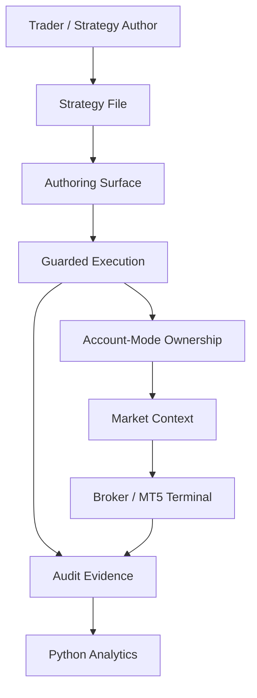

# PRD-01 Container Map

## Document Control

- Parent: `../PRD-01_tradespine_platform_requirements.yaml`
- Diagram type: C4-L2 container
- Source: `../../../archive/architecture-diagram.html`
- Created: 2026-06-01

## Overview

Container-level product view for TradeSpine platform requirements.

## References

- Parent PRD: `../PRD-01_tradespine_platform_requirements.yaml`
- Upstream BRD: `../../../01_BRD/BRD-01_platform_tradespine_framework/BRD-01_platform_tradespine_framework.yaml`
