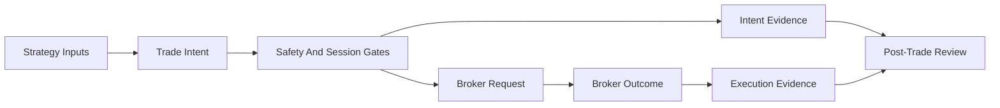

# PRD-01 Feature Data Flow

## Document Control

- Parent: `../PRD-01_tradespine_platform_requirements.yaml`
- Diagram type: DFD-L2
- Source: `../../../../Project/architecture-diagram.html`
- Created: 2026-06-01

## Overview

Feature-level data flow for framework-mediated entries and audit evidence.

## References

- Parent PRD: `../PRD-01_tradespine_platform_requirements.yaml`
- Upstream BRD: `../../../01_BRD/BRD-01_platform_tradespine_framework/BRD-01_platform_tradespine_framework.yaml`
