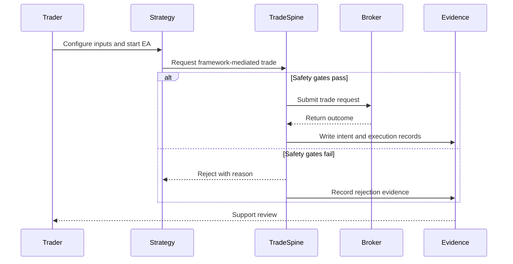

# PRD-01 User Journey

## Document Control

- Parent: `../PRD-01_tradespine_platform_requirements.yaml`
- Diagram type: sequence-sync
- Source: `../../../archive/architecture-diagram.html`
- Created: 2026-06-01

## Overview

Product interaction journey with success and rejection paths.

## References

- Parent PRD: `../PRD-01_tradespine_platform_requirements.yaml`
- Upstream BRD: `../../../01_BRD/BRD-01_platform_tradespine_framework/BRD-01_platform_tradespine_framework.yaml`
