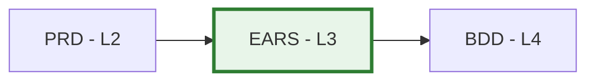

# EARS-00: EARS Requirements Master Index

## Purpose

This document serves as the master index for all EARS (Easy Approach to Requirements Syntax) Requirements in the project. Use this index to:

- **Discover** existing formal requirements
- **Track** requirement specification status
- **Coordinate** requirements engineering across teams
- **Reference** atomic, testable requirements

## Position in Document Workflow

**Layer**: 3 (Formal Requirements Layer)
**Upstream**: BRD, PRD
**Downstream**: BDD (Behavior-Driven Development, Layer 4)
**Traceability chain**: BRD → PRD → EARS → BDD → ADR → SPEC → TDD → IPLAN → Code

## EARS Requirements Index

| EARS ID | Title | Requirement Type | Status | Related PRD | Canonical | Readable | Latest Audit | Last Updated |
|---------|-------|------------------|--------|-------------|-----------|----------|--------------|--------------|
| EARS-01 | TradeSpine Formal Requirements | Platform v1 formal requirements | Approved | PRD-01 | [YAML](EARS-01_tradespine_formal_requirements/EARS-01_tradespine_formal_requirements.yaml) | [Markdown](EARS-01_tradespine_formal_requirements/EARS-01_tradespine_formal_requirements.readable.md) | [v003 PASS](EARS-01_tradespine_formal_requirements/EARS-01.A_audit_report_v003.md) | 2026-06-01 |

## Planned

| ID | Title | Source PRD | Priority | Notes |
|----|-------|------------|----------|-------|
| EARS-02 | Future TradeSpine formal requirements | Future PRD | TBD | Create only after a new approved PRD cycle |

## Status Definitions

| Status | Meaning | Description |
|--------|---------|-------------|
| **Draft** | In development | EARS requirements being written |
| **Review** | Under review | Technical review in progress |
| **Approved** | Finalized | Requirements approved and testable |
| **Implemented** | In system | Requirements implemented in code |
| **Verified** | Tested | Requirements verified through testing |
| **Deprecated** | Obsolete | No longer valid, superseded by newer requirement |

## EARS Statement Types

| Type | Pattern | Example | Usage |
|------|---------|---------|-------|
| **Event-driven** | WHEN [trigger], THE [system] SHALL [response] WITHIN [timing] | WHEN a user submits the form, THE system SHALL validate it WITHIN 200ms | Triggered actions |
| **State-driven** | WHILE [state], THE [system] SHALL [behavior] | WHILE the system is offline, THE system SHALL queue requests | Continuous conditions |
| **Optional** | WHERE [feature enabled], THE [system] SHALL [behavior] | WHERE premium is enabled, THE system SHALL show analytics | Feature/config-gated |
| **Unwanted** | IF [condition], THE [system] SHALL [recovery] WITHIN [timing] | IF input is invalid, THE system SHALL reject it with an error | Error handling |
| **Ubiquitous** | THE [system] SHALL [requirement] | THE system SHALL log all transactions | Always-on requirements |

> Every pattern uses the canonical EARS response clause `THE [system] SHALL …`
> (no `THEN`). `WITHIN [timing]` is a framework extension. Multi-condition
> requirements *compose* these patterns rather than adding a sixth type.

## Adding New EARS Requirements

When creating a new EARS document:

1. **Generate from template**: Copy `EARS-TEMPLATE.yaml` into a new `EARS-NN` file
2. **Assign EARS ID**: Use next sequential number (EARS-01, EARS-02, ...)
3. **Update This Index**: Add new row to the registry table above
4. **Create Cross-References**: Update related PRD and create downstream BDD scenarios

## Allocation Rules

- **Numbering**: Allocate sequentially starting at `01`
- **One Area Per File**: Each `EARS-NN` file covers a coherent requirement area
- **Slugs**: Short, descriptive, lower_snake_case
- **Testability**: Every requirement must be verifiable through testing
- **Index Updates**: Add entry for every new EARS document

## Quality Gate

EARS must achieve **BDD-Ready score >=90/100** before downstream BDD generation.

## Related Documents

- **Template**: framework `layers/03_EARS/EARS-TEMPLATE.yaml`
- **README**: [README.md](./README.md) — EARS purpose and statement types
- **Upstream**: [02_PRD](../02_PRD/) — Product Requirements
- **Downstream**: [04_BDD](../04_BDD/) — Behavior-Driven Development

## Maintenance Guidelines

Before marking EARS as "Approved":
- [PASS] All requirements follow EARS patterns (WHEN/WHILE/WHERE/IF + THE-SHALL, or ubiquitous THE-SHALL)
- [PASS] Requirements are atomic and independently testable
- [PASS] Measurable acceptance criteria defined
- [PASS] Cross-references to PRD use hash-based element IDs
- [PASS] BDD-Ready score >=90/100

---

**Last Updated**: 2026-06-01
**Maintainer**: Paulo Henrique Barreto Reboucas
