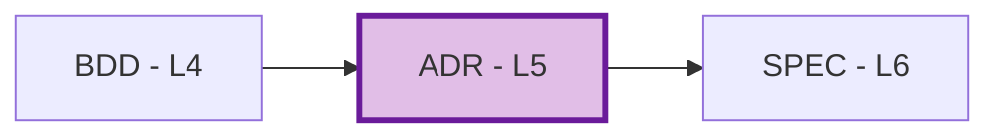
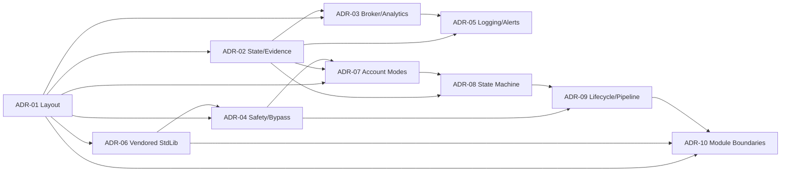

# ADR-00: Architecture Decision Records Index

## Position in Document Workflow

**Layer**: 5 (Architecture Decision Layer)  
**Upstream**: BRD, PRD, EARS, BDD  
**Downstream**: SPEC (Technical Specification, Layer 6)  
**Traceability chain**: BRD -> PRD -> EARS -> BDD -> ADR -> SPEC -> TDD -> IPLAN -> Code

## Architecture Decision Records

| ADR ID | Title | Status | Category | Related BDD | Impact | Latest Audit | Last Updated |
| --- | --- | --- | --- | --- | --- | --- | --- |
| ADR-01 | Self-Contained MT5 Project Layout | Accepted | Infrastructure | BDD.01.03.aa68 | High | [v001 PASS](ADR-01_self_contained_mt5_project_layout/ADR-01.A_audit_report_v001.md) | 2026-06-01 |
| ADR-02 | GV State and CSV Audit Evidence | Accepted | Data Architecture | BDD.01.03.0073, BDD.01.03.d6ae, BDD.01.03.e16a | High | [v001 PASS](ADR-02_gv_state_and_csv_audit_evidence/ADR-02.A_audit_report_v001.md) | 2026-06-01 |
| ADR-03 | Broker Terminal and Analytics Boundary | Accepted | Integration | BDD.01.03.d6ae, BDD.01.03.b37d | Medium | [v001 PASS](ADR-03_broker_terminal_analytics_boundary/ADR-03.A_audit_report_v001.md) | 2026-06-01 |
| ADR-04 | Guarded Trade Safety and Bypass Policy | Accepted | Security | BDD.01.03.9a8b, BDD.01.03.0ad7 | High | [v001 PASS](ADR-04_guarded_trade_safety_bypass_policy/ADR-04.A_audit_report_v001.md) | 2026-06-01 |
| ADR-05 | Logging and Operator Alert Model | Accepted | Observability | BDD.01.03.d6ae, BDD.01.03.e16a | High | [v001 PASS](ADR-05_logging_operator_alert_model/ADR-05.A_audit_report_v001.md) | 2026-06-01 |
| ADR-06 | Vendored MQL5 Standard Library Policy | Accepted | Technology Selection | BDD.01.03.ef54, BDD.01.03.aa68 | High | [v001 PASS](ADR-06_vendored_mql5_standard_library_policy/ADR-06.A_audit_report_v001.md) | 2026-06-01 |
| ADR-07 | Account Mode Ownership Model | Accepted | Ownership Architecture | BDD.01.03.8180, BDD.01.03.f11f | High | [v001 PASS](ADR-07_account_mode_ownership_model/ADR-07.A_audit_report_v001.md) | 2026-06-01 |
| ADR-08 | Position State Machine and Reconciliation | Accepted | State Architecture | BDD.01.03.e16a, BDD.01.03.9a7d | High | [v001 PASS](ADR-08_position_state_machine_and_reconciliation/ADR-08.A_audit_report_v001.md) | 2026-06-01 |
| ADR-09 | Strategy Lifecycle and Intent Pipeline | Accepted | Coordination Architecture | BDD.01.03.aa68, BDD.01.03.0073 | High | [v001 PASS](ADR-09_strategy_lifecycle_and_intent_pipeline/ADR-09.A_audit_report_v001.md) | 2026-06-01 |
| ADR-10 | Module Boundary and Dependency Model | Accepted | Component Architecture | BDD.01.03.aa68, BDD.01.03.7b02 | Medium | [v001 PASS](ADR-10_module_boundary_and_dependency_model/ADR-10.A_audit_report_v001.md) | 2026-06-01 |

## Dependency Order

## Planned

| ID | Decision Topic | Source | Priority | Notes |
| --- | --- | --- | --- | --- |
| ADR-11 | Future implementation-specific decision | Future approved BDD/PRD | TBD | Create only when a new architectural decision is required |

## Quality Gate

All current ADRs are Accepted with SPEC-ready score >=90/100 and v001 audit PASS.

Latest corpus audit: [ADR-00.A v002 PASS](ADR-00.A_audit_report_v002.md). Previous coverage audit [ADR-00.A v001](ADR-00.A_audit_report_v001.md) recorded the missing architecture decisions before the fix cycle; [ADR-00.F v001](ADR-00.F_fix_report_v001.md) records the creation of ADR-07 through ADR-10.

## Related Documents

- [BDD-01](../04_BDD/BDD-01_tradespine_acceptance_scenarios/BDD-01_tradespine_acceptance_scenarios.yaml)
- [EARS-01](../03_EARS/EARS-01_tradespine_formal_requirements/EARS-01_tradespine_formal_requirements.yaml)
- [PRD-01](../02_PRD/PRD-01_tradespine_platform_requirements/PRD-01_tradespine_platform_requirements.yaml)
- [BRD-01](../01_BRD/BRD-01_platform_tradespine_framework/BRD-01_platform_tradespine_framework.yaml)

---

**Last Updated**: 2026-06-01  
**Maintainer**: phbr
