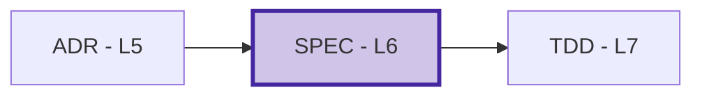
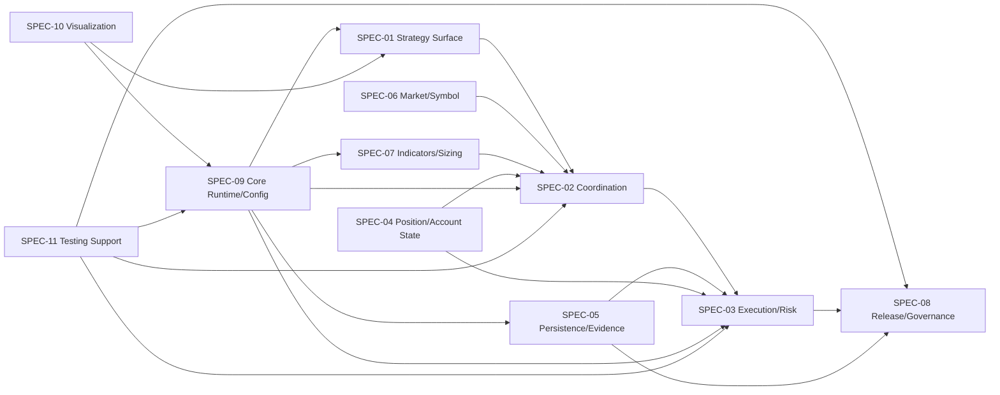

# SPEC-00: Technical Specification Index

## Position in Document Workflow

**Layer**: 6 (Technical Specification Layer)  
**Upstream**: BRD, PRD, EARS, BDD, ADR  
**Downstream**: TDD (Test-Driven Development, Layer 7)  
**Traceability chain**: BRD -> PRD -> EARS -> BDD -> ADR -> SPEC -> TDD -> IPLAN -> Code

## Purpose

SPEC defines the component-level implementation contracts for TradeSpine: interfaces, data models, behavior contracts, dependencies, and downstream TDD targets. These files preserve the approved ADR decisions while translating the BRD, PRD, EARS, and BDD chain into buildable MQL5 component boundaries.

## Document Registry

| ID | Component | Primary ADR Ref | TDD Target | Status | YAML | Readable | Latest Audit | Last Updated |
| --- | --- | --- | --- | --- | --- | --- | --- | --- |
| SPEC-01 | Strategy Authoring Surface | ADR-09 | TDD-01 | Draft, TDD-ready 93/100 | [YAML](SPEC-01_strategy_authoring_surface/SPEC-01_strategy_authoring_surface.yaml) | [Markdown](SPEC-01_strategy_authoring_surface/SPEC-01_strategy_authoring_surface.readable.md) | [Corpus v004 PASS](SPEC-00.A_audit_report_v004.md) | 2026-06-02 |
| SPEC-02 | Trade Coordination Pipeline | ADR-04, ADR-08, ADR-09 | TDD-02 | Draft, TDD-ready 94/100 | [YAML](SPEC-02_trade_coordination_pipeline/SPEC-02_trade_coordination_pipeline.yaml) | [Markdown](SPEC-02_trade_coordination_pipeline/SPEC-02_trade_coordination_pipeline.readable.md) | [Corpus v004 PASS](SPEC-00.A_audit_report_v004.md) | 2026-06-02 |
| SPEC-03 | Guarded Execution and Risk Controls | ADR-04, ADR-06, ADR-09 | TDD-03 | Draft, TDD-ready 94/100 | [YAML](SPEC-03_guarded_execution_and_risk_controls/SPEC-03_guarded_execution_and_risk_controls.yaml) | [Markdown](SPEC-03_guarded_execution_and_risk_controls/SPEC-03_guarded_execution_and_risk_controls.readable.md) | [Corpus v004 PASS](SPEC-00.A_audit_report_v004.md) | 2026-06-02 |
| SPEC-04 | Position Account Mode and State | ADR-02, ADR-07, ADR-08 | TDD-04 | Draft, TDD-ready 95/100 | [YAML](SPEC-04_position_account_mode_and_state/SPEC-04_position_account_mode_and_state.yaml) | [Markdown](SPEC-04_position_account_mode_and_state/SPEC-04_position_account_mode_and_state.readable.md) | [Corpus v004 PASS](SPEC-00.A_audit_report_v004.md) | 2026-06-02 |
| SPEC-05 | Persistence and Audit Evidence | ADR-02, ADR-03, ADR-05 | TDD-05 | Draft, TDD-ready 94/100 | [YAML](SPEC-05_persistence_and_audit_evidence/SPEC-05_persistence_and_audit_evidence.yaml) | [Markdown](SPEC-05_persistence_and_audit_evidence/SPEC-05_persistence_and_audit_evidence.readable.md) | [Corpus v004 PASS](SPEC-00.A_audit_report_v004.md) | 2026-06-02 |
| SPEC-06 | Market Session and Symbol Context | ADR-04, ADR-06, ADR-10 | TDD-06 | Draft, TDD-ready 92/100 | [YAML](SPEC-06_market_session_and_symbol_context/SPEC-06_market_session_and_symbol_context.yaml) | [Markdown](SPEC-06_market_session_and_symbol_context/SPEC-06_market_session_and_symbol_context.readable.md) | [Corpus v004 PASS](SPEC-00.A_audit_report_v004.md) | 2026-06-02 |
| SPEC-07 | Indicators Stops Sizing and Trailing | ADR-04, ADR-09, ADR-10 | TDD-07 | Draft, TDD-ready 93/100 | [YAML](SPEC-07_indicators_stops_sizing_trailing/SPEC-07_indicators_stops_sizing_trailing.yaml) | [Markdown](SPEC-07_indicators_stops_sizing_trailing/SPEC-07_indicators_stops_sizing_trailing.readable.md) | [Corpus v004 PASS](SPEC-00.A_audit_report_v004.md) | 2026-06-02 |
| SPEC-08 | Release Testing and Documentation Governance | ADR-06, ADR-07, ADR-10 | N/A - documentation/process scope | Draft, governance-ready | [YAML](SPEC-08_release_testing_and_documentation_governance/SPEC-08_release_testing_and_documentation_governance.yaml) | [Markdown](SPEC-08_release_testing_and_documentation_governance/SPEC-08_release_testing_and_documentation_governance.readable.md) | [Corpus v005 SUPERSEDES v004](SPEC-00.A_audit_report_v005.md) | 2026-06-03 |
| SPEC-09 | Core Runtime and Configuration | ADR-03, ADR-09, ADR-10 | TDD-09 | Draft, TDD-ready 93/100 | [YAML](SPEC-09_core_runtime_and_configuration/SPEC-09_core_runtime_and_configuration.yaml) | [Markdown](SPEC-09_core_runtime_and_configuration/SPEC-09_core_runtime_and_configuration.readable.md) | [Corpus v004 PASS](SPEC-00.A_audit_report_v004.md) | 2026-06-02 |
| SPEC-10 | Visualization Optional Services | ADR-03, ADR-10 | TDD-10 | Draft, TDD-ready 91/100 | [YAML](SPEC-10_visualization_optional_services/SPEC-10_visualization_optional_services.yaml) | [Markdown](SPEC-10_visualization_optional_services/SPEC-10_visualization_optional_services.readable.md) | [Corpus v004 PASS](SPEC-00.A_audit_report_v004.md) | 2026-06-02 |
| SPEC-11 | Testing Support and Harnesses | ADR-06, ADR-07, ADR-08, ADR-10 | TDD-11 | Draft, TDD-ready 94/100 | [YAML](SPEC-11_testing_support_and_harnesses/SPEC-11_testing_support_and_harnesses.yaml) | [Markdown](SPEC-11_testing_support_and_harnesses/SPEC-11_testing_support_and_harnesses.readable.md) | [Corpus v004 PASS](SPEC-00.A_audit_report_v004.md) | 2026-06-02 |

## Dependency Order

## Coverage Notes

- Account mode, hedging ticket ownership, deferred netting/exchange init failure, and position state transitions are specified in SPEC-04.
- Signal-to-order conversion, lifecycle gating, strategy hooks, and coordinator flow are specified in SPEC-01 and SPEC-02.
- Per-order safety guards, separate CRiskManager runtime controls, and bypass policy are specified in SPEC-03.
- Market session, user-defined trading hours, one-day contract expiration warning, broker symbol readiness, and day-trade close behavior are specified in SPEC-06.
- Documentation governance, deferred account-mode evidence, and release gates are specified in SPEC-08.
- Core runtime configuration, common inputs, optimization-aware diagnostics, SafeMath, profiling, and new-bar helpers are specified in SPEC-09.
- Optional visualization services are specified in SPEC-10 and remain isolated from execution and state correctness.
- Test doubles, scenario harnesses, Tier-1/Tier-1.5 support, and deferred account-mode evidence contracts are specified in SPEC-11.

## Quality Gate

SPEC requires **TDD-ready score >=90/100** before downstream TDD generation. All current SPEC documents meet the gate.

Latest corpus audit: [SPEC-00.A v004 PASS](SPEC-00.A_audit_report_v004.md).

## Related Documents

- [ADR-00](../05_ADR/ADR-00_index.md)
- [BDD-01](../04_BDD/BDD-01_tradespine_acceptance_scenarios/BDD-01_tradespine_acceptance_scenarios.yaml)
- [EARS-01](../03_EARS/EARS-01_tradespine_formal_requirements/EARS-01_tradespine_formal_requirements.yaml)
- [PRD-01](../02_PRD/PRD-01_tradespine_platform_requirements/PRD-01_tradespine_platform_requirements.yaml)
- [BRD-01](../01_BRD/BRD-01_platform_tradespine_framework/BRD-01_platform_tradespine_framework.yaml)

---

**Last Updated**: 2026-06-02  
**Maintainer**: phbr
