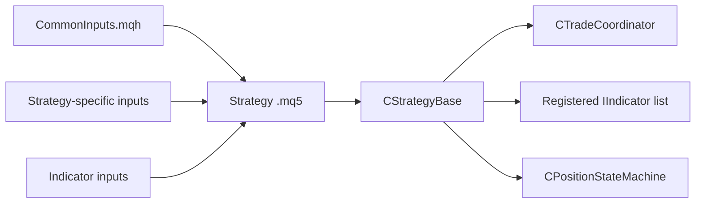

# SPEC-01: Strategy Authoring Surface

## Document Control

| Field | Value |
| --- | --- |
| Status | Draft |
| Version | 1.1 |
| Component | CStrategyBase and strategy template surface |
| TDD-ready Score | 93/100 |
| Architecture Decision | ADR-09 |
| TDD Target | TDD-01 |

## Overview

The strategy authoring surface defines the base class, strategy-specific inputs, inherited indicator inputs, helper methods, exit-management hooks, event hook contract, common input include, and template requirements that keep strategy files focused on signal logic and behavior selection.

## Interfaces

| Export | Type | Purpose |
| --- | --- | --- |
| CStrategyBase | class | Owns lifecycle staging, helper methods, and strategy hooks. |
| OnStrategyInit | virtual method | Lets a strategy install indicators and configure policies before live trading. |
| OpenLong | method | Requests a long entry through the coordinator pipeline. |
| OpenShort | method | Requests a short entry through the coordinator pipeline. |
| CloseAll | method | Requests closure of this strategy instance's owned exposure. |
| OnManagePosition | virtual method | Lets strategy code manage signal exits, trailing stops, partial management, and other post-entry exit behavior. |
| RegisterIndicator | method | Registers an indicator for readiness-gate enforcement. |

## Data Models

| Model | Purpose |
| --- | --- |
| StrategyLifecyclePhase | Tracks construct, framework-init, strategy-init, and live phases. |
| StrategyIdentity | Captures account, symbol, and ulong magic for ownership and evidence. |
| CommonInputSet | Defines ordered input groups for identity, risk, execution, sessions, sizing, lifecycle, visualization, and logging. |
| StrategyInputSet | Captures strategy-specific inputs and indicator inputs exposed for Strategy Tester optimization. |

## Behavior

- Strategy files SHALL delegate entries and exits through documented TradeSpine helpers.
- Each shipped v1 strategy artifact, including simple samples and hedging ports, SHALL compile as one strategy `.mq5` file plus shared TradeSpine includes.
- Registered indicators that are not ready SHALL block entries.
- Strategy files SHALL declare their own strategy-specific inputs and the inputs of the indicators they use so signal behavior and indicator parameters are optimizer-visible.
- Exit management is strategy-owned: entry-time SL/TP, signal exits, trailing stops, partial closes, and `CloseAll` are distinct mechanisms that may coexist but route through TradeSpine helpers or position-context operations.
- The component moves from strategy-init to live only after framework modules, strategy init, symbol context, and required overrides are valid.
- Helper calls before live are rejected without broker submission.

## Implementation Notes

- Strategy authors MUST NOT override or process `OnTradeTransaction` beyond framework shim delegation.
- Sub-maintenance-cadence periodic trade logic belongs in `OnTickEvent`, not `OnTimerEvent`.
- `Signal` is framework-internal and MUST NOT become a strategy-authored API.
- The concrete strategy class owns signal decisions, strategy-specific inputs, indicator inputs, and post-entry exit-management decisions.
- Policy objects are composed as strategy members and selected through `GetSizer`, `GetStopPolicy`, and trailing hooks.
- `CloseAll` remains an explicit exposure-close request; signal exits and trailing stops belong in strategy management hooks and remain distinct from entry-time SL/TP.

## TDD Contract

| Test File | Coverage |
| --- | --- |
| `Scripts/Tests/Test_StrategyBase.mq5` | Lifecycle phase gating, helper routing, required override failures, exit-management hook routing, and indicator registration. |
| `Scripts/Tests/Test_StrategyTemplateCompile.mq5` | Simple sample and hedging port packaging plus include-path contract. |
| `Scripts/Tests/Test_AuthoringDocsChecklist.mq5` | Authoring guide, common inputs, strategy-specific inputs, and indicator-input coverage evidence. |

## Traceability

`@spec: SPEC-01`, `@brd: BRD.01.07.88a6`, `@prd: PRD.01.09.eaf3`, `@ears: EARS.01.03.b784`, `@bdd: BDD.01.03.aa68`, `@adr: ADR.09.03.84b9`
