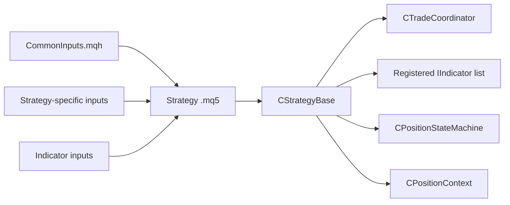

# SPEC-01: Strategy Authoring Surface

> Human-readable rendering generated from `SPEC-01_strategy_authoring_surface.yaml`. The YAML file remains the canonical aidoc artifact.

## Document Control

| Field | Value |
| --- | --- |
| Status | Draft |
| Version | 1.3 |
| Component | CStrategyBase and strategy template surface |
| TDD-ready Score | 93/100 |
| CHG References | @chg: CHG-22, @chg: CHG-23 |
| Created | 2026-06-02T00:20:00-03:00 |
| Updated | 2026-08-27T00:00:00-03:00 |

## Overview

The strategy authoring surface defines the base class, strategy-specific input contract, inherited indicator input contract, helper methods, exit-management hooks, event hook contract, common input include, and template requirements that keep strategy files focused on signal logic and behavior selection.

```mermaid
flowchart LR
  StrategyFile["Strategy .mq5"] --> Base["CStrategyBase"]
  CommonInputs["CommonInputs.mqh"] --> StrategyFile
  StrategyInputs["Strategy-specific inputs"] --> StrategyFile
  IndicatorInputs["Indicator inputs"] --> StrategyFile
  Base --> Coordinator["CTradeCoordinator"]
  Base --> Indicators["Registered IIndicator list"]
  Base --> StateMachine["CPositionStateMachine"]
  Base --> PositionContext["CPositionContext"]
```

## Interfaces

| Export | Type | Signature | Purpose | Errors |
| --- | --- | --- | --- | --- |
| CStrategyBase | class | class CStrategyBase | Base class that owns lifecycle staging, helper methods, and strategy hooks. | INIT_FAILED: required strategy initialization or signal timeframe contract is missing. |
| OnStrategyInit | virtual method | bool OnStrategyInit() | Strategy hook used to install indicators and configure behavior policies before live trading. | false: strategy initialization is rejected before phase Live. |
| OpenLong | method | ulong OpenLong(string comment, double sl_price = 0, double tp_price = 0, string metadata = "") | Requests a long entry through the coordinator pipeline. | 0: lifecycle, readiness, validation, sizing, or guard rejection. |
| OpenShort | method | ulong OpenShort(string comment, double sl_price = 0, double tp_price = 0, string metadata = "") | Requests a short entry through the coordinator pipeline. | 0: lifecycle, readiness, validation, sizing, or guard rejection. |
| CloseAll | method | bool CloseAll(string reason) | Requests closure of this strategy instance's owned exposure through the coordinator close branch. | false: ownership is unknown, close is rejected, or strategy is halted. |
| OnManagePosition | virtual method | void OnManagePosition() | Strategy hook for signal exits, trailing-stop decisions, partial-management logic, and other post-entry exit management distinct from entry-time SL/TP and CloseAll. | None; invalid management actions are rejected by helper, guard, or position-context calls. |
| RegisterIndicator | method | bool RegisterIndicator(IIndicator *indicator) | Registers an indicator for readiness-gate enforcement. | false: indicator reference is invalid or strategy init phase has passed. |
| OnTimer | framework event method | void OnTimer() | Framework timer event that delegates maintenance to CPositionContext.OnMaintenance(now). Strategy-authored sub-maintenance-cadence trade logic remains in the deferred OnTickEvent surface (CHG-22). | None; maintenance failures are routed through owned components. |
| OnTickEvent | virtual method | void OnTickEvent() | Deferred v1 strategy-authored hook; IPLAN-01 will implement invocation after framework lifecycle, HALT, and readiness gates. | Deferred until IPLAN-01; state-changing requests remain subject to coordinator and guarded-execution results. |
| OnTradeTransaction | framework event method | void OnTradeTransaction(const MqlTradeTransaction &trans, const MqlTradeRequest &request, const MqlTradeResult &result) | Deferred v1 event surface; IPLAN-01 will assemble production wiring to CPositionContext.RouteTradeTransaction. | Deferred until IPLAN-01; missing or ambiguous evidence is classified by the position module. |
| OnDeinit | framework event method | void OnDeinit(const int reason) | Deferred v1 teardown surface; IPLAN-01 will stop the timer and delegate owned component teardown. | Deferred until IPLAN-01; durable state/evidence must not be cleared implicitly. |

## Data Models

| Model | Type | Purpose |
| --- | --- | --- |
| StrategyLifecyclePhase | enum |  |
| StrategyIdentity | struct |  |
| CommonInputSet | include contract |  |
| StrategyInputSet | include contract |  |

## Behavior

- Strategy files SHALL delegate entries and exits through documented TradeSpine helpers.
- Each shipped v1 strategy artifact, including simple samples and hedging ports, SHALL compile as one strategy mq5 file plus shared TradeSpine includes.
- Registered indicators that are not ready SHALL block entries.
- Strategy files SHALL declare their own strategy-specific inputs and the inputs of the indicators they use so both signal behavior and indicator parameters are optimizer-visible.
- Exit management SHALL be strategy-owned: entry-time SL/TP, signal exits, trailing stops, partial closes, and CloseAll are distinct mechanisms that may coexist but MUST route through TradeSpine helpers or position-context operations.
- CStrategyBase SHALL register a timer during framework initialization, kill it on deinitialization, and call CPositionContext.OnMaintenance(now) from OnTimer for framework maintenance, lease heartbeat, and reconciliation work (CHG-22).

| From | To | Trigger | Source |
| --- | --- | --- | --- |
| Strategy-init | Live | Framework modules, strategy init, symbol context, and required overrides are valid. | @bdd: BDD.01.03.aa68 |

### Error Handling

| Condition | Response | Source |
| --- | --- | --- |
| A helper is called before Live. | Reject helper request and return failure without broker submission. | @bdd: BDD.01.03.9a8b |

## Implementation Notes

- When implemented by IPLAN-01, strategy authors MUST NOT override or process OnTradeTransaction beyond the framework shim delegation.
- Sub-maintenance-cadence strategy-authored trade logic belongs in the deferred OnTickEvent surface, not OnTimerEvent; framework maintenance, lease heartbeat, and reconciliation work is timer-driven through OnTimer and CPositionContext.OnMaintenance (CHG-22).
- Signal is framework-internal and MUST NOT become a strategy-authored API.
- CStrategyBase exposes lifecycle hooks and helper methods; the concrete strategy class owns signal decisions, strategy-specific inputs, indicator inputs, and post-entry exit-management decisions.
- Compose policy objects as strategy members and select them through GetSizer, GetStopPolicy, and trailing hooks.
- Keep CloseAll as an explicit strategy-exposure close request; keep signal exits and trailing stops in OnManagePosition or strategy hooks so they remain distinct from entry-time SL/TP.
- Use classes for lifecycle/stateful concerns and pure namespaces for stateless calculations per ADR-10.
- Optimization-aware branches SHALL skip logging, drawing, and persistence work not required for accepted audit output.
- Matched release benchmarks use the same terminal/build/data/settings and at least 1,000 warm-up plus 10,000 measured idle callbacks. Median idle tick must be <=50 us and matched median tester overhead <=10%; p95 and the measurement window are reported. Under backlog, lease/HALT/risk maintenance wins, new entries block, and drawing/nonessential diagnostics shed first.
- Each EA instance uses one serial, non-reentrant MQL5 event queue. Separate EA/chart instances coordinate only through the SPEC-04/SPEC-05 token-fenced marker lease.

## TDD Contract

| Test File | Coverage |
| --- | --- |
| Scripts/Tests/Test_StrategyBase.mq5 | Lifecycle phase gating, helper routing, required override failures, exit-management hook routing, indicator registration, timer registration/teardown, and OnMaintenance delegation. |
| Scripts/Tests/Test_StrategyTemplateCompile.mq5 | Simple sample and hedging port packaging plus include-path contract. |
| Scripts/Tests/Test_AuthoringDocsChecklist.mq5 | Authoring guide, CommonInputs, strategy-specific inputs, and indicator-input coverage evidence. |

## Traceability

| Trace Type | References |
| --- | --- |
| tags | @spec: SPEC-01, @brd: BRD.01.07.88a6, @prd: PRD.01.09.eaf3, @ears: EARS.01.03.b784, @bdd: BDD.01.03.aa68, @adr: ADR.09.03.84b9, @chg: CHG-22 |
| upstream | adr_references: @adr: ADR.01.03.42e3, @adr: ADR.09.03.84b9, @adr: ADR.10.03.51ea, bdd_references: @bdd: BDD.01.03.aa68, @bdd: BDD.01.03.c0f6, @bdd: BDD.01.03.7b02, ears_references: @ears: EARS.01.03.4c3f, @ears: EARS.01.03.b784, @ears: EARS.01.03.0c0a, @ears: EARS.01.03.4e80, prd_references: @prd: PRD.01.09.5ef1, @prd: PRD.01.09.eaf3, @prd: PRD.01.09.5963, brd_references: @brd: BRD.01.07.88a6, @brd: BRD.01.07.a94e |
| downstream | type: TDD; layer: 7; description: Strategy authoring, lifecycle, and template compile test cases. |
| health_score | tdd_ready: 93%, target_score: >=90/100 |
