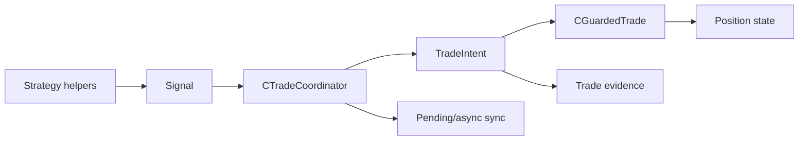

# SPEC-02: Trade Coordination Pipeline

## Document Control

| Field | Value |
| --- | --- |
| Status | Draft |
| Version | 1.1 |
| Component | CTradeCoordinator, Signal, TradeIntent |
| TDD-ready Score | 94/100 |
| Architecture Decision | ADR-09 |
| TDD Target | TDD-02 |

## Overview

The trade coordination pipeline is the normalization and synchronization layer between strategy decisions and broker-bound execution. It converts strategy helper requests into canonical `TradeIntent` records, resolves order-definition details through strategy-selected policies, delegates guarded submission, synchronizes pending-entry and async order outcomes, and emits paired audit evidence; it does not decide whether the strategy should enter or exit.

## Interfaces

| Export | Type | Purpose |
| --- | --- | --- |
| CTradeCoordinator | class | Normalizes helper requests, delegates guarded execution, synchronizes pending/async outcomes, and reports broker responses without making strategy decisions. |
| ProcessSignal | method | Converts canonical strategy signals into validated trade intents. |
| Update | method | Runs pending-entry, async-fill, timeout, and reconciliation bookkeeping outside normal entry flow. |
| Signal | struct | Carries internal direction, market-entry mode, optional requested price placeholder, stops, comment, and metadata. |
| TradeIntent | struct | Carries normalized order definition, risk, timestamp, symbol, magic, comment, and evidence metadata before guarded broker handoff. |

## Data Models

| Model | Purpose |
| --- | --- |
| Signal | Internal strategy request normalized by the coordinator, including `entry_mode`, optional `entry_price`, SL/TP, comment, and compact metadata. |
| TradeIntent | Order definition with resolved entry, stops, lots, risk percent, timestamp, symbol, magic, comment, and audit metadata. |

## Behavior

- Entry and exit helper requests SHALL route through documented TradeSpine helper calls and coordinator processing.
- CTradeCoordinator SHALL NOT decide strategy intent, including flat/non-flat entry policy, signal exits, or trailing invocation; those decisions remain in the strategy layer.
- Intent evidence SHALL be written before accepted broker submission.
- Execution evidence SHALL be written after broker outcome reconciliation.
- Market entries ignore accidental `Signal.entry_price` and resolve against current broker-side bid/ask context.
- Entry stop failures, zero-distance stops, or side-inverted stop topology reject before sizing and broker submission.
- Accepted pending submissions move from flat to pending-entry.
- Indicator readiness is evaluated by the strategy layer before helper requests reach coordinator processing; the coordinator may reject not-ready requests defensively but does not own readiness decisions.
- Pending-entry and async order creation/execution synchronization is owned by the coordinator update path and reported to the shared position state machine.
- Unsupported v1 pending-entry modes are rejected without broker submission.
- Invalid stop policy output records a strategy diagnostic and blocks `TradeIntent` submission.

## Implementation Notes

- The coordinator owns internal `Signal` to `TradeIntent` conversion.
- Strategy code should not directly construct broker orders.
- Strategy code owns entry, exit, pyramiding/flat-only, indicator-readiness, and trailing decisions.
- The coordinator delegates broker-bound checks to guarded execution.
- `Signal` stays strategy-friendly while `TradeIntent` carries normalized order definition, broker/audit identity fields, and evidence metadata.
- Pending placement, async fill observation, timeout, cancel ambiguity, and final broker-response reporting route through the coordinator update path.
- Accepted broker outcomes must preserve both pre-submit intent evidence and post-outcome execution evidence.

## TDD Contract

| Test File | Coverage |
| --- | --- |
| `Scripts/Tests/Test_Coordinator.mq5` | Helper routing, defensive readiness rejection, policy resolution, evidence ordering, and absence of strategy-decision policy. |
| `Scripts/Tests/Test_CoordinatorUpdate.mq5` | Pending-entry, async-fill, timeout, cancel-ambiguity, and reconciliation handoff. |
| `Scripts/Tests/Test_TradeIntentEvidence.mq5` | Intent and execution evidence pairing. |

## Traceability

`@spec: SPEC-02`, `@brd: BRD.01.07.88a6`, `@prd: PRD.01.09.eaf3`, `@ears: EARS.01.03.b784`, `@bdd: BDD.01.03.0073`, `@adr: ADR.09.03.84b9`
