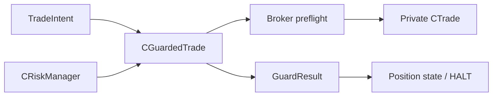

# SPEC-03: Guarded Execution and Risk Controls

## Document Control

| Field | Value |
| --- | --- |
| Status | Draft |
| Version | 1.1 |
| Component | CGuardedTrade and CRiskManager |
| TDD-ready Score | 94/100 |
| Architecture Decision | ADR-04 |
| TDD Target | TDD-03 |

## Overview

Guarded execution is the broker boundary component that validates framework-mediated `TradeIntent` objects for internal consistency, applies per-order catastrophic guards, performs broker preflight checks, and submits through a private vendored `CTrade` instance. Runtime account/strategy risk controls are a separate `CRiskManager` module that evaluates daily loss, open lots, trade count, and panic-stop state before entries and emergency closes.

## Interfaces

| Export | Type | Purpose |
| --- | --- | --- |
| ITradePort | interface | Broker-bound execution boundary for coordinator and adapters. |
| CGuardedTrade | class | Performs TradeIntent consistency validation, catastrophic guards, broker preflight, and private `CTrade` submission. |
| CRiskManager | class | Tracks daily-loss, max-open-lots, max-trades-per-day, and panic-stop state separately from per-order guarded execution. |
| FillingPolicy | class | Selects broker-supported fill mode from initialized symbol metadata. |
| SpreadGuard | class | Applies spread and price-grid checks before broker handoff. |
| GuardResult | struct | Reports accepted, rejected, submitted, ambiguous, and safety-trip outcomes. |

## Data Models

| Model | Purpose |
| --- | --- |
| GuardResult | Carries validation status, broker result, OrderCheck retcode, broker retcode, ticket, submitted price/lots, retryability, and ambiguity status. |
| RiskControlState | Tracks daily-loss, max-open-lots, max-trades-per-day, and panic-stop trip status. |

## Behavior

- Framework-mediated catastrophic safety violations SHALL be rejected before broker handoff.
- Daily loss, max open lots, max trades per day, and panic trips SHALL refuse new entries and trigger strategy-scoped close behavior.
- `CRiskManager` owns daily-loss, max-open-lots, max-trades-per-day, and panic-stop evaluation; `CGuardedTrade` owns per-order `TradeIntent` consistency, catastrophic caps, broker preflight, and private `CTrade` submission.
- `CGuardedTrade` rejects internally inconsistent order definitions before broker handoff, including non-positive lots, invalid entry price, side-inverted stops, zero risk distance, and off-grid lots or prices.
- Panic stop SHALL close only the strategy instance's virtual position or tickets.
- Filling mode, lot grid, price grid, stop distance, spread, margin, and OrderCheck must pass before private `CTrade` submission.
- Unknown broker retcodes or unresolved retry outcomes are treated as failsafe ambiguity, not success.
- A runtime risk control trip moves risk-control state from clear to tripped.
- Catastrophic validation failure returns rejection and does not call private `CTrade`.
- Ambiguous broker or retcode outcomes request HALT through the state-machine and reconciliation path.
- Retryable broker retcodes use a bounded retry policy and HALT when the final outcome remains ambiguous.
- OrderCheck or margin failures reject with preflight evidence and do not call private `CTrade`.

## Implementation Notes

- Strategy and framework modules do not bypass guarded execution for broker submission.
- Runtime risk controls are distinct from per-order catastrophic checks.
- `CGuardedTrade` consumes risk state as an environmental gate only; it does not own daily-loss, max-open-lots, max-trades-per-day, or panic-stop policy.
- `CRiskManager` does not submit broker orders directly; emergency close requests route back through strategy/coordinator/guarded execution paths.
- Panic close behavior must preserve strategy ownership boundaries in both netting and hedging modes.
- `GuardResult` preserves normalized submitted price/lots and broker retcodes so execution logs can compare intended versus actual outcome.
- Bypass scans are part of release governance and evidence.

## TDD Contract

| Test File | Coverage |
| --- | --- |
| `Scripts/Tests/Test_GuardedTrade.mq5` | TradeIntent consistency validation, catastrophic validation, broker preflight, and guarded submission outcomes. |
| `Scripts/Tests/Test_RiskManager.mq5` | CRiskManager daily-loss, max-lots, max-trades, and panic-stop trips. |
| `Scripts/Tests/Test_BrokerBypassScan.mq5` | Evidence that broker-bound calls are routed through the guard boundary. |

## Traceability

`@spec: SPEC-03`, `@brd: BRD.01.07.a94e`, `@prd: PRD.01.09.d74e`, `@ears: EARS.01.03.222f`, `@bdd: BDD.01.03.9a8b`, `@adr: ADR.04.03.7277`
