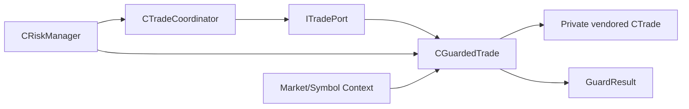

# SPEC-03: Guarded Execution and Risk Controls

> Human-readable rendering generated from `SPEC-03_guarded_execution_and_risk_controls.yaml`. The YAML file remains the canonical aidoc artifact.

## Document Control

| Field | Value |
| --- | --- |
| Status | Draft |
| Version | 1.5 |
| Component | CGuardedTrade and CRiskManager |
| TDD-ready Score | 92/100 |
| CHG References | CHG-21, CHG-22 |
| Created | 2026-06-02T00:20:00-03:00 |
| Updated | 2026-08-24T00:00:00-03:00 |

## Overview

Guarded execution is the broker boundary component that validates framework-mediated TradeIntent objects for internal consistency, applies per-order catastrophic guards, performs broker preflight checks, and submits through a private vendored CTrade instance. Runtime account/strategy risk controls are a separate CRiskManager module that evaluates daily loss, open lots, trade count, and panic-stop state before entries and emergency closes.

```mermaid
flowchart LR
  Coord["CTradeCoordinator"] --> Port["ITradePort"]
  Port --> Guard["CGuardedTrade"]
  Risk["CRiskManager"] --> Coord["CTradeCoordinator"]
  Risk --> Guard
  Market["Market/Symbol Context"] --> Guard
  Guard --> Vendored["Private vendored CTrade"]
  Guard --> Result["GuardResult"]
```

## Interfaces

| Export | Type | Signature | Purpose | Errors |
| --- | --- | --- | --- | --- |
| ITradePort | interface | interface ITradePort { GuardResult Submit(const TradeIntent &intent); } | Submission seam used by coordinator and mocks. The TradeIntent argument is the canonical type from Include/Core/TradeTypes.mqh (SPEC-02 extends it); CGuardedTrade consumes that shared definition rather than a private struct (CHG-21). | GuardResult rejected: validation, risk, market, OrderCheck, margin, fill, or broker outcome failed. |
| ITradeExecutor | interface | interface ITradeExecutor { CloseTicket(ticket,lots); ModifyTicket(ticket,sl,tp); CancelOrder(order_ticket); } | Guarded close/modify/cancel seam consumed by the Position layer. IPLAN-04 declares and fake-tests the seam; CGuardedTrade implements it in IPLAN-03 (CHG-22). | false: close, modify, or cancel rejected by guard, broker, or ownership policy. |
| CGuardedTrade | class | class CGuardedTrade : public ITradePort | Validates and submits TradeIntent through a private vendored CTrade. | GuardResult halted: broker outcome is ambiguous or ownership cannot be proven. |
| CRiskManager | class | class CRiskManager | Tracks strategy-scoped daily loss, open lots, trade count, and panic-stop state independently from per-order guarded execution. | RiskTrip: new entries are refused and strategy-scoped close behavior is requested. |
| FillingPolicy | class | class FillingPolicy | Selects and validates broker-supported fill mode from initialized symbol metadata before submission. | UnsupportedFill: no allowed filling mode is compatible with the requested order. |
| SpreadGuard | class | class SpreadGuard | Applies symbol-aware spread and price-grid checks before broker handoff. | SpreadBlocked: current market spread exceeds configured strategy guard. |
| GuardResult | struct | struct GuardResult | Submission outcome returned to the coordinator. | None; contains status and reason fields. |

## Data Models

| Model | Type | Purpose |
| --- | --- | --- |
| GuardResult | struct |  |
| RiskControlState | struct |  |

## Behavior

- Framework-mediated catastrophic safety violations SHALL be rejected before broker handoff.
- Daily loss, max open lots, max trades per day, and panic trips SHALL refuse new entries and trigger strategy-scoped close behavior.
- CRiskManager SHALL own daily-loss, max-open-lots, max-trades-per-day, and panic-stop evaluation; CGuardedTrade SHALL own per-order TradeIntent consistency, catastrophic caps, broker preflight, and private CTrade submission.
- CGuardedTrade SHALL reject internally inconsistent order definitions before broker handoff, including non-positive lots, invalid entry price, side-inverted stops, zero risk distance, and off-grid lots or prices.
- Panic stop SHALL close only the strategy instance's virtual position or tickets.
- Filling mode, lot grid, price grid, stop distance, spread, margin, and OrderCheck SHALL all pass before private CTrade submission.
- Unknown broker retcodes or unresolved retry outcomes SHALL be treated as failsafe ambiguity, not as success.
- CGuardedTrade SHALL implement the ITradeExecutor close/modify/cancel seam used by Position adapters and CPositionStateMachine timeout-cancel handling (CHG-22).

| From | To | Trigger | Source |
| --- | --- | --- | --- |
| RiskControlState clear | RiskControlState tripped | Runtime risk control trips. | @bdd: BDD.01.03.0ad7 |

### Error Handling

| Condition | Response | Source |
| --- | --- | --- |
| Catastrophic validation fails. | Return rejection and do not call private CTrade. | @bdd: BDD.01.03.9a8b |
| Broker or retcode outcome is ambiguous after submission. | Request HALT through state-machine/reconciliation path. | @bdd: BDD.01.03.e16a |
| Retryable broker retcode is returned. | Apply the configured bounded retry policy; HALT if final outcome remains ambiguous. | @ears: EARS.01.03.588b |
| OrderCheck or margin validation fails. | Reject with preflight evidence and do not call private CTrade. | @bdd: BDD.01.03.9a8b |
| Broker returns TRADE_RETCODE_DONE_PARTIAL. | Set status to partial; record filled_lots from broker response; treat as deterministic — ambiguous: false, retryable: false. | @ears: EARS.01.03.ec72 |
| Guarded close, modify, or cancel cannot be safely submitted or confirmed. | Return false/guard rejection to Position; Position owns follow-up HALT or reconciliation policy (CHG-22). | CHG-22 |

## Implementation Notes

- CGuardedTrade owns the only private CTrade instance reachable from framework-mediated execution.
- Strategy files MUST NOT include terminal-global Trade.mqh or call raw broker execution APIs.
- OrderCheck and explicit margin validation are separate guard stages.
- CGuardedTrade MUST NOT become the owner of daily-loss, max-open-lots, max-trades-per-day, or panic-stop policy; it consumes CRiskManager state as an environmental gate only.
- CRiskManager MUST NOT submit broker orders directly; emergency close requests route back through strategy/coordinator/guarded execution paths.
- Execution-owned test fixtures MUST supply spread, fill-mode, OrderCheck, margin, broker-retcode, and private CTrade outcome scenarios; do not add those fields to FakeMarketContext (CHG-19).
- CGuardedTrade implements ITradeExecutor in IPLAN-03; IPLAN-04 ships only the seam and fake executor needed by position tests (CHG-22).
- Use composition around vendored CTrade because convenience methods are not virtual.
- Classify retcodes into success, pending, retryable, terminal failure, and unknown-failsafe groups.
- Store normalized submitted price/lots and broker retcodes in GuardResult so trade evidence can compare intended versus actual outcome.
- Rejected orders should emit diagnostics without adding optimization-mode I/O unless audit in optimization is enabled.

## TDD Contract

| Test File | Coverage |
| --- | --- |
| Scripts/Tests/Test_GuardedTrade.mq5 | TradeIntent consistency validation, catastrophic caps, OrderCheck, margin, fill-mode, retcode classification, private CTrade boundary, and guarded close/modify/cancel executor seam. |
| Scripts/Tests/Test_RiskManager.mq5 | CRiskManager daily loss, open lots, trade count, and panic-stop trips. |
| Scripts/Tests/Test_BrokerBypassScan.mq5 | Release scan for raw broker bypass and terminal-global Trade includes. |

## Traceability

| Trace Type | References |
| --- | --- |
| tags | @spec: SPEC-03, @brd: BRD.01.07.a94e, @prd: PRD.01.09.d74e, @ears: EARS.01.03.222f, @bdd: BDD.01.03.9a8b, @adr: ADR.04.03.7277 |
| upstream | adr_references: @adr: ADR.04.03.7277, @adr: ADR.06.03.b277, @adr: ADR.09.03.84b9, bdd_references: @bdd: BDD.01.03.9a8b, @bdd: BDD.01.03.0ad7, @bdd: BDD.01.03.e16a, @bdd: BDD.01.03.ef54, ears_references: @ears: EARS.01.03.222f, @ears: EARS.01.03.7a9c, @ears: EARS.01.03.375b, @ears: EARS.01.03.f562, @ears: EARS.01.03.e20a, @ears: EARS.01.03.ec72, @ears: EARS.01.03.588b, prd_references: @prd: PRD.01.09.d74e, @prd: PRD.01.09.4fb4, @prd: PRD.01.14.8720, brd_references: @brd: BRD.01.07.a94e, @brd: BRD.01.08.0ce5 |
| downstream | type: TDD; layer: 7; description: Guarded execution, retcode, and runtime risk tests. |
| health_score | tdd_ready: 92%, target_score: >=90/100 |
