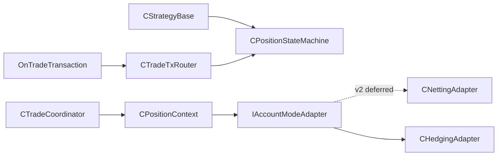

# SPEC-04: Position Account Mode and State

## Document Control

| Field | Value |
| --- | --- |
| Status | Draft |
| Version | 1.0 |
| Component | CPositionContext, adapters, router, and state machine |
| TDD-ready Score | 95/100 |
| Architecture Decision | ADR-07 |
| TDD Target | TDD-04 |

## Overview

The position component owns account-mode selection, strategy-scoped ownership queries and operations, transaction routing, and the per-strategy position state machine used by coordinator and recovery paths.

## Interfaces

| Export | Type | Purpose |
| --- | --- | --- |
| IAccountModeAdapter | interface | Mode-specific ownership and position operation contract. |
| CPositionContext | class | Selects the active adapter and exposes strategy-owned position queries. |
| CNettingAdapter | class | Deferred v2+ placeholder for netting and exchange-netting exposure through a virtual ledger and pending exits; v1 fails initialization before it can trade. |
| CHedgingAdapter | class | Tracks strategy exposure through magic-filtered broker tickets and orders. |
| CPositionStateMachine | class | Owns strategy position lifecycle transitions and HALT behavior. |

## Data Models

| Model | Purpose |
| --- | --- |
| VirtualPosition | Deferred v2+ strategy-scoped virtual identity, signed volume, average entry price, and lifecycle state. |
| PendingExitLink | Deferred v2+ broker pending-exit ticket, SL/TP role, and optional OCO sibling ticket. |
| StateTransition | From-state, to-state, and trigger evidence for broker events, timeout, reconciliation, panic, or day-trade transitions. |
| DuplicateMarker | Account, terminal, symbol, magic identity key with heartbeat and conflict/stale status. |
| ExecutionMutex | Deferred v2+ netting lock key, owner, and lease expiry for serialized ownership mutations. |
| RecoveryDecision | Resume, safe-clear, repair-ledger, or HALT decision with evidence. |

## Behavior

- Netting and exchange-netting modes SHALL fail initialization in v1 before any trade path, virtual ledger, pending-exit tracker, or execution mutex becomes active.
- Hedging adapter SHALL record strategy ownership against broker tickets or orders.
- Duplicate same-terminal account-symbol-magic identity SHALL fail or safely recover initialization.
- HALT SHALL block non-emergency helpers and preserve last-known state.
- Strategy-scoped v1 position state is sourced from hedging ticket evidence, GV-backed state, and broker reconciliation, not from broker aggregate position alone.
- Netting and exchange-netting execution paths are deferred v2+ and are not reachable in v1.
- External intervention detection reconciles strategy-owned state while preserving manual/non-TradeSpine exposure boundaries.
- Accepted pending entries move from flat to pending-entry.
- Async fill, cancel, or reconciliation ambiguity moves pending-entry to HALT.
- Failed day-trade close/cancel of all strategy-owned exposure moves active state to HALT.
- Netting and exchange-netting deferred-mode init-failure evidence is required for v1 release sign-off.
- Active duplicate markers fail initialization unless proven stale and safely recoverable.
- Pending-exit sibling, partial-fill, or cancel-origin ambiguity persists last-known state and enters HALT.

## Implementation Notes

- `CStrategyBase` owns one `CPositionStateMachine`; adapters, router, and coordinator receive references only.
- Netting MUST NOT infer strategy-owned state from `PositionSelect(symbol)` alone.
- Manual or non-TradeSpine exposure without this strategy magic MUST NOT perturb strategy state.
- Adapter selection comes from `ACCOUNT_MARGIN_MODE` during framework init.
- OCO links are deferred v2+ strategy-owned ledger records; v1 hedging uses broker-native ticket SL/TP.
- Duplicate marker heartbeat is written through the persistence boundary.
- Reconciliation broker scans run on init, trade transaction, explicit timer maintenance, or intervention detection, not on idle ticks.

## TDD Contract

| Test File | Coverage |
| --- | --- |
| `Scripts/Tests/Test_PositionStateMachine.mq5` | State transitions, cancel-origin disambiguation, HALT persistence, and safe auto-clear. |
| `Scripts/Tests/Test_AccountModeAdapters.mq5` | Hedging ticket ownership and netting/exchange deferred-mode init failure. |
| `Scripts/Tests/Test_AccountModeDeferred.mq5` | RETAIL_NETTING and EXCHANGE init failure, no side effects, no trade path activation, and release evidence. |

## Traceability

`@spec: SPEC-04`, `@brd: BRD.01.07.b44d`, `@prd: PRD.01.09.5cce`, `@ears: EARS.01.03.5d1b`, `@bdd: BDD.01.03.8180`, `@adr: ADR.07.03.6df1`
