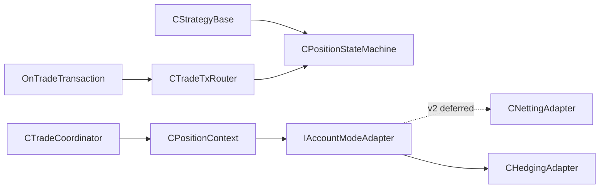

# SPEC-04: Position Account Mode and State

> Human-readable rendering generated from `SPEC-04_position_account_mode_and_state.yaml`. The YAML file remains the canonical aidoc artifact.

## Document Control

| Field | Value |
| --- | --- |
| Status | Draft |
| Version | 1.2 |
| Component | CPositionContext, adapters, router, and state machine |
| TDD-ready Score | 95/100 |
| CHG References | CHG-22, CHG-23 |
| Created | 2026-06-02T00:20:00-03:00 |
| Updated | 2026-08-26T00:00:00-03:00 |

## Overview

The position component owns account-mode selection, strategy-scoped ownership, transaction-hint filtering, and the per-strategy lifecycle. CHG-22 makes startup, timer maintenance, and transaction hints use one canonical broker reconciliation path; complete snapshots commit before memory changes; cancellation evidence includes origin and timestamps; HALT is absorbing until explicit safe recovery; and production broker evidence is supplied by separate read-only adapters.

```mermaid
flowchart LR
  Base["CStrategyBase"] --> SM["CPositionStateMachine"]
  Coord["CTradeCoordinator"] --> Pos["CPositionContext"]
  Tx["OnTradeTransaction"] --> Router["CTradeTxRouter"]
  Router --> SM
  Pos --> Adapter["IAccountModeAdapter"]
  Adapter -.->|v2 deferred| Netting["CNettingAdapter"]
  Adapter --> Hedging["CHedgingAdapter"]
```

## Interfaces

| Export | Type | Signature | Purpose | Errors |
| --- | --- | --- | --- | --- |
| IAccountModeProvider | interface | interface IAccountModeProvider { ENUM_ACCOUNT_MARGIN_MODE MarginMode(); } | Injectable account-mode source; CLiveAccountModeProvider is the production read-only implementation. | Deferred/unsupported mode fails context initialization before trading. |
| IAccountModeAdapter | interface | Exact typed surface in `Include/Position/AccountModeAdapter.mqh`: Init, mode/readiness/ownership queries, CloseTicket, ModifyTicket, CancelOrder, TrailSL, and capability queries. | Mode-specific ownership and position operation contract. | OperationRejected: ownership unknown, invalid lots, or unsupported mode operation. |
| CPositionContext | class | Exact typed surface in `Include/Position/PositionContext.mqh`: Init, OnDeinit, OnMaintenance, Recover, OnTick, RouteTradeTransaction, RepairExternalStops, Router, IsReady, and every IPositionView query. | Owns initialization order, runtime namespace, lease fencing, canonical reconciliation, and explicit HALT recovery; readiness follows proof, never precedes it. | INIT_FAILED: account mode, evidence, or duplicate identity cannot be initialized safely. |
| CNettingAdapter | class | class CNettingAdapter : public IAccountModeAdapter | Deferred v2+ placeholder for netting/exchange strategy exposure through virtual ledger and pending exits. In v1, selecting netting or exchange-netting fails initialization before this adapter can trade. | INIT_FAILED: netting/exchange mode is deferred in v1. |
| CHedgingAdapter | class | class CHedgingAdapter : public IAccountModeAdapter | Tracks strategy exposure through magic-filtered broker tickets and orders. | OperationRejected: no strategy-owned ticket matches requested operation. |
| CPositionStateMachine | class | Exact typed surface in `Include/Position/PositionStateMachine.mqh`: Init, identity/lease binding, state/snapshot accessors, pending/cancel commits, Update, EnterHalt, Reconcile/ReconcileOnInit, TryAutoClearHalt, and IsHalted. | Commits complete lifecycle snapshots before memory mutation; owns classified cancellation, canonical reconciliation, stable identity, lease-fenced mutations, and absorbing HALT. | HALT: evidence, ownership, or persistence is ambiguous. |
| IPositionView | interface | interface IPositionView { bool HasOpenPosition(); double NetExposureLots(); int MyTicketCount(); ENUM_POSITION_STATE State(); ENUM_ACCOUNT_MARGIN_MODE MarginMode(); } | Read-only strategy-owned position facade consumed by downstream coordination layers (CHG-22). | UNKNOWN: position state is not yet initialized. |
| IBrokerPositionView | interface | Exact typed surface in `Include/Position/Interfaces.mqh`: Total, index/ticket selection, identity/symbol/magic/type/volume, SL, and TP. | Read-only current-position seam exposing ticket and stable POSITION_IDENTIFIER. | false: selected position or stable identity is unavailable. |
| ITradeTransactionEvidence | interface | Exact typed surface in `Include/Position/Interfaces.mqh`: bounded history selection, deal/order correlation, active-order iteration, and residual-position reads. | Explicit bounded-history, active-order iteration, deal/order/position correlation, and residual-position evidence seam. | false/zero/empty evidence: required proof is unavailable; ambiguous correlated evidence enters HALT. |
| CLiveAccountModeProvider / CLiveBrokerPositionView / CLiveTradeTransactionEvidence | classes | separate read-only adapters | Compose vendored CAccountInfo, CPositionInfo, COrderInfo, CHistoryOrderInfo, and CDealInfo; selection failures invalidate prior state; no CTrade or broker submission. | Safe empty values after failed selection. |
| ITradeExecutor | interface | interface ITradeExecutor { bool CloseTicket(ulong ticket, double lots); bool ModifyTicket(ulong ticket, double sl, double tp); bool CancelOrder(ulong order_ticket); } | Canonical declaration owned by IPLAN-04; IPLAN-03 consumes it through derived ITradePort and one-parent CGuardedTrade. | false: guarded close, modify, or cancel was rejected or unavailable. |

## Data Models

| Model | Type | Purpose |
| --- | --- | --- |
| VirtualPosition | struct |  |
| PendingExitLink | struct |  |
| StateTransition | struct |  |
| PendingEntry | struct |  |
| DuplicateMarker | struct |  |
| ExecutionMutex | struct |  |
| RecoveryDecision | struct |  |

## Behavior

- Netting and exchange-netting modes SHALL fail initialization in v1 before any trade path, virtual ledger, pending-exit tracker, or execution mutex becomes active.
- Hedging adapter SHALL record strategy ownership against broker tickets or orders.
- Duplicate same-terminal account-symbol-magic identity SHALL fail or safely recover initialization.
- HALT SHALL be absorbing, block normal transitions and non-emergency writes, and preserve last-known position/pending/cancel evidence.
- Strategy-scoped v1 position state SHALL be sourced from hedging ticket evidence, GV-backed state, and broker reconciliation, not from broker aggregate position alone.
- Netting and exchange-netting execution paths are deferred v2+ and SHALL NOT be reachable in v1.
- External intervention detection SHALL reconcile strategy-owned state and preserve manual/non-TradeSpine exposure boundaries.
- CPositionContext SHALL become ready only after dependencies, runtime namespace, account mode, lease, router, and startup reconciliation succeed. OnMaintenance SHALL evaluate local timeouts every callback and run broker reconciliation plus heartbeat every fixed 30 seconds with a minimum 60-second live lease; OnTick SHALL NOT persist maintenance state.
- Account-mode adapters SHALL delegate close, modify, and cancel writes only through ITradeExecutor; production guard implementation is owned by IPLAN-03 (CHG-22).
- CPositionStateMachine SHALL commit order ticket, submission time, cancel-request time, and cancellation origin before CancelOrder; wait five seconds for confirmation; reconcile once; and retain evidence in HALT when the outcome remains unavailable.
- Every state-changing lifecycle operation SHALL validate the current marker owner token immediately before commit; every context-owned broker mutation SHALL revalidate it immediately before submission.
- Optimization and nonvisual tester suppression SHALL require an explicit isolated state namespace and SHALL NOT clear or mutate the live namespace.
- CPositionContext.Recover(now) SHALL be the only normal path out of HALT and SHALL report ready only after current lease ownership and canonical reconciliation prove a flat state with no matching order/position or one unambiguously owned position.
- After a competing owner is removed and required broker/history evidence is available, a live context SHALL establish a fresh lease and complete safe reconciliation within one 60-second lease expiry plus one 30-second maintenance interval (90 seconds total).
- Broker fills, rejects, cancellations, partial exits, and external closes SHALL have no public direct lifecycle mutator. Exact broker/history correlation and observed residual volume SHALL flow through canonical reconciliation; close reasons remain audit evidence, not transition authority.
- CPositionContext.RepairExternalStops(ticket, expected_sl, expected_tp) SHALL repair externally drifted hedging-ticket SL/TP only through ITradeExecutor-backed adapter modification; invalid stop topology or failed repair SHALL enter HALT with symbol, magic, and ticket evidence (CHG-22).

| From | To | Trigger | Source |
| --- | --- | --- | --- |
| FLAT | PENDING_ENTRY | Accepted pending entry submission. | @bdd: BDD.01.03.0073 |
| PENDING_ENTRY | PENDING_CANCEL | Fill timeout expires and guarded CancelOrder succeeds. | @chg: CHG-22 |
| PENDING_CANCEL | ACTIVE | Fill race is proven during cancel reconciliation. | @chg: CHG-22 |
| PENDING_CANCEL | FLAT | Cancel is confirmed for the pending entry. | @chg: CHG-22 |
| PENDING_ENTRY | HALT | Async fill, cancel, or reconciliation outcome cannot be disambiguated. | @bdd: BDD.01.03.e16a |
| ACTIVE | FLAT | Canonical reconciliation proves zero residual position and a correlated exit for the stable position identity. | @chg: CHG-22 |
| ACTIVE | HALT | Day-trade close sequence cannot close or cancel all strategy-owned exposure. | @bdd: BDD.01.03.9a7d |

### Error Handling

| Condition | Response | Source |
| --- | --- | --- |
| Netting or exchange-netting deferred-mode init-failure evidence is missing. | Block v1 release sign-off. | @bdd: BDD.01.03.f415 |
| Duplicate marker is active for the same account-symbol-magic identity. | Fail initialization unless the marker is proven stale and safely recoverable. | @ears: EARS.01.03.7d34 |
| Hedging ticket state, partial fill, or cancel origin cannot be reconstructed. | Persist last-known state and enter HALT rather than guessing ownership. | @ears: EARS.01.03.588b |
| Pending-entry fill timeout occurs and CancelOrder fails or cannot be proven. | Route HALT through IAlertSink with symbol, magic, ticket, and last-known state; do not write HALT directly from the state machine (CHG-22). | @chg: CHG-22 |
| OnTradeTransaction has zero/missing IDs, unavailable selected history, replay, ordering drift, partial exit, or mismatched correlation. | Treat it as an untrusted hint; unrelated/replayed evidence is an idempotent no-op, while ambiguous correlated evidence is retained and enters HALT. | @chg: CHG-22 |
| External broker-side SL/TP drift is detected but the expected topology is invalid or guarded repair fails. | Route HALT through IAlertSink with symbol, magic, ticket, and last-known state; do not guess a safe repaired state (CHG-22). | @chg: CHG-22 |

## Implementation Notes

- CStrategyBase owns one CPositionStateMachine; adapters, router, and coordinator receive references only.
- Netting/exchange modes MUST NOT reach live trading in v1.
- Manual or non-TradeSpine exposure without this strategy magic MUST NOT perturb strategy state.
- CPositionContext.OnMaintenance is driven by framework OnTimer wiring from SPEC-01 at a fixed 30-second broker-maintenance cadence; OnTick performs no marker or snapshot maintenance writes.
- CPositionStateMachine keeps in-memory HALT effective even when snapshot or alert persistence fails; IAlertSink.Halt returns durable evidence success/failure.
- Use adapter selection from ACCOUNT_MARGIN_MODE during framework init.
- Use deferred-mode diagnostics for netting/exchange in v1; virtual ledger identity account, symbol, magic, and virtual position id are v2+ only.
- Use magic and symbol ticket filtering for hedging ownership.
- Treat OCO links as deferred v2+ strategy-owned ledger records; v1 hedging uses broker-native ticket SL/TP.
- Repair external SL/TP drift through CPositionContext.RepairExternalStops and the ITradeExecutor-backed adapter path only; freeze/stop clamping remains guarded-execution scope for IPLAN-03.
- Write duplicate marker heartbeat through the persistence boundary, not ad hoc terminal globals in strategy code.
- Use IStateStore.MarkerClaimOrReclaim/MarkerHeartbeat/MarkerIsOwner/MarkerRelease for duplicate identity ownership; bootstrap creation is mutex-protected and claim success is reread-validated.
- CPositionContext.Recover obtains a fresh claim after ownership loss, rebinds the fence, and invokes reconciliation with explicit HALT-clear permission; maintenance and transaction hints never carry that permission.
- Select pending history from submission time minus 60 seconds or active-position history by stable identifier before reading any HistoryOrderGet*/HistoryDealGet* evidence.
- Reconciliation requiring broker scans runs on init, trade transaction, explicit timer maintenance, or intervention detection, not on idle ticks.
- Idle OnTick performs zero broker scans/writes. Matched release benchmarks use at least 1,000 warm-up plus 10,000 measured callbacks, require median idle tick <=50 us and tester overhead <=10%, and report p95, scan/write counts, evidence cardinality, and the measurement window. Threatened safety deadlines block mutations and preserve reconciliation/HALT.
- Each EA instance uses a serial, non-reentrant event queue; separate chart instances coordinate only through the SPEC-05 token-fenced marker lease and revalidate ownership immediately before mutation.

## TDD Contract

| Test File | Coverage |
| --- | --- |
| Scripts/Tests/Test_PositionStateMachine.mq5 | Commit-before-apply transitions, both cancel origins, restart matrix, transaction correlation/defer/replay/partial exit, persistence/lease failures, and explicit HALT recovery. |
| Scripts/Tests/Test_AccountModeAdapters.mq5 | Hedging ticket ownership and netting/exchange deferred-mode init failure. |
| Scripts/Tests/Test_AccountModeDeferred.mq5 | Initialization ordering, deferred modes, 30-second cadence, lease loss, isolated suppressed runtimes, no idle OnTick persistence, and stop-repair fences. |
| Scripts/Tests/Test_PositionLiveProviders.mq5 | Native API comparison for the three read-only production evidence providers without submitting trades. |

## Traceability

| Trace Type | References |
| --- | --- |
| tags | @spec: SPEC-04, @brd: BRD.01.07.b44d, @prd: PRD.01.09.5cce, @ears: EARS.01.03.5d1b, @bdd: BDD.01.03.8180, @adr: ADR.07.03.6df1, @chg: CHG-22 |
| upstream | adr_references: @adr: ADR.02.03.c7dd, @adr: ADR.07.03.6df1, @adr: ADR.08.03.0a8f, bdd_references: @bdd: BDD.01.03.8180, @bdd: BDD.01.03.f11f, @bdd: BDD.01.03.e16a, @bdd: BDD.01.03.9a7d, @bdd: BDD.01.03.a31d, @bdd: BDD.01.03.f415, ears_references: @ears: EARS.01.03.5d1b, @ears: EARS.01.03.fb67, @ears: EARS.01.03.4f9d, @ears: EARS.01.03.95ea, @ears: EARS.01.03.7d34, @ears: EARS.01.03.588b, @ears: EARS.01.03.6bda, prd_references: @prd: PRD.01.09.5cce, @prd: PRD.01.09.7767, @prd: PRD.01.09.a252, @prd: PRD.01.09.7608, @prd: PRD.01.09.3f12, brd_references: @brd: BRD.01.07.b44d, @brd: BRD.01.07.a94e |
| downstream | type: TDD; layer: 7; description: Account-mode hedging ownership, deferred-mode init failure, state-machine, and recovery test cases. |
| health_score | tdd_ready: 95%, target_score: >=90/100 |
