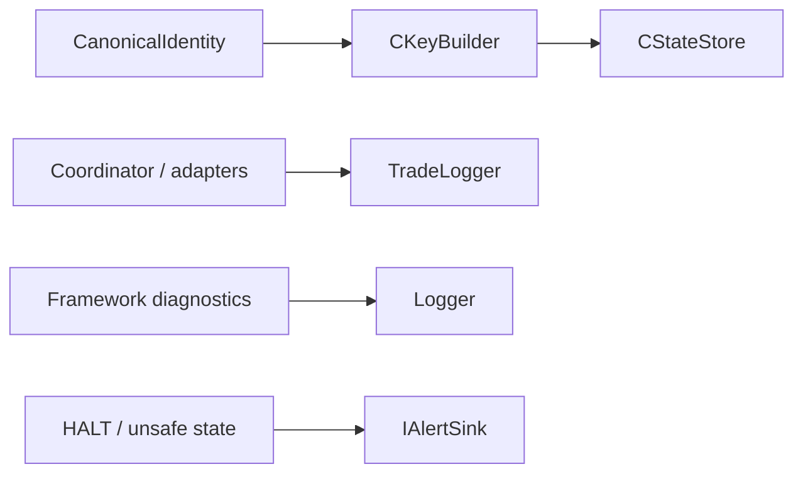

# SPEC-05: Persistence and Audit Evidence

## Document Control

| Field | Value |
| --- | --- |
| Status | Draft |
| Version | 1.0 |
| Component | CStateStore, CKeyBuilder, TradeLogger, Logger, AlertSink |
| TDD-ready Score | 94/100 |
| Architecture Decision | ADR-02 |
| TDD Target | TDD-05 |

## Overview

The persistence and evidence component stores low-I/O strategy state in terminal Global Variables, builds deterministic hashed keys, writes paired trade evidence CSV records, keeps diagnostic logs separate, and raises operator alerts for HALT and unsafe states.

## Interfaces

| Export | Type | Purpose |
| --- | --- | --- |
| IStateStore | interface | Persistence seam for scalar state, hedging ticket state, identity markers, duplicate markers, deferred-mode diagnostics, and HALT flags. Virtual ledger fragments are v2+ scope. |
| CKeyBuilder | class | Builds deterministic keys for terminal Global Variables and evidence correlation. |
| CStateStore | class | Persists strategy state, hedging ticket state, HALT markers, duplicate markers, and recovery markers; virtual ledger data is v2+ scope. |
| TradeLogger | class | Writes strategy-evaluation trade evidence records. |
| Logger | class | Writes framework and strategy diagnostic logs separate from trade records. |
| IAlertSink | interface | Delivers operator-facing HALT and unsafe-state alerts. |

## Data Models

| Model | Purpose |
| --- | --- |
| CanonicalIdentity | Account, symbol, magic, strategy, and key hash identity. |
| TradeEvidenceRecord | Intent/execution record with broker outcome, lots, prices, slippage, and correlation metadata. |
| HaltEvidence | Last-known state, HALT reason, evidence keys, and recovery status. |
| GlobalVariableScalarState | Deterministic GV key, double scalar value, and explicit encoding for flags, timestamps, volume, hash fragments, or split identifier parts. |

## Behavior

- Trade evidence SHALL pair intent and execution records.
- Diagnostic logs SHALL remain separate from trade evaluation records.
- Idle-path persistence and evidence work SHALL honor low-I/O requirements.
- GV-backed state stores only scalar double-compatible values; string payloads and rich evidence stay in files, logs, or documentation evidence packs.
- Recoverable evidence restores state when GlobalVariable and broker/history evidence prove current ownership.
- Ambiguous evidence moves the strategy to HALT.
- GlobalVariable identity hash mismatch fails init before live trading or enters HALT if detected live.
- Trade evidence write failure logs diagnostic failure while preserving broker safety outcome.

## Implementation Notes

- Trade execution logs are for strategy evaluation; framework and strategy-code logs are for audit and diagnostics.
- Persistence should be durable enough for restart recovery without making idle ticks heavy.
- Terminal Global Variables are used for deterministic scalar state only; lossless identifiers are split into exact-safe scalar parts or stored outside GV state as file evidence.
- GV keys use deterministic hashing and respect documented terminal Global Variable key constraints.
- Alert delivery must be testable, including HALT and unsafe state paths.

## TDD Contract

| Test File | Coverage |
| --- | --- |
| `Scripts/Tests/Test_StateStore.mq5` | Key building, GlobalVariable persistence, identity hash checks, and recovery. |
| `Scripts/Tests/Test_TradeLogger.mq5` | Intent/execution pairing, slippage fields, and separated diagnostic records. |
| `Scripts/Tests/Test_AlertSink.mq5` | HALT and unsafe-state operator alert behavior. |

## Traceability

`@spec: SPEC-05`, `@brd: BRD.01.08.cea7`, `@prd: PRD.01.14.737b`, `@ears: EARS.01.03.a023`, `@bdd: BDD.01.03.0073`, `@adr: ADR.02.03.c7dd`
