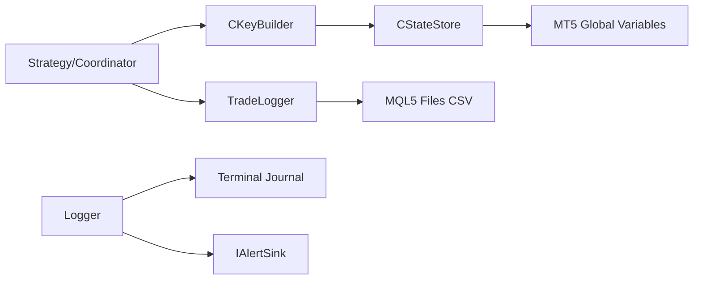

# SPEC-05: Persistence and Audit Evidence

> Human-readable rendering generated from `SPEC-05_persistence_and_audit_evidence.yaml`. The YAML file remains the canonical aidoc artifact.

## Document Control

| Field | Value |
| --- | --- |
| Status | Draft |
| Version | 1.7 |
| Component | PersistenceTypes, CStateStore, CKeyBuilder, TradeLogger, Logger, AlertSink |
| TDD-ready Score | 94/100 |
| CHG References | CHG-13, CHG-14, CHG-15, CHG-16, CHG-17, CHG-18, CHG-22 |
| Created | 2026-06-02T00:20:00-03:00 |
| Updated | 2026-08-24T00:00:00-03:00 |

## Overview

The persistence component stores complete lifecycle aggregates in two checksum-verified GV slots and publishes the active generation last. CHG-22 adds detailed read classification, stable position and cancellation evidence, explicit runtime namespaces, mutex/CAS/reread marker fencing, append-only HALT/recovery audit evidence, and observable alert-persistence failure while preserving prior committed state on replacement failure.

```mermaid
flowchart LR
  Strategy["Strategy/Coordinator"] --> Key["CKeyBuilder"]
  Key --> Store["CStateStore"]
  Store --> GV["MT5 Global Variables"]
  Strategy --> TradeLog["TradeLogger"]
  TradeLog --> CSV["MQL5 Files CSV"]
  Logger["Logger"] --> Journal["Terminal Journal"]
  Logger --> Alert["IAlertSink"]
```

## Interfaces

| Export | Type | Signature | Purpose | Errors |
| --- | --- | --- | --- | --- |
| IStateStore | interface | interface IStateStore | LifecycleSnapshot read/write, detailed ABSENT/VALID/CORRUPT/ERROR classification, runtime isolation, retained HALT/recovery and unfenced audit evidence, legacy migration surfaces, and MarkerIsOwner fencing. | Corruption/error or failed commit is never reported as absence/success. |
| CKeyBuilder | class | class CKeyBuilder | Builds deterministic hashed GV names from canonical strategy identity fields. | KeyCollision: stored identity hash does not match expected identity. |
| CStateStore | class | class CStateStore : public IStateStore | Writes inactive snapshot payload/checksum, verifies readback, then publishes generation; retains the prior commit on failure. First-use lease creation is protected by an exclusive hashed lock and ownership is reread-validated. | Any failed stage leaves the prior committed snapshot authoritative. |
| TradeLogger | class | class TradeLogger | Writes paired intent and execution records for trade evaluation. _EnsureFile() checks the CSV header write on a newly created file and fails closed if it cannot be written (CHG-18). | LogFailure: evidence write failed, including header-write failure on new-file creation (CHG-18); component returns status for caller policy. |
| Logger | class | class Logger | Writes leveled diagnostic messages separate from trade evaluation records. | None; logging failures are reported as diagnostics where possible. |
| IAlertSink | interface | bool Halt(const HaltEvidence &ev) | Routes HALT and reports whether durable evidence succeeded; in-memory HALT remains effective on false. | false: persistence failed, lifecycle stays halted. |
| CAlertSink | class | class CAlertSink : public IAlertSink | Persists HALT evidence before runtime-mode UI/log suppression and returns the persistence result. A missing store is a durable failure; the state machine keeps HALT effective in memory when this result is false. | false: durable evidence failed; recovery remains blocked and a secondary diagnostic is emitted. |

## Data Models

| Model | Type | Purpose |
| --- | --- | --- |
| CanonicalIdentity | struct |  |
| TradeEvidenceRecord | struct |  |
| HaltEvidence | struct |  |
| PendingOrderEvidence | struct |  |
| DuplicateMarkerLease | struct |  |
| GlobalVariableScalarState | struct |  |

## Behavior

- Trade evidence SHALL pair intent and execution records.
- Diagnostic logs SHALL remain separate from trade evaluation records.
- Idle-path persistence and evidence work SHALL honor low-I/O requirements.
- GV-backed state SHALL store only scalar double-compatible values; string payloads and rich evidence SHALL remain in files, logs, or documentation evidence packs.
- IStateStore SHALL expose LifecycleSnapshot commit/read classification, explicit runtime isolation, checked HALT evidence, legacy migration surfaces, and MarkerClaimOrReclaim/Heartbeat/IsOwner/Release fencing in lockstep with all implementations and fakes.
- Duplicate marker liveness SHALL use explicit marker_hb_ts and SHALL NOT use GlobalVariableTime because reads/checks can refresh access time (CHG-22).
- CAlertSink.Halt SHALL attempt store.SetHalt(ev) before UI/log suppression and return the persistence result; suppressed runtimes require an isolated namespace and never clear live HALT state.
- A context that lost `MarkerIsOwner` SHALL NOT write the shared lifecycle snapshot or HALT flag. It becomes HALT in memory and may append audit evidence without changing the current owner's authoritative state.

| From | To | Trigger | Source |
| --- | --- | --- | --- |
| Recoverable evidence | Restored state | GV and broker/history evidence prove current ownership. | @bdd: BDD.01.03.e16a |
| Ambiguous evidence | HALT | Hedging ticket ownership cannot be proven; pending-exit relationships are v2+ scope. | @bdd: BDD.01.03.e16a |

### Error Handling

| Condition | Response | Source |
| --- | --- | --- |
| GV identity hash mismatch. | Fail init before live trading, or set persistent GV HALT flag via IStateStore.SetHalt() and notify operator via Alert()/SendNotification() if detected live. EA remains halted on subsequent ticks until operator resets the flag. If SetHalt() fails, a secondary Error is emitted; the operator must treat the halt state as unconfirmed. (CHG-16, CHG-17) | @bdd: BDD.01.03.a31d |
| Trade evidence write fails. | Log diagnostic failure and preserve broker safety outcome. Header-write failure on new-file creation is treated as a write failure: the file handle is closed and reset, and the call returns false (CHG-18). | @bdd: BDD.01.03.d6ae |
| Marker owner is fresh or token compare-and-swap loses. | Return status=DUPLICATE_MARKER_CONFLICT and no token (CHG-22). | @chg: CHG-22 |
| Marker owner is stale by explicit marker_hb_ts. | Allow MarkerClaimOrReclaim to CAS a strictly larger token and return status=DUPLICATE_MARKER_STALE_RECLAIMED on success (CHG-22). | @chg: CHG-22 |
| Stale owner attempts heartbeat or release after ownership moved. | Reject the operation because token no longer matches marker_owner (CHG-22). | @chg: CHG-22 |

## Implementation Notes

- One-way decision `SNAPSHOT-MIGRATION-BOUNDARY`: the first committed LifecycleSnapshot generation retires prior-binary compatibility. Old and `CHG-22-R1` interfaces have a zero-width coexistence window; downgrade afterward requires disabled/HALT operation, exclusive ownership, exported evidence, proven flat/no-matching-order broker state, and the rehearsed legacy-IDLE procedure.
- v1 lifecycle state uses terminal GV double-buffer slots and a commit-last generation key; HALT/recovery audit evidence remains an append-only terminal file retained for at least 30 days.
- Ticket, deal, and order identifiers MUST be stored losslessly, not packed into imprecise double integers.
- Raw account, symbol, and magic identity appears in logs/docs, not GV names.
- GV keys MUST use deterministic hashing and respect documented terminal Global Variable key constraints.
- Lossless identifiers in GV state MUST be split into exact-safe scalar parts or stored outside GV state as file evidence.
- Use deterministic canonical identity strings before hashing GV keys.
- Use separate sinks for diagnostic logs, trade records, and alerts.
- Use GlobalVariableSetOnCondition-compatible scalar values for duplicate markers; execution mutex state is v2+ with netting/exchange support.
- ENUM_TRADE_RECORD_TYPE is defined in Include/Persistence/PersistenceTypes.mqh (CHG-13). StateStore.mqh re-exports it transitively via its own include; TradeLogger.mqh includes PersistenceTypes.mqh directly and does not depend on StateStore.mqh.
- CSV string fields MUST be RFC 4180 quoted (double-quote wrap; internal double-quotes doubled). broker_outcome is explicitly free-form evidence and MUST be quoted unconditionally (CHG-14).
- ulong fields (magic, ticket, deal IDs) in serialized CSV output MUST use StringFormat("%I64u", v) — never cast to long before formatting, which corrupts values above LONG_MAX (CHG-14). Consistent with CKeyBuilder's %I64u canonical identity pattern.
- TradeEvidenceRecord has 16 CSV columns (CHG-15). Intent-side fields (intended_price, sl_price, tp_price, lots_requested) are written as empty cells on EXECUTION rows; execution-side fields (retcode, ticket, fill_price, lots_submitted) are written as empty cells on INTENT rows. side is written on both row types. broker_outcome is retained as free-form overflow. Single-file design is preserved; strategy performance analysis is out of scope for TradeLogger (MT5 trade history owns that).
- CAlertSink.Init() accepts optional IStateStore* (default NULL). When wired, Halt() persists first and returns success/failure. Resume requires a fresh lease claim and explicit full reconciliation; reattachment or scalar deletion alone is not recovery proof.
- CAlertSink.Halt() checks the bool returned by SetHalt(). On false, a secondary logger.Error() is emitted: 'HALT persistence failed; persistent circuit breaker may not be set'. Fall-back to Print() when logger is NULL. This gives the operator maximum information in the degraded path while preserving the primary HALT log already written above the SetHalt() call. (CHG-17)
- TradeEvidenceRecord.side uses ENUM_TRADE_SIDE (TRADE_SIDE_BUY/TRADE_SIDE_SELL), not a free-form string; TradeLogger::_SideToString() renders "BUY"/"SELL" for the CSV column. Closes off casing/typo/localisation variants entering the audit evidence file. (CHG-18)
- CStateStore::_setGV() logs GetLastError() via PrintFormat() on GlobalVariableSet() failure (key, value, error code), distinguishing permission/storage/transient failures for operators; the public method still returns bool per the IStateStore contract. (CHG-18)
- TradeLogger::_EnsureFile() checks the FileWriteString() result when writing the CSV header on a newly created file. On failure, it closes and resets the file handle and returns false so WriteIntent()/WriteExecution() emit the existing LogFailure diagnostic, instead of silently proceeding with a possibly headerless evidence file. (CHG-18)
- ENUM_DUPLICATE_MARKER_STATUS is defined in Include/Persistence/PersistenceTypes.mqh to avoid a Persistence-to-Position include cycle (CHG-22).
- CStateStore marker lease uses marker_owner as the CAS fence and marker_hb_ts as liveness; first-use creation/claim is mutex-protected, positive-owner/missing-heartbeat is conflict, success requires owner+heartbeat reread, and MarkerRelease stores -token to prevent ABA reuse.
- CAlertSink.Halt routes symbol, magic, and ticket in the HALT payload; existing callers may leave them empty/zero for backward compatibility (CHG-22).
- State writes occur on meaningful transitions, not every tick, and release evidence must cover @threshold: PRD.01.perf.idle_tick.

## TDD Contract

| Test File | Coverage |
| --- | --- |
| Scripts/Tests/Test_StateStore.mq5 | Snapshot generation/publication/corruption and invariant checks, retained HALT evidence, runtime namespaces, legacy IDs, and deterministic lease interleavings. |
| Scripts/Tests/Test_TradeLogger.mq5 | Intent/execution pairing, CSV field coverage, and log separation. |
| Scripts/Tests/Test_AlertSink.mq5 | Runtime routing plus explicit durable-HALT success/failure return and persistence-attempt evidence. |

## Traceability

| Trace Type | References |
| --- | --- |
| tags | @spec: SPEC-05, @brd: BRD.01.08.cea7, @prd: PRD.01.14.737b, @ears: EARS.01.03.a023, @bdd: BDD.01.03.0073, @adr: ADR.02.03.c7dd, @chg: CHG-22 |
| upstream | adr_references: @adr: ADR.02.03.c7dd, @adr: ADR.03.03.4124, @adr: ADR.05.03.2586, bdd_references: @bdd: BDD.01.03.0073, @bdd: BDD.01.03.d6ae, @bdd: BDD.01.03.e16a, @bdd: BDD.01.03.b37d, ears_references: @ears: EARS.01.03.a023, @ears: EARS.01.03.fef3, @ears: EARS.01.03.a71c, @ears: EARS.01.03.c5b7, @ears: EARS.01.03.588b, prd_references: @prd: PRD.01.14.737b, @prd: PRD.01.09.9d68, @prd: PRD.01.09.c622, @prd: PRD.01.09.3092, brd_references: @brd: BRD.01.08.cea7, @brd: BRD.01.07.8e15, @brd: BRD.01.07.bf02 |
| downstream | type: TDD; layer: 7; description: Persistence, evidence, logging, and alert-sink test cases. |
| health_score | tdd_ready: 94%, target_score: >=90/100 |
