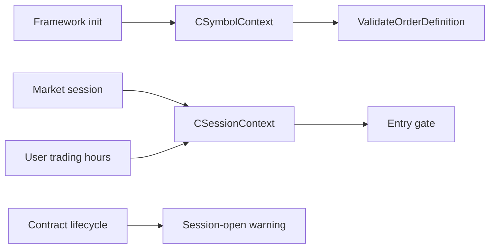

# SPEC-06: Market Session and Symbol Context

## Document Control

| Field | Value |
| --- | --- |
| Status | Draft |
| Version | 1.0 |
| Component | CSymbolContext, CSessionContext, CMarketContext |
| TDD-ready Score | 92/100 |
| Architecture Decision | ADR-10 |
| TDD Target | TDD-06 |

## Overview

The market context component loads broker symbol metadata at init, exposes account and symbol diagnostics, validates order definitions against symbol constraints, gates entries by market and user-defined sessions, and emits fixed contract-expiration warnings.

## Interfaces

| Export | Type | Purpose |
| --- | --- | --- |
| CSymbolContext | class | Loads symbol metadata and exposes normalized symbol calculations. |
| CSessionContext | class | Evaluates market session, user trading-hours window, and day-trade close timing. |
| CMarketContext | class | Aggregates symbol, account, and session diagnostics. |
| ValidateOrderDefinition | method | Validates lots, prices, stops, and broker grid before order submission. |

## Data Models

| Model | Purpose |
| --- | --- |
| SymbolMetadata | Tick size, volume min/max/step, stops level, freeze level, contract size, and supported filling/order data. |
| SessionWindow | Market and user-defined entry windows plus day-trade close buffer. |

## Behavior

- Required symbol information SHALL load during strategy initialization.
- Order definitions SHALL validate sizing, lots, stop prices, and price grid against initialized symbol information.
- Entries SHALL require both market trade session and user-defined strategy trading-hours window.
- Expiration warning SHALL fire at session open when a supported futures contract expires in one broker day.
- Closed market or user trading-hours sessions block new entries.
- Day-trade mode reaches force-close before market session close; failure enters HALT and preserves unresolved exposure evidence.

## Implementation Notes

- Broker-valid lots and prices are mandatory, not optional.
- Anything related to order definition, including sizing, lots, and price grid, is validated on init using symbol information.
- Day-trade positions cannot roll to the next day.
- Contract expiration warning uses a fixed one-day boundary.

## TDD Contract

| Test File | Coverage |
| --- | --- |
| `Scripts/Tests/Test_SymbolContext.mq5` | Symbol metadata loading, lot grid, tick size, and order-definition validation. |
| `Scripts/Tests/Test_SessionContext.mq5` | Market session, user trading hours, entry blocking, and day-trade forced close. |
| `Scripts/Tests/Test_ContractLifecycle.mq5` | Session-open one-day expiration warning behavior. |

## Traceability

`@spec: SPEC-06`, `@brd: BRD.01.07.69ef`, `@prd: PRD.01.09.fada`, `@ears: EARS.01.03.03b2`, `@bdd: BDD.01.03.edae`, `@adr: ADR.10.03.51ea`
