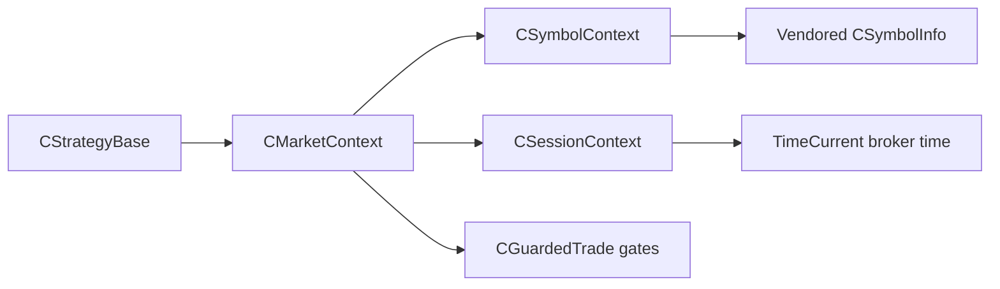

# SPEC-06: Market Session and Symbol Context

> Human-readable rendering generated from `SPEC-06_market_session_and_symbol_context.yaml`. The YAML file remains the canonical aidoc artifact.

## Document Control

| Field | Value |
| --- | --- |
| Status | Draft |
| Version | 1.2 |
| Component | CSymbolContext, CSessionContext, CMarketContext |
| TDD-ready Score | 92/100 |
| Architecture Decision | ADR-10 |
| TDD Target | TDD-06 |
| Last Updated | 2026-06-21 |

## Overview

The market context component loads broker symbol metadata at init, exposes account and symbol diagnostics, validates order definitions against symbol constraints, gates entries by market and user-defined sessions, and emits fixed contract-expiration warnings.

```mermaid
flowchart LR
  Strategy["CStrategyBase"] --> Market["CMarketContext"]
  Market --> Symbol["CSymbolContext"]
  Market --> Session["CSessionContext"]
  Symbol --> StdLib["Vendored CSymbolInfo"]
  Session --> BrokerClock["TimeCurrent broker time"]
  Market --> Guard["CGuardedTrade gates"]
```

## Interfaces

| Export | Type | Purpose |
| --- | --- | --- |
| CSymbolContext | class | Loads and exposes required symbol metadata for sizing and order validation. |
| CSessionContext | class | Evaluates broker market session, user trading-hours window, and day-trade close buffer. Accepts `market_session_end_tod` so the close trigger can be measured from the broker REGULAR session end when selected. |
| IContractInfoProvider | interface | Contract expiry seam: `ExpirationTime()` returns expiry timestamp (0 = no expiry / non-futures); production reads `SYMBOL_EXPIRATION_TIME`, test doubles return a configured fixture. |
| IMarketSessionProvider | interface | Broker session schedule seam: `IsMarketSessionOpen(when)` reports schedule membership; `MarketSessionEndTod(when)` returns the REGULAR (first / index-0) trade-session end-of-day for the close-reference trigger. After-hours sessions are excluded (@chg: CHG-21). Returns -1 when no session is defined or when the broker reports a full-day 00:00–24:00 sentinel (common on B3); close trigger then falls back to `entry_window_end`. |
| CMarketContext | class | Coordinates symbol, account, session, and contract lifecycle checks. |
| ValidateOrderDefinition | method | Validates lots, stop prices, and price grid against initialized symbol metadata. Consumes the canonical `TradeIntent` from `Include/Core/TradeTypes.mqh` (SPEC-02 extends it, SPEC-03 consumes it — @chg: CHG-21). |

## Data Models

| Model | Purpose |
| --- | --- |
| SymbolMetadata | Tick size, volume min/max/step, stops level, freeze level, contract size, and supported filling/order data. |
| SessionWindow | `market_open` (broker session schedule), `user_trading_hours_open` (operator window), and `day_trade_close_required` (close buffer reached). |

## Behavior

- Required symbol information SHALL load during strategy initialization.
- Order definitions SHALL validate sizing, lots, stop prices, and price grid against initialized symbol information.
- Entries SHALL require both market trade session and user-defined strategy trading-hours window.
- Day-trade forced-close trigger SHALL be measured from the reference selected by `CommonInputs.close_reference`: `entry_window_end` for `CLOSE_REF_USER_WINDOW_END`, or the broker REGULAR (first / index-0) market-session end for `CLOSE_REF_MARKET_SESSION_END`, falling back to `entry_window_end` when unavailable. After-hours sessions SHALL NOT be used.
- Expiration warning SHALL fire at session open when a supported futures contract expires in one broker day.
- Day-trade mode reaching force-close before session close; failure enters HALT and preserves unresolved exposure evidence.

## Implementation Notes

- Broker/server time is authoritative; no v1 timezone offset input exists.
- Futures v1 is validated for B3 futures scope; unsupported symbols block release validation.
- Contract-expiration warning threshold is fixed via `@fixed-threshold: PRD.01.market.expiration_warning_one_broker_day`.
- **v1 simplification (@chg: CHG-21):** `MarketSessionEndTod` uses the regular (first / index-0) trade session only; after-hours sessions are excluded. Brokers that split the regular session across multiple indices before after-hours would need refinement. Consistent with the midnight-crossing out-of-scope simplification.
- **v1 limitation (@chg: CHG-21, verified B3 WINQ26 2026-06-21):** some B3 brokers do not configure real session hours and report a full-day window (00:00–24:00) for index 0. `MarketSessionEndTod` treats `to >= 86400` as a sentinel and returns -1; the close trigger falls back to `entry_window_end`. A side effect is that `IsMarketSessionOpen` always returns true for such symbols (the `[0, 86400)` window covers all times), effectively disabling the `market_open` gate — a broker-configuration limitation, not a framework defect. For B3, `CLOSE_REF_USER_WINDOW_END` is the recommended close reference.

## TDD Contract

| Test File | Coverage |
| --- | --- |
| `Scripts/Tests/Test_SymbolContext.mq5` | Required metadata loading, invalid metadata init failure, lot/price-grid validation. |
| `Scripts/Tests/Test_SessionContext.mq5` | Market session, user trading-hours gate, entry blocking, and day-trade forced close. |
| `Scripts/Tests/Test_ContractLifecycle.mq5` | One-broker-day expiration warning at session open. |

## Traceability

`@spec: SPEC-06`, `@brd: BRD.01.07.69ef`, `@prd: PRD.01.09.fada`, `@ears: EARS.01.03.03b2`, `@bdd: BDD.01.03.edae`, `@adr: ADR.10.03.51ea`, `@chg: CHG-19`, `@chg: CHG-21`
