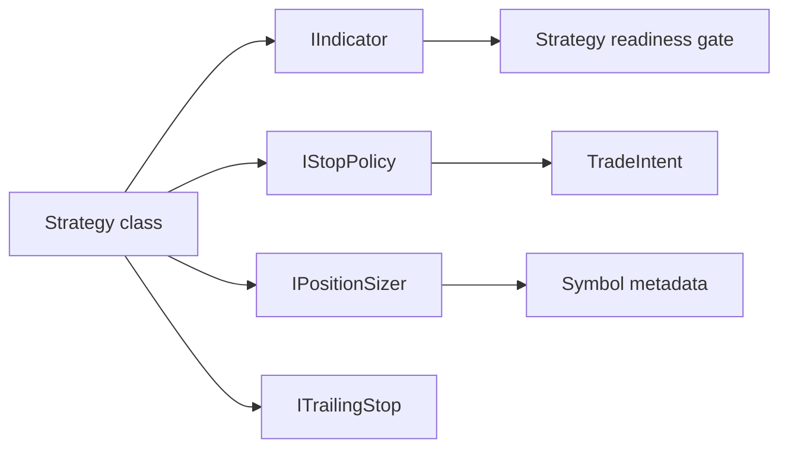

# SPEC-07: Indicators Stops Sizing and Trailing

## Document Control

| Field | Value |
| --- | --- |
| Status | Draft |
| Version | 1.1 |
| Component | IIndicator, stop, sizing, and trailing policy modules |
| TDD-ready Score | 93/100 |
| Architecture Decision | ADR-10 |
| TDD Target | TDD-07 |

## Overview

The pluggable behavior component defines the indicator wrappers, stop-policy interface, futures sizing modes, v2 sizing placeholders, and trailing policy contracts used by strategy classes. Strategy code owns indicator-readiness decisions and trailing invocation; the coordinator consumes only normalized stop and sizing outputs for `TradeIntent` construction.

## Interfaces

| Export | Type | Purpose |
| --- | --- | --- |
| IIndicator | interface | Exposes readiness and indicator values to strategy-layer readiness checks. |
| CIndicatorBase | class | Base wrapper for concrete indicator implementations. |
| IStopPolicy | interface | Resolves SL/TP policy values for generated intents. |
| IPositionSizer | interface | Produces executable lots from strategy sizing mode and symbol metadata. |
| ITrailingStop | interface | Applies trailing rules to owned positions. |
| IndATR, IndMA, IndDonchian, IndSupertrend | classes | v1 concrete indicator wrappers for approved native/custom strategy dependencies. |
| CStopATR, CStopFixed, CStopSwing | classes | v1 initial stop policies for ATR, fixed-distance, and swing-level stops. |
| CTrailATRMultiple, CTrailBreakeven | classes | v1 strategy-owned trailing policies for ATR-multiple and breakeven stop proposals. |

## Data Models

| Model | Purpose |
| --- | --- |
| StopLevels | Stop-loss and take-profit price outputs with validation metadata. |
| SizingRequest | Equity, risk, symbol, stop-distance, and sizing-mode inputs. |
| IndicatorValue | Indicator readiness, buffer value, timestamp, and source metadata. |

## Behavior

- Registered indicators that are not ready SHALL block entries.
- Indicator readiness SHALL be checked at the strategy layer before helper requests are sent to the coordinator.
- Futures risk-percent sizing SHALL use initialized symbol information.
- Fixed-lot sizing SHALL normalize fixed lots against initialized symbol information.
- Equity sizing modes selected in v1 SHALL reject as visible v2 placeholders.
- Concrete stop and sizing policies validate symbol-derived lot, price-grid, and stop-distance constraints before coordinator submission.
- Trailing policies only propose tighten-only stop changes and are invoked by strategy management code, not the framework idle path.
- Indicator readiness moves from not-ready to ready only when required history and buffer readiness are present.
- Sizing modes that cannot produce executable lots return `0.0` and let the coordinator reject without broker submission.
- Concrete indicator wrapper init/read failures report not-ready or init failure and block dependent entries.
- Side-inverted, off-grid, or zero-distance stop outputs return `InvalidStops` for coordinator rejection.

## Implementation Notes

- v1 supports fixed lots and futures risk-percent sizing.
- Equity sizing remains a visible v2 placeholder and must not silently execute as futures sizing.
- Stop and trailing policies should be composable strategy members.
- Indicator readiness must be explicit on attach and restart.
- Indicator readiness is strategy-owned; the coordinator may defensively reject unresolved requests but does not own indicator-readiness decisions.
- v1 enum values map explicitly to `IndATR`, `IndMA`, `IndDonchian`, `IndSupertrend`, `CStopATR`, `CStopFixed`, `CStopSwing`, `CTrailATRMultiple`, and `CTrailBreakeven`.

## TDD Contract

| Test File | Coverage |
| --- | --- |
| `Scripts/Tests/Test_Indicators.mq5` | Indicator readiness, history loading, and readiness gate behavior. |
| `Scripts/Tests/Test_Sizers.mq5` | Fixed-lot, futures risk-percent sizing, normalization, and v2 placeholder rejection. |
| `Scripts/Tests/Test_StopsAndTrailing.mq5` | Stop policy output and trailing behavior. |

## Traceability

`@spec: SPEC-07`, `@brd: BRD.01.07.69ef`, `@prd: PRD.01.09.60ad`, `@ears: EARS.01.03.5e92`, `@bdd: BDD.01.03.e593`, `@adr: ADR.10.03.51ea`
