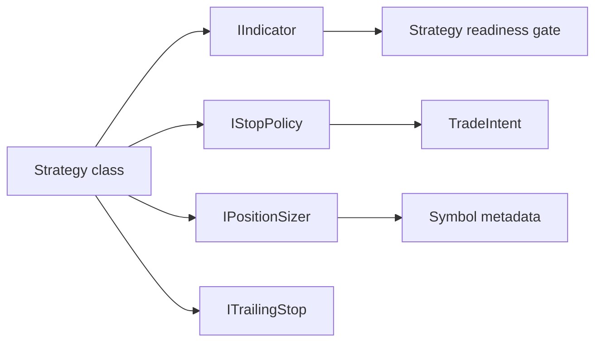

# SPEC-07: Indicators Stops Sizing and Trailing

## Document Control

| Field | Value |
| --- | --- |
| Status | Draft |
| Version | 1.2 |
| Component | IIndicator, stop, sizing, and trailing policy modules |
| TDD-ready Score | 93% |
| Architecture Decision | ADR-10 |
| TDD Target | TDD-07 |

## Overview

The pluggable behavior component defines the indicator wrappers, stop-policy interface, futures sizing modes, v2 sizing placeholders, and trailing policy contracts used by strategy classes. Strategy code owns indicator-readiness decisions and trailing invocation; the coordinator consumes only normalized stop and sizing outputs for `TradeIntent` construction.

```mermaid
flowchart LR
  Strategy["Strategy class"] --> Indicator["IIndicator"]
  Strategy --> Stops["IStopPolicy"]
  Strategy --> Sizer["IPositionSizer"]
  Strategy --> Trail["ITrailingStop"]
  Indicator --> StrategyReady["Strategy readiness gate"]
  Sizer --> Symbol["Symbol metadata"]
  Stops --> Intent["TradeIntent"]
```

## Interfaces

| Export | Type | Purpose |
| --- | --- | --- |
| IIndicator | interface | Initialization state, readiness by minimum bars, handle/name observability, and buffer/shift value access. |
| CIndicatorBase | class | Base wrapper for handle lifecycle, buffer reads, and readiness through an injectable runtime. |
| IIndicatorRuntime | interface | Injectable post-creation seam: `BarsCalculated`, `CopyBuffer`, and `Release`; each adapter owns `CreateHandle(symbol,timeframe)`. |
| IStopPolicy | interface | Computes initial SL/TP from IPLAN-07-owned requests, without a `Signal` dependency. |
| IPositionSizer | interface | Produces normalized lots; risk implementations obtain equity through `IAccountValueProvider`. |
| IAccountValueProvider | interface | Injected `Equity()` seam used only by risk-percent sizing. |
| SizingMath::CalcRiskLots | namespace function | Pure sizing math from supplied equity, request, and `SymbolMetadata`. |
| ITrailingStop | interface | Proposes a tighten-only stop from the supplied snapshot; never reads or mutates broker state. |
| IndATR, IndMA, IndDonchian, IndSupertrend | classes | v1 concrete indicator wrappers for approved native/custom strategy dependencies. |
| CStopATR, CStopFixed, CStopSwing | classes | v1 initial stop policies for ATR, fixed-distance, and swing-level stops. |
| CTrailATRMultiple, CTrailBreakeven | classes | v1 strategy-owned trailing policies for ATR-multiple and breakeven stop proposals. |

## Data Models

| Model | Purpose |
| --- | --- |
| StopRequest | Entry order type and resolved entry price for stop topology. |
| StopLevels | IPLAN-07-owned (`PolicyTypes.mqh`) SL/TP output; `sl_distance == 0` is the invalid sentinel. |
| SizingRequest | Entry `ENUM_ORDER_TYPE`, entry/SL prices, risk percentage, and optional fixed lots. |
| TrailingRequest | Ticket, `ENUM_POSITION_TYPE`, open/current price, and current SL/TP snapshot. |
| IndicatorValue | Readiness flag and indicator buffer value. |

## Behavior

- Registered indicators that are not ready SHALL block entries.
- Indicator readiness SHALL be checked at the strategy layer before helper requests are sent to the coordinator.
- Futures risk-percent sizing SHALL use initialized symbol information.
- Fixed-lot sizing SHALL normalize fixed lots against initialized symbol information.
- Equity sizing modes selected in v1 SHALL reject as visible v2 placeholders.
- Concrete stop and sizing policies validate symbol-derived lot, price-grid, and stop-distance constraints before coordinator submission.
- Trailing policies only propose tighten-only stop changes and are invoked by strategy management code, not the framework idle path.
- Indicator readiness moves from not-ready to ready only when required history and buffer readiness are present.
- Sizing modes that cannot produce executable lots return `0.0` and let the coordinator reject without broker submission.
- Concrete indicator wrapper init/read failures report not-ready or init failure and block dependent entries.
- Side-inverted, off-grid, or zero-distance stop outputs return `InvalidStops` for coordinator rejection.
- Policy request/result types are IPLAN-07-owned and do not depend on IPLAN-02 `Signal`.
- Native handles are created by each adapter; the injected runtime makes bars, buffer reads, and release deterministic in tests.
- Risk sizing calculates `risk_money = equity * risk_percent / 100`, then divides by `abs(entry_price - sl_price) / tick_size * tick_value`; it rounds down to `lot_step`, caps at `lot_max`, and returns `0.0` below `lot_min` or for invalid inputs. `contract_size` is validated metadata and is not double-counted in this tick-value-per-lot formula.

## Implementation Notes

- v1 supports fixed lots and futures risk-percent sizing.
- Equity sizing remains a visible v2 placeholder and must not silently execute as futures sizing.
- Stop and trailing policies should be composable strategy members.
- Indicator readiness must be explicit on attach and restart.
- Indicator readiness is strategy-owned; the coordinator may defensively reject unresolved requests but does not own indicator-readiness decisions.
- The generic indicator interface has lifecycle/readiness/value methods; it does not expose one method per native indicator.
- ATR and MA native adapters are grouped in `Include/Indicators/NativeIndicators.mqh`; Donchian and Supertrend remain separate custom implementations, exposed through `Include/Indicators/Indicators.mqh`.
- v1 enum values map explicitly to `IndATR`, `IndMA`, `IndDonchian`, `IndSupertrend`, `CStopATR`, `CStopFixed`, `CStopSwing`, `CTrailATRMultiple`, and `CTrailBreakeven`.

## TDD Contract

| Test File | Coverage |
| --- | --- |
| `Scripts/Tests/Test_Indicators.mq5` | Indicator readiness, history loading, and readiness gate behavior. |
| `Scripts/Tests/Test_Sizers.mq5` | Fixed-lot, futures risk-percent sizing, normalization, and v2 placeholder rejection. |
| `Scripts/Tests/Test_StopsAndTrailing.mq5` | Stop policy output and trailing behavior. |

## Traceability

`@spec: SPEC-07`, `@brd: BRD.01.07.69ef`, `@prd: PRD.01.09.60ad`, `@ears: EARS.01.03.5e92`, `@bdd: BDD.01.03.e593`, `@adr: ADR.10.03.51ea`, `@chg: CHG-25`
