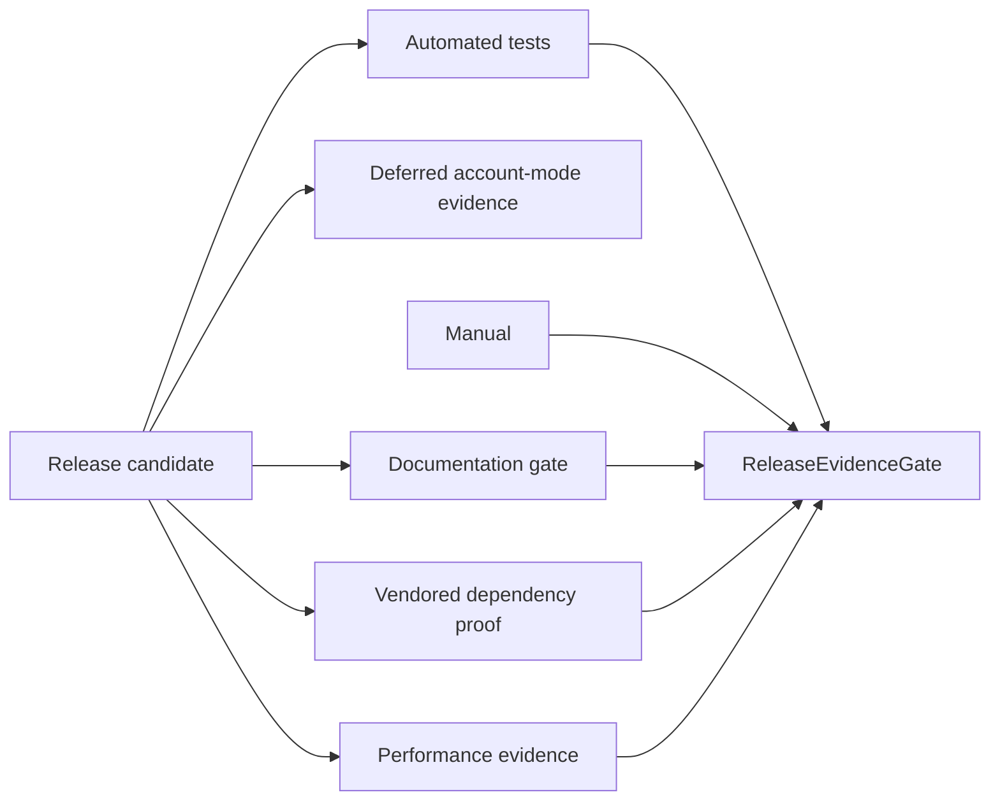

# SPEC-08: Release Testing and Documentation Governance

## Document Control

| Field | Value |
| --- | --- |
| Status | Draft |
| Version | 1.0 |
| Component | Release evidence, test harnesses, and documentation gates |
| TDD-ready Score | N/A - documentation/process scope |
| Architecture Decision | ADR-10 |
| TDD Target | N/A - no explicit TDD-08/IPLAN-08 artifact |

## Overview

The release governance component defines the evidence gates, automated and manual test harness boundaries, documentation inventory, Doxygen/API documentation gate if retained, bypass scans, vendored dependency proof, performance evidence, and changelog decision review required before v1 sign-off.

## Interfaces

| Export | Type | Purpose |
| --- | --- | --- |
| ReleaseEvidenceGate | process contract | Aggregates required evidence before sign-off. |
| RunAllTests | script/process | Executes the automated test suite for release evidence. |
| DeferredAccountModeEvidenceChecklist | checklist | Captures v1 evidence that netting/exchange-netting modes fail initialization before trading. |
| DocumentationGate | process contract | Verifies authoring guide, API documentation, changelog, and same-change documentation updates. |

## Data Models

| Model | Purpose |
| --- | --- |
| ReleaseEvidencePack | Automated tests, performance evidence, scans, docs, and sign-off status. |
| DeferredAccountModeEvidencePack | Evidence that RETAIL_NETTING and EXCHANGE fail initialization with no trade-path side effects. |
| DocumentationInventory | Required docs, Doxygen/API coverage if retained, and changelog evidence. |

## Behavior

- Release reviewer SHALL require evidence that netting and exchange-netting fail initialization with deferred-mode diagnostics in v1.
- Release reviewer SHALL verify required docs, same-change documentation updates, Doxygen coverage if retained, and CHANGELOG decision record.
- Vendored dependency policy SHALL be verified before release.
- Doxygen coverage SHALL be checked if retained by the implementation standard.
- Missing deferred account-mode init-failure evidence blocks release.
- Passing governance evidence, tests, docs, scans, and benchmarks approves the build for downstream implementation sign-off.

## Implementation Notes

- True concurrent same-symbol netting contention is not fully automatable in the Strategy Tester and is deferred to v2+ executable netting scope.
- Manual live/demo evidence is a release gate, not an optional supplement.
- Documentation for implementing new strategies is a v1 requirement.
- Performance evidence must cover tester overhead, memory budget, idle-tick overhead, and low-I/O write behavior.

## TDD Contract

SPEC-08 is documentation/process governance scope. It has no explicit TDD-08 or IPLAN-08 artifact. Release evidence and documentation obligations are closed through the final documentation closeout after code-deliverable implementation plans complete.

## Traceability

`@spec: SPEC-08`, `@brd: BRD.01.07.717b`, `@prd: PRD.01.09.4c66`, `@ears: EARS.01.03.1d60`, `@bdd: BDD.01.03.ef54`, `@adr: ADR.10.03.51ea`
