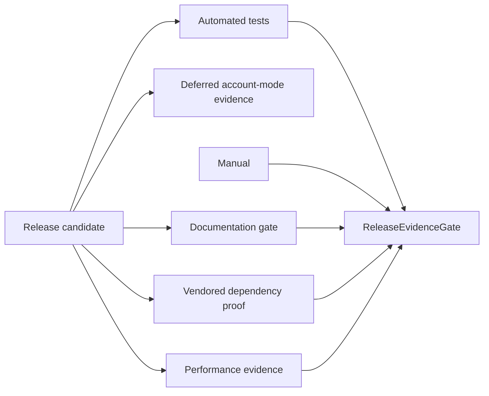

# SPEC-08: Release Testing and Documentation Governance

> Human-readable rendering generated from `SPEC-08_release_testing_and_documentation_governance.yaml`. The YAML file remains canonical. SPEC-08 intentionally has no TDD-08 or IPLAN-08.
>
> Provenance: @chg: CHG-23, @chg: CHG-24

## Document Control

| Field | Value |
| --- | --- |
| Status | Draft |
| Version | 1.2 |
| Updated | 2026-08-27T00:00:00-03:00 |
| Component | Release evidence, test harnesses, and documentation gates |
| TDD-ready Score | N/A - documentation/process scope |
| Architecture Decision | ADR-10 |
| TDD Target | N/A - no explicit TDD-08/IPLAN-08 artifact |

## Overview

The release governance component is a declarative human/governance review contract. It separates evidence sufficient for module closure from integration, final broker fencing, operational rollout, and approvals required for production release. It defines no callable MQL5 gate and intentionally has no TDD-08 or IPLAN-08.

```mermaid
flowchart LR
  Candidate["Release candidate"] --> Tests["Automated tests"]
  Candidate --> Mode["Deferred account-mode evidence"]
  Candidate --> Docs["Documentation gate"]
  Candidate --> Vendor["Vendored dependency proof"]
  Candidate --> Perf["Performance evidence"]
  Tests --> Gate["ReleaseEvidenceGate"]
  Manual --> Gate
  Docs --> Gate
  Vendor --> Gate
  Perf --> Gate
```

## Interfaces

| Export | Type | Purpose |
| --- | --- | --- |
| ReleaseEvidenceGate | declarative review contract | Named reviewers evaluate structured evidence; this is not a callable MQL5 interface. |
| RunAllTests | `Scripts/Tests/RunAllTests.mq5::OnStart()` | Existing IPLAN-11 aggregate script; code IPLANs own registration of their tests and reviewers verify inclusion, reachability, and counts. |
| DeferredAccountModeEvidenceChecklist | checklist | Captures v1 evidence that netting/exchange-netting modes fail initialization before trading. |
| DocumentationGate | declarative review contract | Verifies canonical/readable parity, required docs, changelog, coverage policy, and approvals. |

## Data Models

### Canonical Evidence Contract

`SPEC-08 data_models.evidence_contract` is the single normative source for
module closure, release obligations, and the aggregate `RunAllTests` contract.
Evidence fields use ASCII `snake_case`; required fields cannot be null; timestamps
use ISO-8601 with timezone offsets; and unknown or not-applicable values require
an explicit value or reason. Module closure requires aggregate execution evidence,
coverage/reachability proof, audit/approval references, and leaves production
readiness false. Release authorization additionally requires IPLAN-01/02/03 and
final-release-closeout obligations.

| Model | Purpose |
| --- | --- |
| ExecutionEvidenceRecord | Source/hash identity, fresh EX5 path/hash/mtime, MetaEditor error/warning counts, environment/timestamp, exact pass/fail/skip counts, skip mappings, and evidence pointer. |
| ModuleEvidencePack | Module execution evidence, aggregate inclusion/reachability proof, per-IPLAN Doxygen/module-doc/canonical-readable/code-inventory evidence, fresh audits/approvals, and mandatory `production_readiness=false`. |
| ReleaseIntegrationEvidencePack | IPLAN-02 consumer pinning, IPLAN-01 provider/timer/transaction/two-chart assembly, IPLAN-03 mutation fencing/bypass proof, and final rollback/canary/staged rollout. |
| ReleaseEvidencePack | Module packs plus release-integration, dependency, documentation, benchmark, and final approval evidence. |
| DeferredAccountModeEvidencePack | Evidence that RETAIL_NETTING and EXCHANGE fail initialization with no trade-path side effects. |
| DocumentationInventory | Required docs, same-change updates, canonical/readable parity, retained Doxygen/API result, CHANGELOG decision, and named documentation approvals. |
| BenchmarkEvidence | Applicable PRD thresholds, environment/method/measurements, evidence pointer, and PASS/FAIL verdict. An approved upstream threshold amendment is a separate prerequisite for a new evaluation. |
| DependencyEvidence | Vendored inventory/version/hash plus licensing and dependency/bypass scan result. |
| ApprovalEvidence | Gate/report revision, human identity/role, explicit decision, and timestamp; blank or pending is not approval. |

## Behavior

- Release reviewer SHALL require evidence that netting and exchange-netting fail initialization with deferred-mode diagnostics in v1.
- Release reviewer SHALL verify required docs, same-change documentation updates, Doxygen coverage if retained, and CHANGELOG decision record.
- Vendored dependency policy SHALL be verified before release.
- Doxygen coverage SHALL be checked if retained by the implementation standard.
- One fresh aggregate F7/EX5 may close a module when exact Test-file inclusion, actual-case reachability, and module counts prove all owned tests executed; duplicate focused EX5 artifacts are not mandatory.
- CHG-22/IPLAN-04/05 module closure keeps `production_readiness=false` and does not authorize deployment.
- IPLAN-02 owns coordinator consumption; IPLAN-01 owns provider assembly, timer/transaction wiring, packaging, and two-chart validation; IPLAN-03 owns final broker-mutation fencing and bypass proof; final closeout owns rollback, canary, staged rollout, and deployment approval.
- Release approval requires every module and all integration, docs, dependency, benchmark, operational, and named-human approval evidence.
- Missing a product performance threshold blocks release. SPEC-08 has no waiver path; a threshold change requires a separately approved upstream requirement/change amendment and a new candidate evaluation.

## Implementation Notes

- True concurrent same-symbol netting contention is not fully automatable in the Strategy Tester and is deferred to v2+ executable netting scope.
- Manual live/demo evidence is a release gate, not an optional supplement.
- Documentation for implementing new strategies is a v1 requirement.
- Performance evidence must cover tester overhead, memory budget, idle-tick overhead, and low-I/O write behavior.
- SPEC-08 is declarative process governance. RunAllTests implementation remains owned by IPLAN-11; no executable gate, TDD-08, or IPLAN-08 is introduced.
- Module approval and production deployment authorization are separate decisions.

## TDD Contract

SPEC-08 is declarative documentation/process governance, not a callable code contract. It has no TDD-08 or IPLAN-08. RunAllTests is owned by IPLAN-11, each code IPLAN owns registration of its tests, and the existing final registry release-closeout obligation owns integration evidence and publication.

## Traceability

`@spec: SPEC-08`, `@brd: BRD.01.07.717b`, `@prd: PRD.01.09.4c66`, `@ears: EARS.01.03.1d60`, `@bdd: BDD.01.03.ef54`, `@adr: ADR.10.03.51ea`
