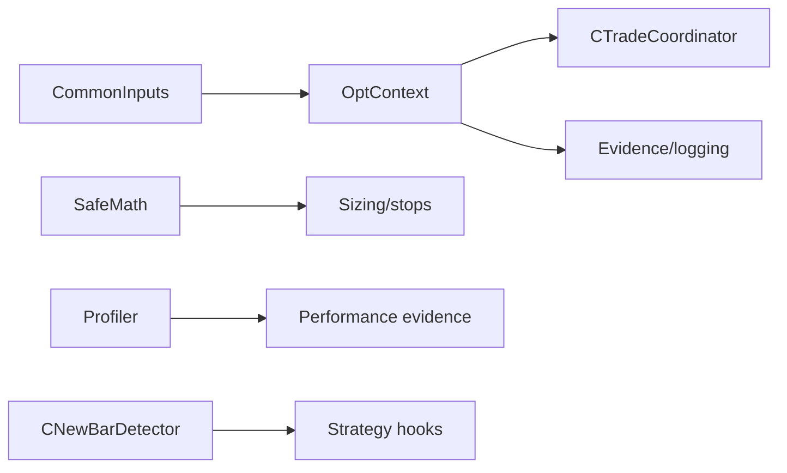

# SPEC-09: Core Runtime and Configuration

## Document Control

| Field | Value |
| --- | --- |
| Status | Draft |
| Version | 1.0 |
| Component | OptContext, SafeMath, Profiler, CommonInputs, CNewBarDetector |
| TDD-ready Score | 93/100 |
| Architecture Decision | ADR-10 |
| TDD Target | TDD-09 |

## Overview

The core runtime component provides shared configuration binding, optimization-mode awareness, safe numeric helpers, low-overhead profiling hooks, and bar/time detection primitives consumed by strategy, coordinator, execution, persistence, and testing modules.

## Interfaces

| Export | Type | Purpose |
| --- | --- | --- |
| IClock | interface | Time source seam for broker time, local test time, timeout checks, and deterministic test advancement. |
| CommonInputs | struct | Canonical framework input binding for magic, mode, session, sizing, risk, logging, and documentation-visible settings. |
| OptContext | class | Detects tester/optimization/live mode and exposes policy decisions for logging, diagnostics, profiling, and release evidence. |
| SafeMath | namespace | Central numeric normalization, finite-value, price-grid, lot-grid, and comparison helpers. |
| Profiler | class | Low-overhead timing and memory-budget evidence helper gated by runtime context. |
| CNewBarDetector | class | Bar-transition detector used by strategies to avoid duplicate per-bar signal evaluation. |

## Data Models

| Model | Purpose |
| --- | --- |
| CommonInputs | Magic, account-mode policy, session mode, sizing mode, and optimization-audit settings. |
| RuntimeMode | Tester, optimization, and diagnostics policy flags. |
| ProfileSample | Profiling sample scope, elapsed microseconds, and enablement flag. |
| BenchmarkBaseline | Scenario, baseline memory reading, component memory delta, and timing source for release benchmark evidence. |

## Behavior

- Common inputs expose documented v1 strategy authoring settings and reject unsupported v2 placeholder selections visibly.
- Optimization-mode logging and profiling avoid high-I/O work unless explicitly enabled for audit evidence.
- `SafeMath` centralizes finite-number, price-grid, lot-grid, and tolerance checks used by sizing, stops, and execution guards.
- Performance evidence includes tester overhead, per-EA memory, and idle-tick overhead budgets.
- Memory-budget evidence uses a documented baseline-and-delta harness rather than claiming exact per-object memory attribution.
- Unsupported v2 placeholder inputs fail initialization or are visibly rejected without silent behavior mapping.

## Implementation Notes

- Core runtime utilities do not call broker execution APIs.
- `Profiler` and `OptContext` are dependency-injectable for Tier-1 tests.
- `CommonInputs` is the canonical source for framework-wide input names.
- `CNewBarDetector` is used inside strategy hook code, not as a hidden framework signal scheduler.
- Memory evidence records the benchmark baseline, component delta, terminal/build context, and scenario name.
- Runtime timing and memory introspection are accessed through `Profiler`, not scattered across components.

## TDD Contract

| Test File | Coverage |
| --- | --- |
| `Scripts/Tests/Test_CommonInputs.mq5` | Input validation, v1/v2 boundary rejection, and strategy guide alignment. |
| `Scripts/Tests/Test_OptContextProfiler.mq5` | Tester/optimization policy, diagnostic gating, and profile sample enablement. |
| `Scripts/Tests/Test_SafeMathAndNewBar.mq5` | Numeric normalization, grid snapping, finite checks, and new-bar detection. |

## Traceability

`@spec: SPEC-09`, `@brd: BRD.01.07.88a6`, `@prd: PRD.01.09.841a`, `@ears: EARS.01.03.0c0a`, `@bdd: BDD.01.03.aa68`, `@adr: ADR.10.03.51ea`
