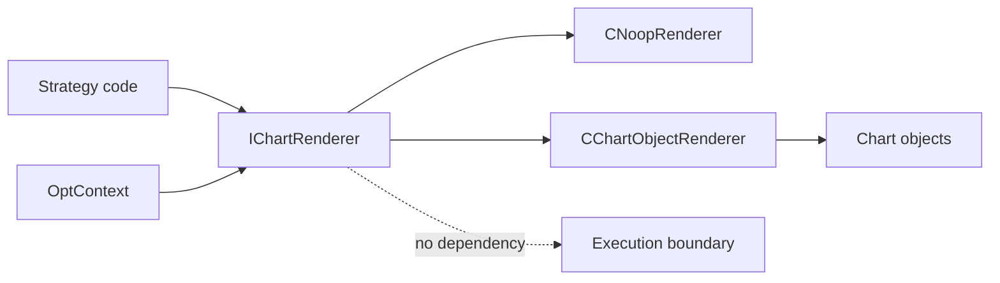

# SPEC-10: Visualization Optional Services

## Document Control

| Field | Value |
| --- | --- |
| Status | Draft |
| Version | 1.0 |
| Component | IChartRenderer, CNoopRenderer, CChartObjectRenderer |
| TDD-ready Score | 91/100 |
| Architecture Decision | ADR-10 |
| TDD Target | TDD-10 |

## Overview

Visualization optional services provide strategy-owned chart annotations for development and manual review while remaining disabled or no-op in optimization/hot paths and isolated from execution, persistence, and state-machine correctness.

## Interfaces

| Export | Type | Purpose |
| --- | --- | --- |
| IChartRenderer | interface | Optional renderer seam for strategy annotations, signal markers, stop/TP lines, and debug overlays. |
| CNoopRenderer | class | No-op renderer used in optimization, tests, and disabled visualization mode. |
| CChartObjectRenderer | class | Chart-object-backed renderer for manual/live visual diagnostics. |

## Data Models

| Model | Purpose |
| --- | --- |
| RenderEvent | Signal, entry, exit, stop, target, session, or diagnostic marker with time/price coordinates. |
| RenderPolicy | Runtime visualization policy, optimization permission, and strategy-scoped object prefix. |

## Behavior

- Visualization is optional and is not required for execution, state reconciliation, or audit evidence correctness.
- Visualization is no-op in optimization by default and must not add hot-path I/O.
- Chart objects are strategy-scoped by symbol and magic to avoid collisions across EA instances.
- Renderer tests treat terminal chart object creation and update as queued chart operations; immediate object readback is not a required correctness signal.
- Chart failures skip rendering and optionally emit strategy diagnostics without changing trade state.

## Implementation Notes

- Visualization modules do not call broker execution APIs, mutate position state, or gate entries.
- Rendering is injected as an optional service and defaults to `CNoopRenderer` for tester/optimization-safe operation.
- Chart object naming includes a stable strategy prefix derived from account/symbol/magic context.
- Chart-renderer correctness is defined by accepted render events, scoped names, no-op behavior, and failure isolation.
- Terminal object readback belongs only in controlled chart tests.
- Object cleanup stays scoped to the strategy prefix.

## TDD Contract

| Test File | Coverage |
| --- | --- |
| `Scripts/Tests/Test_ChartRenderer.mq5` | No-op behavior, scoped object names, failure isolation, and optional render policy. |
| `Scripts/Tests/Test_VisualizationPerformance.mq5` | Optimization-disabled rendering and idle-path no-I/O guarantees. |

## Traceability

`@spec: SPEC-10`, `@brd: BRD.01.07.88a6`, `@prd: PRD.01.09.3092`, `@ears: EARS.01.03.c5b7`, `@bdd: BDD.01.03.b37d`, `@adr: ADR.10.03.51ea`
