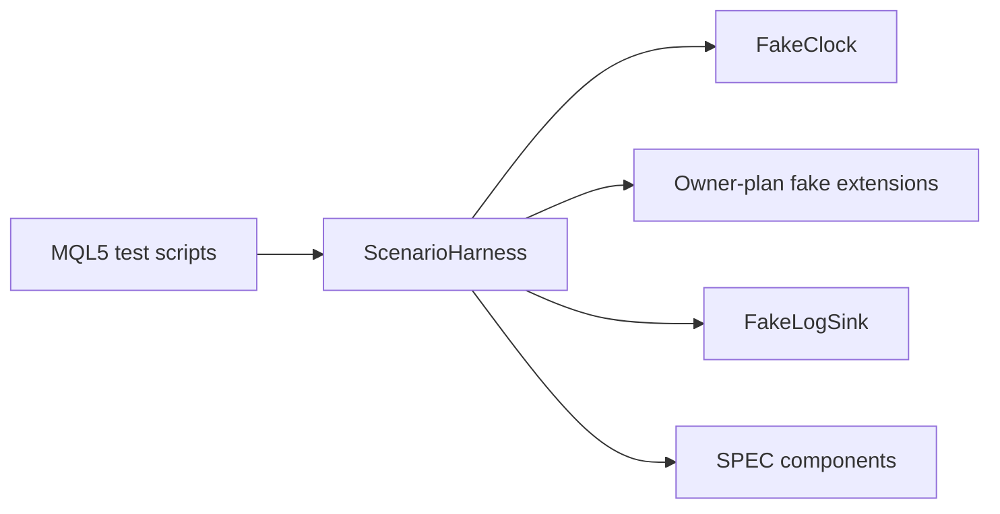

# SPEC-11: Testing Support and Harnesses

## Document Control

| Field | Value |
| --- | --- |
| Status | Draft |
| Version | 1.0 |
| Component | Shared test doubles, clocks, log sinks, assertions, and harness primitives |
| TDD-ready Score | 94/100 |
| Architecture Decision | ADR.10.03.51ea |
| TDD Target | TDD-11 |

## Overview

Testing support provides shared deterministic primitives for clocks, log sinks, assertions, minimal scenario harness assembly, and release-evidence separation so Tier-1 and Tier-1.5 tests can start after IPLAN-09 without waiting for broker, position, or persistence owner interfaces.

## Interfaces

| Export | Type | Purpose |
| --- | --- | --- |
| FakeClock | class | Deterministic time source for session, timeout, daily reset, and evidence ordering tests. |
| FakeLogSink | class | Captures diagnostics and evidence messages for deterministic assertions without production logging side effects. |
| CAssert | class | Shared assertion counters, equality checks, and pass/fail summary output for MQL5 test scripts. |
| ScenarioHarness | class | Minimal reusable assembly for component-under-test, shared fakes, owner-extension hooks, stimulus, and evidence assertions. |

## Data Models

| Model | Purpose |
| --- | --- |
| EvidenceAssertion | Intent, execution, diagnostic, state, or release evidence kind.; Expected requirement/spec trace tag in the emitted evidence.; Whether absence is a test failure. |
| DeferredAccountModeEvidencePack | Deferred account mode label covered by init-failure evidence.; Deferred-mode validation scenario name.; Evidence file paths or operator notes proving init failure and no trade-path side effects. |

## Behavior

- Tier-1 tests SHALL use deterministic shared fakes for clock, logging, runtime, and assertion seams; broker, position, symbol, and store fakes are added by their owner plans.
- Tier-1.5 tests SHALL cover hedging account ownership, deferred netting/exchange init failure, no side effects, and manual non-interference scenarios.
- Release governance SHALL distinguish automated Strategy Tester evidence from deferred account-mode evidence required for v1 netting/exchange exclusion.
- Test harnesses SHALL verify paired strategy diagnostics and trade execution logs remain separate evidence streams.
- Fail the test with a missing owner-extension assertion and defer behavior-specific assertions to the owner IPLAN.
- Mark release gate blocked rather than substituting automated tester evidence.

## Implementation Notes

- Test support modules MUST remain outside production execution paths.
- IPLAN-11 fakes MUST implement only IPLAN-09 contracts: IClock, ILogSink, runtime context, and profiling data models.
- Broker, position/account, symbol, and persistence fakes MUST be implemented by the owner plans that publish their production interfaces: IPLAN-03, IPLAN-04, IPLAN-06, and IPLAN-05 respectively.
- Manual evidence pack contracts MUST remain visible to release governance and must not be represented as Strategy Tester automation.
- Use owner-extension hooks so later plans can attach broker outcomes, position views, symbol context, and state stores without changing shared assertion helpers.
- Keep component construction explicit so TDD can map each BDD scenario to a harness.
- Record deferred owner fake scope in the consuming owner IPLAN rather than in the shared testing foundation manifest.

## TDD Contract

| Test File | Coverage |
| --- | --- |
| `Scripts/Tests/Test_TestSupportScenarioHarness.mq5` | Executable entry point for minimal ScenarioHarness assembly, owner-extension hooks, and evidence assertions. |
| `Scripts/Tests/Test_TestSupportClock.mq5` | Executable unit entry point for deterministic clock and assertion helper behavior. |
| `Scripts/Tests/Support/FakeClock.mqh` | Deterministic time, session, timeout, and daily reset tests. |
| `Scripts/Tests/Support/FakeLogSink.mqh` | Capturing log sink tests for diagnostics and evidence assertions. |
| `Scripts/Tests/Support/ScenarioHarness.mqh` | Reusable shared component assembly, owner-extension hooks, and evidence assertions. |
| `Scripts/Tests/Test_ReleaseEvidenceHarness.mq5` | Manual evidence pack contracts and automated/manual gate separation. |

## Traceability

@spec: SPEC-11, @brd: BRD.01.07.a94e, @prd: PRD.01.14.8720, @ears: EARS.01.03.d7e9, @bdd: BDD.01.03.f415, @adr: ADR.10.03.51ea
