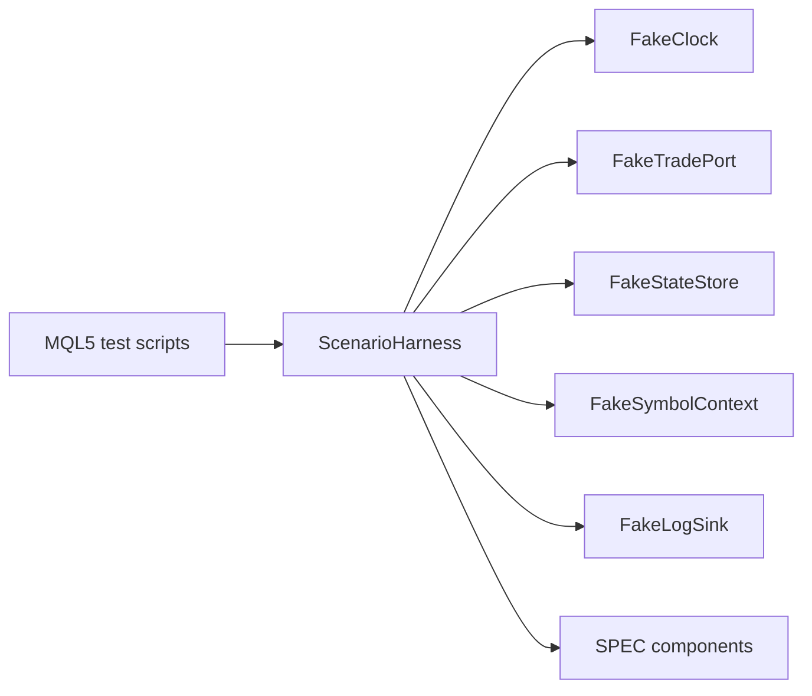

# SPEC-11: Testing Support and Harnesses

## Document Control

| Field | Value |
| --- | --- |
| Status | Draft |
| Version | 1.0 |
| Component | Test doubles, clocks, brokers, stores, and scenario harnesses |
| TDD-ready Score | 94/100 |
| Architecture Decision | ADR-10 |
| TDD Target | TDD-11 |

## Overview

Testing support provides deterministic doubles for clock, broker port, state store, symbol/account context, log sinks, and scenario harnesses so Tier-1 and Tier-1.5 tests can validate TradeSpine behavior before Strategy Tester or live/demo release gates.

## Interfaces

| Export | Type | Purpose |
| --- | --- | --- |
| FakeClock | class | Deterministic time source for session, timeout, daily reset, and evidence ordering tests. |
| FakeTradePort | class | Deterministic broker boundary double returning configured `GuardResult` sequences. |
| FakeStateStore | class | In-memory persistence double for ledger, duplicate marker, HALT, and evidence tests. |
| FakeSymbolContext | class | Deterministic symbol metadata and market data provider for sizing, stops, spread, and fill-mode tests. |
| ScenarioHarness | class | Reusable assembly for component-under-test, fakes, stimulus, and evidence assertions. |

## Data Models

| Model | Purpose |
| --- | --- |
| BrokerEventScript | Ordered fake broker and transaction events. |
| EvidenceAssertion | Expected evidence kind, trace tag, and required/optional assertion. |
| DeferredAccountModeEvidencePack | Deferred account-mode evidence contract for v1 netting/exchange exclusion gates. |

## Behavior

- Tier-1 tests use deterministic fakes for broker, clock, store, symbol, account, logging, and runtime seams.
- Tier-1.5 tests cover hedging account ownership, deferred netting/exchange init failure, no side effects, and manual non-interference scenarios.
- Release governance distinguishes automated Strategy Tester evidence from deferred account-mode evidence required for v1 netting/exchange exclusion.
- Harnesses verify paired strategy diagnostics and trade execution logs remain separate evidence streams.
- Missing required deferred-mode evidence blocks release sign-off rather than being substituted by unrelated tester output.

## Implementation Notes

- Test support modules stay outside production execution paths.
- Fakes implement the same interfaces consumed by production components: IClock/ILogSink from IPLAN-09, ITradePort from IPLAN-03, IPositionView from IPLAN-04, and IStateStore from IPLAN-05.
- Manual evidence pack contracts remain visible to release governance and are not represented as Strategy Tester automation.
- Scenario scripts drive fake broker outcomes and trade transaction callbacks.

## TDD Contract

| Test File | Coverage |
| --- | --- |
| `Scripts/Tests/Test_TestSupportTradePort.mq5` | Executable unit entry point for FakeTradePort scripted outcomes and GuardResult order. |
| `Scripts/Tests/Test_TestSupportScenarioHarness.mq5` | Executable integration entry point for ScenarioHarness assembly and evidence assertions. |
| `Scripts/Tests/Test_TestSupportClock.mq5` | Executable unit entry point for deterministic clock and assertion helper behavior. |
| `Scripts/Tests/Support/FakeClock.mqh` | Deterministic time, session, timeout, and daily reset tests. |
| `Scripts/Tests/Support/FakeTradePort.mqh` | Broker outcome, retry, pending, and ambiguity scripts. |
| `Scripts/Tests/Support/ScenarioHarness.mqh` | Reusable component assembly and evidence assertions. |
| `Scripts/Tests/Test_ReleaseEvidenceHarness.mq5` | Manual evidence pack contracts and automated/manual gate separation. |

## Traceability

`@spec: SPEC-11`, `@brd: BRD.01.07.a94e`, `@prd: PRD.01.14.8720`, `@ears: EARS.01.03.d7e9`, `@bdd: BDD.01.03.f415`, `@adr: ADR.10.03.51ea`
