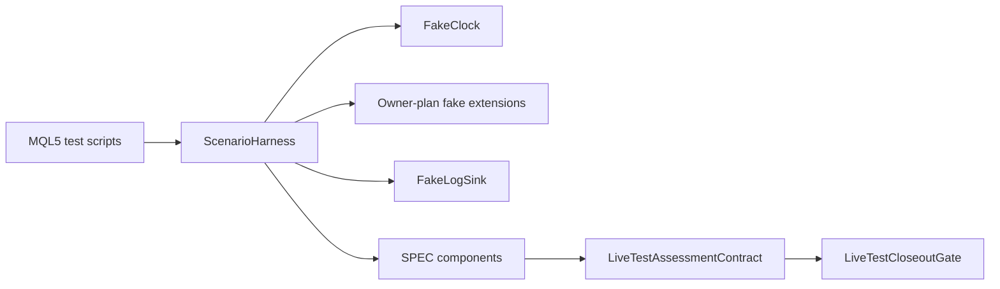

# SPEC-11: Testing Support and Harnesses

> Contract approved at GATE-06 under @chg: CHG-26. CHG-26 remains In Review and does not authorize IPLAN-14 execution; GATE-08 is pending.

## Document Control

| Field | Value |
| --- | --- |
| Status | Approved |
| Approval Scope | SPEC-11 contract only (GATE-06) |
| Governing Change | CHG-26 — In Review |
| IPLAN-14 Execution | Not authorized; GATE-08 pending |
| Version | 1.2 |
| Component | Shared test doubles, clocks, log sinks, assertions, and harness primitives |
| TDD-ready Score | 94/100 |
| Architecture Decision | ADR.10.03.51ea |
| TDD Target | TDD-11 |

## Overview

Testing support provides shared deterministic primitives, release-evidence separation, and the approved live-test architecture assessment contract used after code delivery to classify live evidence needs and resolve test-architecture findings before documentation closeout.

```mermaid
flowchart LR
  Tests["MQL5 test scripts"] --> Harness["ScenarioHarness"]
  Harness --> Clock["FakeClock"]
  Harness --> Extensions["Owner-plan fake extensions"]
  Harness --> Logs["FakeLogSink"]
  Harness --> Components["SPEC components"]
  Components --> Assessment["LiveTestAssessmentContract"]
  Assessment --> Closeout["LiveTestCloseoutGate"]
```

## Interfaces

| Export | Type | Purpose |
| --- | --- | --- |
| FakeClock | class | Deterministic time source for session, timeout, daily reset, and evidence ordering tests. |
| FakeLogSink | class | Captures diagnostics and evidence messages for deterministic assertions without production logging side effects. |
| CAssert | class | Shared assertion counters, equality checks, and pass/fail summary output for MQL5 test scripts. |
| ScenarioHarness | class | Minimal reusable assembly for component-under-test, shared fakes, owner-extension hooks, stimulus, and evidence assertions. |
| LiveTestAssessmentContract | process contract | Produces the complete coverage, finding, and architecture-decision result from the implemented code inventory. |
| LiveTestCloseoutGate | governance contract | Compares the complete assessed finding inventory with dispositions one-to-one before allowing documentation closeout. |

## Data Models

| Model | Purpose |
| --- | --- |
| EvidenceAssertion | Intent, execution, diagnostic, state, or release evidence kind.; Expected requirement/spec trace tag in the emitted evidence.; Whether absence is a test failure. |
| DeferredAccountModeEvidencePack | Deferred account mode label covered by init-failure evidence.; Deferred-mode validation scenario name.; Evidence file paths or operator notes proving init failure and no trade-path side effects. |
| LiveTestCoverageRecord | Module, implemented boundary, source paths, dependency level, mutation class, distinct evidence and gap, live-test need, safe environment, owner, proposed tier, and rationale. |
| LiveTestArchitectureDecision | Exactly one refactor decision, affected contracts, risks, migration order, and governed follow-on artifacts. |
| LiveTestAssessmentFinding | Unique stable finding ID, summary, supporting coverage-record references, and evidence references. |
| LiveTestAssessmentResult | Complete coverage-record inventory, authoritative finding inventory, and evidence-backed architecture decision. |
| LiveTestFindingDisposition | Finding ID, owner, exactly one terminal disposition, supporting rationale/evidence, and required deferral risk/revisit fields. |

## Behavior

- Tier-1 tests SHALL use deterministic shared fakes for clock, logging, runtime, and assertion seams; broker, position, symbol, and store fakes are added by their owner plans.
- Tier-1.5 tests SHALL cover hedging account ownership, deferred netting/exchange init failure, no side effects, and manual non-interference scenarios.
- Release governance SHALL distinguish automated Strategy Tester evidence from deferred account-mode evidence required for v1 netting/exchange exclusion.
- Test harnesses SHALL verify paired strategy diagnostics and trade execution logs remain separate evidence streams.
- After all code-deliverable IPLANs complete, inventory every implemented behavior boundary before documentation closeout.
- Keep automated, Strategy Tester, demo/live, and manual evidence distinct; classify live evidence as REQUIRED, CONDITIONAL, or NOT_REQUIRED.
- Restrict mutation-capable live tests to DEMO or an explicitly controlled RESTRICTED_LIVE environment.
- Select exactly one refactor decision: NO_REFACTOR, TARGETED_REFACTOR, or SHARED_ARCHITECTURE_REFACTOR.
- Keep closeout blocked unless the complete assessed finding ID set and disposition finding_id set match one-to-one, with no missing, extra, or duplicate IDs.
- Require every matched finding to have exactly one disposition: IMPLEMENTED, DEFERRED_WITH_RATIONALE, or REJECTED_WITH_EVIDENCE.
- Treat IMPLEMENTED as valid only after the governed follow-on and required evidence are complete; require owner, rationale, risk acceptance, and revisit trigger for DEFERRED_WITH_RATIONALE; require evidence showing why neither implementation nor deferral is required for REJECTED_WITH_EVIDENCE.
- Fail the test with a missing owner-extension assertion and defer behavior-specific assertions to the owner IPLAN.
- Mark release gate blocked rather than substituting automated tester evidence.

## Implementation Notes

- Test support modules MUST remain outside production execution paths.
- IPLAN-11 fakes MUST implement only IPLAN-09 contracts: IClock, ILogSink, runtime context, and profiling data models.
- Broker, position/account, symbol, and persistence fakes MUST be implemented by the owner plans that publish their production interfaces: IPLAN-03, IPLAN-04, IPLAN-06, and IPLAN-05 respectively.
- Market-owned fakes cover symbol metadata, broker-session state, session-close references, and contract expiration only; spread, fill-mode, margin, OrderCheck, broker-retcode, and submission-outcome fixtures belong to IPLAN-03.
- Manual evidence pack contracts MUST remain visible to release governance and must not be represented as Strategy Tester automation.
- Consume the final implemented code inventory; planned placeholders are not assessment evidence.
- Do not authorize MQL5 source changes from the assessment; route implementation findings through governed downstream artifacts.
- Use owner-extension hooks so later plans can attach broker outcomes, position views, symbol context, and state stores without changing shared assertion helpers.
- Keep component construction explicit so TDD can map each BDD scenario to a harness.
- Record deferred owner fake scope in the consuming owner IPLAN rather than in the shared testing foundation manifest.
- Create the coverage matrix before the architecture review and refactor decision.

## TDD Contract

Path casing is intentional: `Docs/` is the case-sensitive implementation evidence root; lowercase `docs/` is the SDD corpus.

| Test File | Coverage |
| --- | --- |
| `Scripts/Tests/Test_TestSupportScenarioHarness.mq5` | Executable entry point for minimal ScenarioHarness assembly, owner-extension hooks, and evidence assertions. |
| `Scripts/Tests/Test_TestSupportClock.mq5` | Executable unit entry point for deterministic clock and assertion helper behavior. |
| `Scripts/Tests/Support/FakeClock.mqh` | Deterministic time, session, timeout, and daily reset tests. |
| `Scripts/Tests/Support/FakeLogSink.mqh` | Capturing log sink tests for diagnostics and evidence assertions. |
| `Scripts/Tests/Support/ScenarioHarness.mqh` | Reusable shared component assembly, owner-extension hooks, and evidence assertions. |
| `Scripts/Tests/Test_ReleaseEvidenceHarness.mq5` | Manual evidence pack contracts and automated/manual gate separation. |
| `Docs/ASSESSMENTS/LIVE_TEST_COVERAGE_MATRIX.yaml` | LiveTestAssessmentContract coverage and evidence classification. |
| `Docs/ASSESSMENTS/LIVE_TEST_ARCHITECTURE_REVIEW.md` | Complete LiveTestAssessmentResult finding inventory and architecture analysis. |
| `Docs/ASSESSMENTS/LIVE_TEST_REFACTOR_DECISION.md` | Architecture decision, exact-inventory closeout gate, and finding dispositions. |

## Traceability

@spec: SPEC-11, @brd: BRD.01.07.a94e, @prd: PRD.01.14.8720, @ears: EARS.01.03.d7e9, @bdd: BDD.01.03.f415, @adr: ADR.10.03.51ea, @chg: CHG-26
