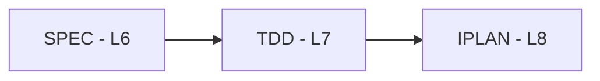

# TDD-00: Test-Driven Development Guide Index

## Purpose

Central registry for TradeSpine TDD documents. Each TDD validates one code-deliverable SPEC component and declares test-first execution order for downstream IPLAN work.

## Position in Document Workflow

**Layer**: 7 (Test-Driven Development Layer)  
**Upstream**: BRD, PRD, EARS, BDD, ADR, SPEC  
**Downstream**: IPLAN  
**Traceability chain**: BRD -> PRD -> EARS -> BDD -> ADR -> SPEC -> TDD -> IPLAN -> Code

## Document Registry

| ID | Component | SPEC Ref | YAML | Readable | BDD Refs | ADR Refs | IPLAN Target | Status |
|----|-----------|----------|------|----------|----------|----------|-------------|--------|
| TDD-01 | Strategy Authoring Surface | @spec: SPEC-01 | [YAML](TDD-01_strategy_authoring_surface/TDD-01_strategy_authoring_surface.yaml) | [Readable](TDD-01_strategy_authoring_surface/TDD-01_strategy_authoring_surface.readable.md) | @bdd: BDD.01.03.aa68 @bdd: BDD.01.03.c0f6 @bdd: BDD.01.03.7b02 | @adr: ADR.01.03.42e3 @adr: ADR.09.03.84b9 @adr: ADR.10.03.51ea | IPLAN-01 | Draft, audit PASS 94/100 |
| TDD-02 | Trade Coordination Pipeline | @spec: SPEC-02 | [YAML](TDD-02_trade_coordination_pipeline/TDD-02_trade_coordination_pipeline.yaml) | [Readable](TDD-02_trade_coordination_pipeline/TDD-02_trade_coordination_pipeline.readable.md) | @bdd: BDD.01.03.0073 @bdd: BDD.01.03.c0f6 @bdd: BDD.01.03.e16a @bdd: BDD.01.03.9a8b | @adr: ADR.04.03.7277 @adr: ADR.08.03.0a8f @adr: ADR.09.03.84b9 | IPLAN-02 | Draft, audit PASS 95/100 |
| TDD-03 | Guarded Execution and Risk Controls | @spec: SPEC-03 | [YAML](TDD-03_guarded_execution_and_risk_controls/TDD-03_guarded_execution_and_risk_controls.yaml) | [Readable](TDD-03_guarded_execution_and_risk_controls/TDD-03_guarded_execution_and_risk_controls.readable.md) | @bdd: BDD.01.03.9a8b @bdd: BDD.01.03.0ad7 @bdd: BDD.01.03.e16a @bdd: BDD.01.03.ef54 | @adr: ADR.04.03.7277 @adr: ADR.06.03.b277 @adr: ADR.09.03.84b9 | IPLAN-03 | Draft, audit PASS 95/100 |
| TDD-04 | Position Account Mode and State | @spec: SPEC-04 | [YAML](TDD-04_position_account_mode_and_state/TDD-04_position_account_mode_and_state.yaml) | [Readable](TDD-04_position_account_mode_and_state/TDD-04_position_account_mode_and_state.readable.md) | @bdd: BDD.01.03.8180 @bdd: BDD.01.03.f11f @bdd: BDD.01.03.e16a @bdd: BDD.01.03.9a7d @bdd: BDD.01.03.a31d @bdd: BDD.01.03.f415 | @adr: ADR.02.03.c7dd @adr: ADR.07.03.6df1 @adr: ADR.08.03.0a8f | IPLAN-04 | Draft, audit PASS 96/100 |
| TDD-05 | Persistence and Audit Evidence | @spec: SPEC-05 | [YAML](TDD-05_persistence_and_audit_evidence/TDD-05_persistence_and_audit_evidence.yaml) | [Readable](TDD-05_persistence_and_audit_evidence/TDD-05_persistence_and_audit_evidence.readable.md) | @bdd: BDD.01.03.0073 @bdd: BDD.01.03.d6ae @bdd: BDD.01.03.e16a @bdd: BDD.01.03.b37d | @adr: ADR.02.03.c7dd @adr: ADR.03.03.4124 @adr: ADR.05.03.2586 | IPLAN-05 | Draft, audit PASS 95/100 |
| TDD-06 | Market Session and Symbol Context | @spec: SPEC-06 | [YAML](TDD-06_market_session_and_symbol_context/TDD-06_market_session_and_symbol_context.yaml) | [Readable](TDD-06_market_session_and_symbol_context/TDD-06_market_session_and_symbol_context.readable.md) | @bdd: BDD.01.03.edae @bdd: BDD.01.03.a399 @bdd: BDD.01.03.d4a5 @bdd: BDD.01.03.4dcb @bdd: BDD.01.03.4a71 @bdd: BDD.01.03.e593 | @adr: ADR.04.03.7277 @adr: ADR.06.03.b277 @adr: ADR.10.03.51ea | IPLAN-06 | Draft, audit PASS 93/100 |
| TDD-07 | Indicators Stops Sizing and Trailing | @spec: SPEC-07 | [YAML](TDD-07_indicators_stops_sizing_trailing/TDD-07_indicators_stops_sizing_trailing.yaml) | [Readable](TDD-07_indicators_stops_sizing_trailing/TDD-07_indicators_stops_sizing_trailing.readable.md) | @bdd: BDD.01.03.c0f6 @bdd: BDD.01.03.e593 @bdd: BDD.01.03.cb03 @bdd: BDD.01.03.aa68 | @adr: ADR.04.03.7277 @adr: ADR.09.03.84b9 @adr: ADR.10.03.51ea | IPLAN-07 | Draft, audit PASS 94/100 |
| TDD-09 | Core Runtime and Configuration | @spec: SPEC-09 | [YAML](TDD-09_core_runtime_and_configuration/TDD-09_core_runtime_and_configuration.yaml) | [Readable](TDD-09_core_runtime_and_configuration/TDD-09_core_runtime_and_configuration.readable.md) | @bdd: BDD.01.03.aa68 @bdd: BDD.01.03.b37d @bdd: BDD.01.03.cb03 | @adr: ADR.03.03.4124 @adr: ADR.09.03.84b9 @adr: ADR.10.03.51ea | IPLAN-09 | Draft, audit PASS 94/100 |
| TDD-10 | Visualization Optional Services | @spec: SPEC-10 | [YAML](TDD-10_visualization_optional_services/TDD-10_visualization_optional_services.yaml) | [Readable](TDD-10_visualization_optional_services/TDD-10_visualization_optional_services.readable.md) | @bdd: BDD.01.03.b37d @bdd: BDD.01.03.d6ae | @adr: ADR.03.03.4124 @adr: ADR.10.03.51ea | IPLAN-10 | Draft, audit PASS 92/100 |
| TDD-11 | Testing Support and Harnesses | @spec: SPEC-11 | [YAML](TDD-11_testing_support_and_harnesses/TDD-11_testing_support_and_harnesses.yaml) | [Readable](TDD-11_testing_support_and_harnesses/TDD-11_testing_support_and_harnesses.readable.md) | @bdd: BDD.01.03.aa68 @bdd: BDD.01.03.f415 @bdd: BDD.01.03.e16a @bdd: BDD.01.03.d6ae @bdd: BDD.01.03.b37d | @adr: ADR.06.03.b277 @adr: ADR.07.03.6df1 @adr: ADR.08.03.0a8f @adr: ADR.10.03.51ea | IPLAN-11 | Draft, audit PASS 95/100 |

## Non-TDD Documentation Scope

| Target | Parent SPEC | Reason | Next Action |
|--------|-------------|--------|-------------|
| TDD-08 | @spec: SPEC-08 | SPEC-08 is documentation/governance scope, not a code or testing component for Layer 7 TDD; the parent SPEC declares `deliverable_type: process`. | No TDD generated. Keep this scope in documentation/governance artifacts unless a future code-deliverable SPEC is split out. |

## Quality Gate

TDD requires IPLAN-Ready score >=90/100 before downstream IPLAN generation. All generated TDD documents passed a fresh v001 audit.

## TDD Execution Order

1. Write tests from Section 3 and Section 4 of the TDD.
2. Run tests and confirm Red state.
3. Implement the parent SPEC component.
4. Verify Green state.
5. Refactor with tests still green.

## Related Documents

- [06_SPEC](../06_SPEC/) - Technical Specifications
- [08_IPLAN](../08_IPLAN/) - Implementation Plans
- [BDD-01](../04_BDD/BDD-01_tradespine_acceptance_scenarios/BDD-01_tradespine_acceptance_scenarios.yaml) - Acceptance scenarios

---

**Last Updated**: 2026-06-02  
**Maintainer**: phbr
