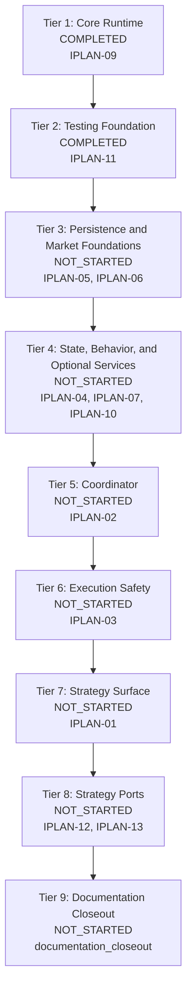

# IPLAN-00: TradeSpine Implementation Plan Registry

> Human-readable rendering generated from `IPLAN-00_index.yaml`. The YAML file remains the canonical aidoc artifact.

## Document Control

| Field | Value |
| --- | --- |
| Document ID | IPLAN-00 |
| Document Type | iplan-registry |
| Layer | 8 |
| Total Permanent Plans | 12 |
| Last Updated | 2026-06-08 |
| Status | 2 completed plans; 10 draft plans |

## Scope

This registry turns passing TradeSpine TDD documents into a test-first implementation sequence. Each permanent IPLAN maps to one code-deliverable SPEC/TDD component. `IPLAN-08` is intentionally absent because `SPEC-08` is process/governance scope, not a Layer 7 code TDD target.

The final documentation closeout is tracked as a registry execution step rather than a permanent IPLAN. It must run after framework implementation and the two required hedging strategy ports so codebase reference documentation and the new strategy creation guide describe the actual implemented framework, not planned placeholders.

## Implementation Sequence

## Registry

| ID | Title | Source | Status | Complexity | Files | Depends On |
| --- | --- | --- | --- | --- | --- | --- |
| IPLAN-09 | Core Runtime and Configuration Implementation | @spec: SPEC-09 | Completed | 4 | 10 | None |
| IPLAN-11 | Testing Support and Harnesses Implementation | @spec: SPEC-11 | Completed | 4 | 9 | IPLAN-09 |
| IPLAN-05 | Persistence and Audit Evidence Implementation | @spec: SPEC-05 | Draft | 4 | 8 | IPLAN-09, IPLAN-11 |
| IPLAN-06 | Market Session and Symbol Context Implementation | @spec: SPEC-06 | Draft | 4 | 6 | IPLAN-09, IPLAN-11 |
| IPLAN-04 | Position Account Mode and State Implementation | @spec: SPEC-04 | Draft | 5 | 9 | IPLAN-05, IPLAN-11 |
| IPLAN-07 | Indicators Stops Sizing and Trailing Implementation | @spec: SPEC-07 | Draft | 5 | 8 | IPLAN-06, IPLAN-09, IPLAN-11 |
| IPLAN-10 | Visualization Optional Services Implementation | @spec: SPEC-10 | Draft | 3 | 5 | IPLAN-09, IPLAN-11 |
| IPLAN-02 | Trade Coordination Pipeline Implementation | @spec: SPEC-02 | Draft | 5 | 7 | IPLAN-04, IPLAN-05, IPLAN-06, IPLAN-07, IPLAN-09, IPLAN-11 |
| IPLAN-03 | Guarded Execution and Risk Controls Implementation | @spec: SPEC-03 | Draft | 5 | 8 | IPLAN-02, IPLAN-04, IPLAN-05, IPLAN-06, IPLAN-09, IPLAN-11 |
| IPLAN-01 | Strategy Authoring Surface Implementation | @spec: SPEC-01 | Draft | 5 | 8 | IPLAN-02, IPLAN-04, IPLAN-07, IPLAN-09, IPLAN-10 |
| IPLAN-12 | 1minscalpv3 Hedging Port Implementation | @spec: SPEC-01 | Draft | 4 | 2 | IPLAN-01, IPLAN-02, IPLAN-03, IPLAN-04, IPLAN-05, IPLAN-06, IPLAN-07, IPLAN-09, IPLAN-11 |
| IPLAN-13 | BullishBearish Engulfing v7 Hedging Port Implementation | @spec: SPEC-01 | Draft | 4 | 2 | IPLAN-01, IPLAN-02, IPLAN-03, IPLAN-04, IPLAN-05, IPLAN-06, IPLAN-07, IPLAN-09, IPLAN-11 |

## Execution Tiers

| Tier | Label | Plans | Status |
| --- | --- | --- | --- |
| 1 | Core Runtime | IPLAN-09 | COMPLETED |
| 2 | Testing Foundation | IPLAN-11 | COMPLETED |
| 3 | Persistence and Market Foundations | IPLAN-05, IPLAN-06 | NOT_STARTED |
| 4 | State, Behavior, and Optional Services | IPLAN-04, IPLAN-07, IPLAN-10 | NOT_STARTED |
| 5 | Coordinator | IPLAN-02 | NOT_STARTED |
| 6 | Execution Safety | IPLAN-03 | NOT_STARTED |
| 7 | Strategy Surface | IPLAN-01 | NOT_STARTED |
| 8 | Strategy Ports | IPLAN-12, IPLAN-13 | NOT_STARTED |
| 9 | Documentation Closeout | documentation_closeout | NOT_STARTED |

## Final Documentation Step

| Deliverable | Purpose |
| --- | --- |
| `Docs/README.md` | Project orientation, supported v1 scope, and repository layout. |
| `Docs/ARCHITECTURE.md` | Codebase reference documentation for component boundaries, dependency direction, and execution flow. |
| `Docs/MODULES/*.md` | Per-module reference pages for Core, Market, Position, Persistence, Coordination, Execution, Risk, Indicators, Strategy, Optional, and Testing. |
| `Docs/AUTHORING.md` | New strategy creation guide with lifecycle hooks, helper calls, common inputs, logging expectations, and compile checklist. |
| `Docs/RECIPES.md` | Strategy author recipes, layered exits, trailing behavior, and B3-specific examples. |
| `Docs/INPUTS_REFERENCE.md` | Canonical common input groups, names, defaults, and operator notes. |
| `Docs/TESTING.md` | Tier-1, Tier-1.5, Tier-2, deferred account-mode evidence, and release evidence procedures. |
| `Experts/_Template/README.md` | Template-specific quick start for creating one-file strategies. |

### Documentation Acceptance Checks

- Documentation references implemented file paths and public interfaces, not planned placeholders.
- AUTHORING walks through creating a new strategy from the template through compile and first test.
- ARCHITECTURE and MODULES document the codebase after implementation, including dependencies and no-bypass boundaries.
- TESTING documents how to run each declared script and how to collect release evidence.
- Docs use the TradeSpine root MQL5/Experts/Main/TradeSpine/ and quoted relative include examples.

## Cross-Plan Obligations

| ID | Obligation | Owner |
| --- | --- | --- |
| CPO-001 | All framework code stays under MQL5/Experts/Main/TradeSpine with quoted relative includes; strategy files must not include terminal-global Trade or Expert headers. | IPLAN-09 |
| CPO-002 | Every plan writes tests before implementation and leaves file_manifest status untouched until a coding session starts. | IPLAN-11 |
| CPO-003 | Code inventory entries are added only by implementation sessions after files are actually created or modified. | IPLAN-00 |
| CPO-004 | After source implementation, run documentation closeout for codebase reference documentation and the new strategy creation guide. | IPLAN-00 |
| CPO-005 | Run aidoc-flow commands from MQL5/Experts/Main/TradeSpine so the authoritative TradeSpine .aidoc/profile.yaml governs docs generation and review. | IPLAN-00 |

## Deferred Items

| Item | Reason | Revisit Trigger |
| --- | --- | --- |
| IPLAN-08 | SPEC-08 is process/governance scope and TDD-00 excludes it from Layer 7 code TDD generation. | Create a code-deliverable SPEC if release governance automation becomes source implementation scope. |

## Implementation Notes

Permanent IPLANs follow the registry state above: completed plans retain completed counts, draft plans stay test-first, and implementation files must not be marked done until their coding sessions verify them. The documentation closeout verifies and documents the completed source tree after the component plans have run.
